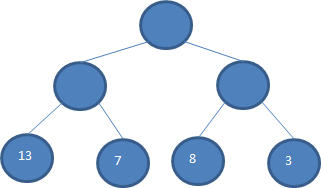
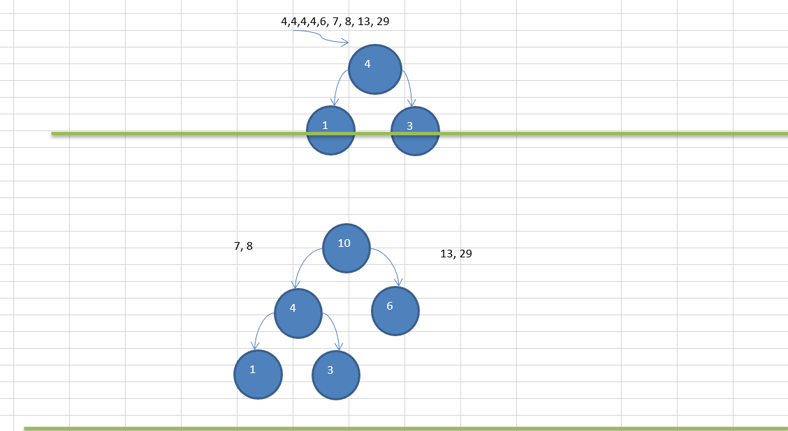
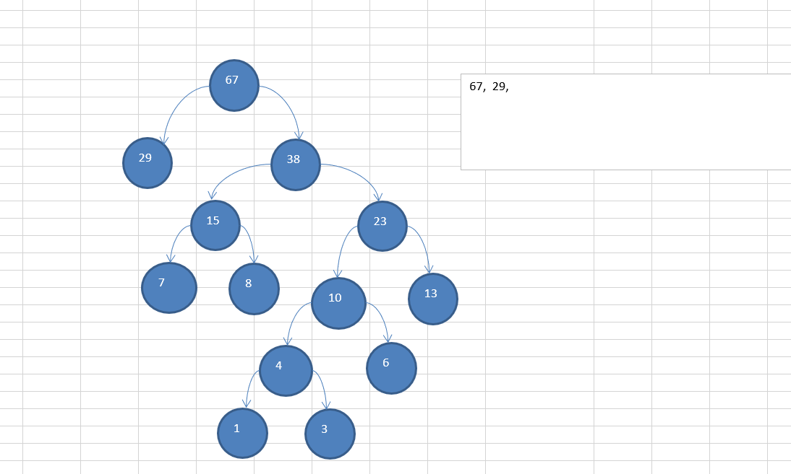
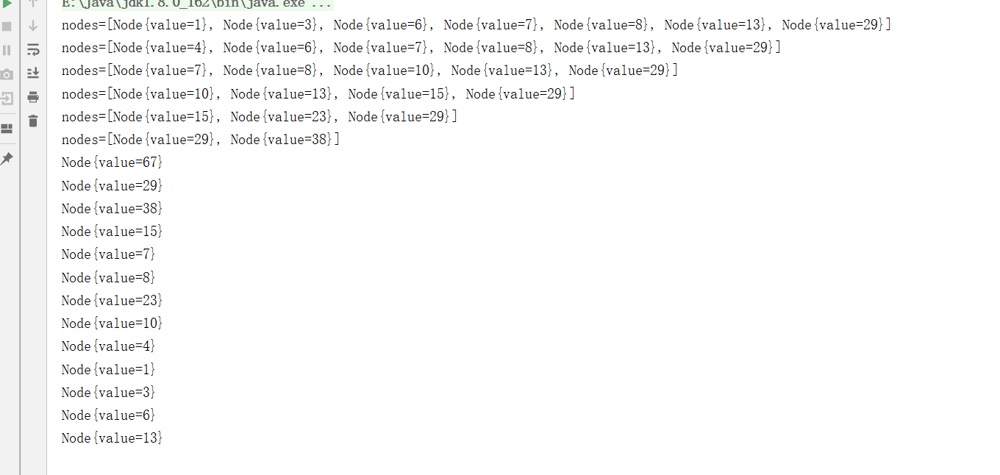
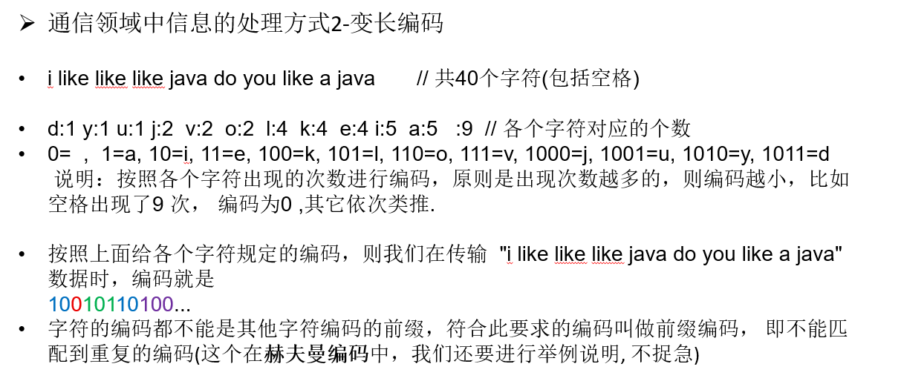
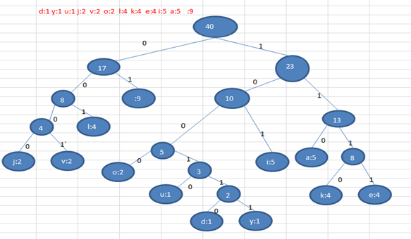
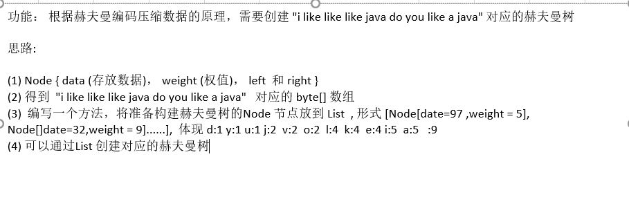

# 哈夫曼树

## 1.1基本介绍

- 给定n个权值作为n个叶子结点，构造一棵二叉树，若该树的带权路径长度(wpl)达到最小，称这样的二叉树为最优二叉树，也称为哈夫曼树(Huffman Tree), 还有的书翻译为霍夫曼树。

- 赫夫曼树是带权路径长度最短的树，权值较大的结点离根较近。

## 1.2赫夫曼树几个重要概念和举例说明

- 路径和路径长度：在一棵树中，从一个结点往下可以达到的孩子或孙子结点之间的通路，称为路径。通路中分支的数目称为路径长度。若规定根结点的层数为1，则从根结点到第L层结点的路径长度为L-1
- 结点的权及带权路径长度：若将树中结点赋给一个有着某种含义的数值，则这个数值称为该结点的权。结点的带权路径长度为：从根结点到该结点之间的路径长度与该结点的权的乘积



## 1.3赫夫曼树创建思路图解

构成赫夫曼树的步骤：

- 从小到大进行排序, 将每一个数据，每个数据都是一个节点 ， 每个节点可以看成是一颗最简单的二叉树
- 取出根节点权值最小的两颗二叉树 
- 组成一颗新的二叉树, 该新的二叉树的根节点的权值是前面两颗二叉树根节点权值的和  
- 再将这颗新的二叉树，以根节点的权值大小 再次排序， 不断重复  1-2-3-4 的步骤，直到数列中，所有的数据都被处理，就得到一颗赫夫曼树





## 1.4编码

```java
package cn.smallmartial.huffmanTree;

import java.util.ArrayList;
import java.util.Collections;
import java.util.List;

/**
 * @Author smallmartial
 * @Date 2019/6/19
 * @Email smallmarital@qq.com
 */

public class HuffmanTree {

    public static void main(String[] args) {
        int arr[] = {13,7,8,3,29,6,1};
        Node root = createHuffmanTree(arr);
        preOrder(root);

    }
    //编写一个前序遍历方法
    public static void preOrder(Node root){
        if(root != null){
            root.proOrder();
        }else {
            System.out.println("是空树，不能遍历");
        }
    }
    //创建哈夫曼树
    public static Node createHuffmanTree(int[] arr){

        //遍历 arr 数组
        List<Node> nodes = new ArrayList<Node>();
        for (int value : arr) {
            nodes.add(new Node(value));
        }
        while (nodes.size() >1) {
            //排序从小到大
            Collections.sort(nodes);
            System.out.println("nodes=" + nodes);

            //取出权值最小的节点
            Node leftNode = nodes.get(0);
            //取出权值第二小的节点
            Node rightNode = nodes.get(1);
            //构建一颗新的二叉树
            Node parent = new Node(leftNode.value + rightNode.value);
            //将parent加入nodes
            parent.left = leftNode;
            parent.rigtht = rightNode;

            nodes.remove(leftNode);
            nodes.remove(rightNode);

            nodes.add(parent);

        }

        return nodes.get(0);

    }
}
//创建节点

class Node implements Comparable<Node>{
    int value;
    Node left;
    Node rigtht;
    //前序遍历
    public void proOrder(){
        System.out.println(this);
        if (this.left != null){
            this.left.proOrder();
        }
        if (this.rigtht != null){
            this.rigtht.proOrder();
        }
    }
    public Node(int value) {
        this.value = value;
    }

    @Override
    public String toString() {
        return "Node{" +
                "value=" + value +
                '}';
    }

    @Override
    public int compareTo(Node o) {

        //从小到大排序
        return this.value - o.value;
    }
}

```

运行结果：



## 1.5哈夫曼树编码

- 基本介绍

- 赫夫曼编码也翻译为    哈夫曼编码(Huffman Coding)，又称霍夫曼编码，是一种编码方式, 属于一种程序算法赫夫曼编码是赫哈夫曼树在电讯通信中的经典的应用之一。

- 赫夫曼编码广泛地用于数据文件压缩。其压缩率通常在20%～90%之间赫夫曼码是可变字长编码(VLC)的一种。Huffman于1952年提出一种编码方法，称之为最佳编码



- 通信领域中信息的处理方式3-赫夫曼编码

  i like like like java do you like a java       // 共40个字符(包括空格)

  d:1 y:1 u:1 j:2  v:2  o:2  l:4  k:4  e:4 i:5  a:5   :9  // 各个字符对应的个数
  按照上面字符出现的次数构建一颗赫夫曼树, 次数作为权值.(图后)

  ​	

- 步骤：
    构成赫夫曼树的步骤：
    1) 从小到大进行排序, 将每一个数据，每个数据都是一个节点 ， 每个节点可以看成是一颗最简单的二叉树
    2) 取出根节点权值最小的两颗二叉树 
    3) 组成一颗新的二叉树, 该新的二叉树的根节点的权值是前面两颗二叉树根节点权值的和  
    4) 再将这颗新的二叉树，以根节点的权值大小 再次排序， 不断重复  1-2-3-4 的步骤，直到数列中，所有的数据都被处理，就得到一颗赫夫曼树

  
  
  4)  根据赫夫曼树，给各个字符,规定编码 (前缀编码)， 向左的路径为0 向右的路径为1 ， 编码如下:
  
  ​	o: 1000   u: 10010  d: 100110  y: 100111  i: 101
  
  ​	a : 110     k: 1110    e: 1111       j: 0000       v: 0001
  
  ​	l: 001          : 01
  
  5) 按照上面的赫夫曼编码，我们的"i like like like java do you like a java"   字符串对应的编码为 (注意这里我们使用的无损压缩)
  
  1010100110111101111010011011110111101001101111011110100001100001110011001111000011001111000100100100110111101111011100100001100001110  通过赫夫曼编码处理  长度为  133
  
  6） 长度为 ： 133 
  
  说明:原来长度是  359 , 压缩了  (359-133) / 359 = 62.9%
  
  此编码满足前缀编码, 即字符的编码都不能是其他字符编码的前缀。不会造成匹配的多义性赫夫曼编码是无损处理方案
  
  > 注意, 这个赫夫曼树根据排序方法不同，也可能不太一样，这样对应的赫夫曼编码也不完全一样，但是wpl 是一样的，都是最小的, 比如: 如果我们让每次生成的新的二叉树总是排在权值相同的二叉树的最后一个

## 1.6最佳实践-数据压缩(创建赫夫曼树)

将给出的一段文本，比如 "i like like like java do you like a java" ， 根据前面的讲的赫夫曼编码原理，对其进行数据压缩处理 ，形式如 "1010100110111101111010011011110111101001101111011110100001100001110011001111000011001111000100100100110111101111011100100001100001110
" 



## 1.7代码

```java
package cn.smallmartial.huffmancode;

import java.util.ArrayList;
import java.util.HashMap;
import java.util.List;
import java.util.Map;

/**
 * @Author smallmartial
 * @Date 2019/6/20
 * @Email smallmarital@qq.com
 */

import java.io.FileInputStream;
import java.io.FileOutputStream;
import java.io.InputStream;
import java.io.ObjectInputStream;
import java.io.ObjectOutputStream;
import java.io.OutputStream;
import java.util.ArrayList;
import java.util.Arrays;
import java.util.Collections;
import java.util.HashMap;
import java.util.List;
import java.util.Map;

public class HuffmanCode {

    public static void main(String[] args) {

        //测试压缩文件
//		String srcFile = "d://Uninstall.xml";
//		String dstFile = "d://Uninstall.zip";
//
//		zipFile(srcFile, dstFile);
//		System.out.println("压缩文件ok~~");


//        //测试解压文件
//        String zipFile = "d://Uninstall.zip";
//        String dstFile = "d://Uninstall2.xml";
//        unZipFile(zipFile, dstFile);
//        System.out.println("解压成功!");


		String content = "i like like like java do you like a java";
		byte[] contentBytes = content.getBytes();
		System.out.println(contentBytes.length); //40

		byte[] huffmanCodesBytes= huffmanZip(contentBytes);
		System.out.println("压缩后的结果是:" + Arrays.toString(huffmanCodesBytes) + " 长度= " + huffmanCodesBytes.length);


		//测试一把byteToBitString方法
		//System.out.println(byteToBitString((byte)1));
		byte[] sourceBytes = decode(huffmanCodes, huffmanCodesBytes);

		System.out.println("原来的字符串=" + new String(sourceBytes)); // "i like like like java do you like a java"


        //如何将 数据进行解压(解码)
        //分步过程
		List<Node> nodes = getNodes(contentBytes);
		System.out.println("nodes=" + nodes);

		//测试一把，创建的赫夫曼树
		System.out.println("赫夫曼树");
		Node huffmanTreeRoot = createHuffmanTree(nodes);
		System.out.println("前序遍历");
		huffmanTreeRoot.preOrder();

		//测试一把是否生成了对应的赫夫曼编码
		Map<Byte, String> huffmanCodes = getCodes(huffmanTreeRoot);
		System.out.println("~生成的赫夫曼编码表= " + huffmanCodes);

		//测试
		byte[] huffmanCodeBytes = zip(contentBytes, huffmanCodes);
		System.out.println("huffmanCodeBytes=" + Arrays.toString(huffmanCodeBytes));//17

		//发送huffmanCodeBytes 数组


    }

    //编写一个方法，完成对压缩文件的解压
    /**
     *
     * @param zipFile 准备解压的文件
     * @param dstFile 将文件解压到哪个路径
     */
    public static void unZipFile(String zipFile, String dstFile) {

        //定义文件输入流
        InputStream is = null;
        //定义一个对象输入流
        ObjectInputStream ois = null;
        //定义文件的输出流
        OutputStream os = null;
        try {
            //创建文件输入流
            is = new FileInputStream(zipFile);
            //创建一个和  is关联的对象输入流
            ois = new ObjectInputStream(is);
            //读取byte数组  huffmanBytes
            byte[] huffmanBytes = (byte[])ois.readObject();
            //读取赫夫曼编码表
            Map<Byte,String> huffmanCodes = (Map<Byte,String>)ois.readObject();

            //解码
            byte[] bytes = decode(huffmanCodes, huffmanBytes);
            //将bytes 数组写入到目标文件
            os = new FileOutputStream(dstFile);
            //写数据到 dstFile 文件
            os.write(bytes);
        } catch (Exception e) {
            // TODO: handle exception
            System.out.println(e.getMessage());
        } finally {

            try {
                os.close();
                ois.close();
                is.close();
            } catch (Exception e2) {
                // TODO: handle exception
                System.out.println(e2.getMessage());
            }

        }
    }

    //编写方法，将一个文件进行压缩
    /**
     *
     * @param srcFile 你传入的希望压缩的文件的全路径
     * @param dstFile 我们压缩后将压缩文件放到哪个目录
     */
    public static void zipFile(String srcFile, String dstFile) {

        //创建输出流
        OutputStream os = null;
        ObjectOutputStream oos = null;
        //创建文件的输入流
        FileInputStream is = null;
        try {
            //创建文件的输入流
            is = new FileInputStream(srcFile);
            //创建一个和源文件大小一样的byte[]
            byte[] b = new byte[is.available()];
            //读取文件
            is.read(b);
            //直接对源文件压缩
            byte[] huffmanBytes = huffmanZip(b);
            //创建文件的输出流, 存放压缩文件
            os = new FileOutputStream(dstFile);
            //创建一个和文件输出流关联的ObjectOutputStream
            oos = new ObjectOutputStream(os);
            //把 赫夫曼编码后的字节数组写入压缩文件
            oos.writeObject(huffmanBytes); //我们是把
            //这里我们以对象流的方式写入 赫夫曼编码，是为了以后我们恢复源文件时使用
            //注意一定要把赫夫曼编码 写入压缩文件
            oos.writeObject(huffmanCodes);


        }catch (Exception e) {
            // TODO: handle exception
            System.out.println(e.getMessage());
        }finally {
            try {
                is.close();
                oos.close();
                os.close();
            }catch (Exception e) {
                // TODO: handle exception
                System.out.println(e.getMessage());
            }
        }

    }

    //完成数据的解压
    //思路
    //1. 将huffmanCodeBytes [-88, -65, -56, -65, -56, -65, -55, 77, -57, 6, -24, -14, -117, -4, -60, -90, 28]
    //   重写先转成 赫夫曼编码对应的二进制的字符串 "1010100010111..."
    //2.  赫夫曼编码对应的二进制的字符串 "1010100010111..." =》 对照 赫夫曼编码  =》 "i like like like java do you like a java"


    //编写一个方法，完成对压缩数据的解码
    /**
     *
     * @param huffmanCodes 赫夫曼编码表 map
     * @param huffmanBytes 赫夫曼编码得到的字节数组
     * @return 就是原来的字符串对应的数组
     */
    private static byte[] decode(Map<Byte,String> huffmanCodes, byte[] huffmanBytes) {

        //1. 先得到 huffmanBytes 对应的 二进制的字符串 ， 形式 1010100010111...
        StringBuilder stringBuilder = new StringBuilder();
        //将byte数组转成二进制的字符串
        for(int i = 0; i < huffmanBytes.length; i++) {
            byte b = huffmanBytes[i];
            //判断是不是最后一个字节
            boolean flag = (i == huffmanBytes.length - 1);
            stringBuilder.append(byteToBitString(!flag, b));
        }
        //把字符串安装指定的赫夫曼编码进行解码
        //把赫夫曼编码表进行调换，因为反向查询 a->100 100->a
        Map<String, Byte>  map = new HashMap<String,Byte>();
        for(Map.Entry<Byte, String> entry: huffmanCodes.entrySet()) {
            map.put(entry.getValue(), entry.getKey());
        }

        //创建要给集合，存放byte
        List<Byte> list = new ArrayList<>();
        //i 可以理解成就是索引,扫描 stringBuilder
        for(int  i = 0; i < stringBuilder.length(); ) {
            int count = 1; // 小的计数器
            boolean flag = true;
            Byte b = null;

            while(flag) {
                //1010100010111...
                //递增的取出 key 1
                String key = stringBuilder.substring(i, i+count);//i 不动，让count移动，指定匹配到一个字符
                b = map.get(key);
                if(b == null) {//说明没有匹配到
                    count++;
                }else {
                    //匹配到
                    flag = false;
                }
            }
            list.add(b);
            i += count;//i 直接移动到 count
        }
        //当for循环结束后，我们list中就存放了所有的字符  "i like like like java do you like a java"
        //把list 中的数据放入到byte[] 并返回
        byte b[] = new byte[list.size()];
        for(int i = 0;i < b.length; i++) {
            b[i] = list.get(i);
        }
        return b;

    }

    /**
     * 将一个byte 转成一个二进制的字符串, 如果看不懂，可以参考我讲的Java基础 二进制的原码，反码，补码
     * @param b 传入的 byte
     * @param flag 标志是否需要补高位如果是true ，表示需要补高位，如果是false表示不补, 如果是最后一个字节，无需补高位
     * @return 是该b 对应的二进制的字符串，（注意是按补码返回）
     */
    private static String byteToBitString(boolean flag, byte b) {
        //使用变量保存 b
        int temp = b; //将 b 转成 int
        //如果是正数我们还存在补高位
        if(flag) {
            temp |= 256; //按位与 256  1 0000 0000  | 0000 0001 => 1 0000 0001
        }
        String str = Integer.toBinaryString(temp); //返回的是temp对应的二进制的补码
        if(flag) {
            return str.substring(str.length() - 8);
        } else {
            return str;
        }
    }

    //使用一个方法，将前面的方法封装起来，便于我们的调用.
    /**
     *
     * @param bytes 原始的字符串对应的字节数组
     * @return 是经过 赫夫曼编码处理后的字节数组(压缩后的数组)
     */
    private static byte[] huffmanZip(byte[] bytes) {
        List<Node> nodes = getNodes(bytes);
        //根据 nodes 创建的赫夫曼树
        Node huffmanTreeRoot = createHuffmanTree(nodes);
        //对应的赫夫曼编码(根据 赫夫曼树)
        Map<Byte, String> huffmanCodes = getCodes(huffmanTreeRoot);
        //根据生成的赫夫曼编码，压缩得到压缩后的赫夫曼编码字节数组
        byte[] huffmanCodeBytes = zip(bytes, huffmanCodes);
        return huffmanCodeBytes;
    }


    //编写一个方法，将字符串对应的byte[] 数组，通过生成的赫夫曼编码表，返回一个赫夫曼编码 压缩后的byte[]
    /**
     *
     * @param bytes 这时原始的字符串对应的 byte[]
     * @param huffmanCodes 生成的赫夫曼编码map
     * @return 返回赫夫曼编码处理后的 byte[]
     * 举例： String content = "i like like like java do you like a java"; =》 byte[] contentBytes = content.getBytes();
     * 返回的是 字符串 "1010100010111111110010001011111111001000101111111100100101001101110001110000011011101000111100101000101111111100110001001010011011100"
     * => 对应的 byte[] huffmanCodeBytes  ，即 8位对应一个 byte,放入到 huffmanCodeBytes
     * huffmanCodeBytes[0] =  10101000(补码) => byte  [推导  10101000=> 10101000 - 1 => 10100111(反码)=> 11011000= -88 ]
     * huffmanCodeBytes[1] = -88
     */
    private static byte[] zip(byte[] bytes, Map<Byte, String> huffmanCodes) {

        //1.利用 huffmanCodes 将  bytes 转成  赫夫曼编码对应的字符串
        StringBuilder stringBuilder = new StringBuilder();
        //遍历bytes 数组
        for(byte b: bytes) {
            stringBuilder.append(huffmanCodes.get(b));
        }

        //System.out.println("测试 stringBuilder~~~=" + stringBuilder.toString());

        //将 "1010100010111111110..." 转成 byte[]

        //统计返回  byte[] huffmanCodeBytes 长度
        //一句话 int len = (stringBuilder.length() + 7) / 8;
        int len;
        if(stringBuilder.length() % 8 == 0) {
            len = stringBuilder.length() / 8;
        } else {
            len = stringBuilder.length() / 8 + 1;
        }
        //创建 存储压缩后的 byte数组
        byte[] huffmanCodeBytes = new byte[len];
        int index = 0;//记录是第几个byte
        for (int i = 0; i < stringBuilder.length(); i += 8) { //因为是每8位对应一个byte,所以步长 +8
            String strByte;
            if(i+8 > stringBuilder.length()) {//不够8位
                strByte = stringBuilder.substring(i);
            }else{
                strByte = stringBuilder.substring(i, i + 8);
            }
            //将strByte 转成一个byte,放入到 huffmanCodeBytes
            huffmanCodeBytes[index] = (byte)Integer.parseInt(strByte, 2);
            index++;
        }
        return huffmanCodeBytes;
    }

    //生成赫夫曼树对应的赫夫曼编码
    //思路:
    //1. 将赫夫曼编码表存放在 Map<Byte,String> 形式
    //   生成的赫夫曼编码表{32=01, 97=100, 100=11000, 117=11001, 101=1110, 118=11011, 105=101, 121=11010, 106=0010, 107=1111, 108=000, 111=0011}
    static Map<Byte, String> huffmanCodes = new HashMap<Byte,String>();
    //2. 在生成赫夫曼编码表示，需要去拼接路径, 定义一个StringBuilder 存储某个叶子结点的路径
    static StringBuilder stringBuilder = new StringBuilder();


    //为了调用方便，我们重载 getCodes
    private static Map<Byte, String> getCodes(Node root) {
        if(root == null) {
            return null;
        }
        //处理root的左子树
        getCodes(root.left, "0", stringBuilder);
        //处理root的右子树
        getCodes(root.right, "1", stringBuilder);
        return huffmanCodes;
    }

    /**
     * 功能：将传入的node结点的所有叶子结点的赫夫曼编码得到，并放入到huffmanCodes集合
     * @param node  传入结点
     * @param code  路径： 左子结点是 0, 右子结点 1
     * @param stringBuilder 用于拼接路径
     */
    private static void getCodes(Node node, String code, StringBuilder stringBuilder) {
        StringBuilder stringBuilder2 = new StringBuilder(stringBuilder);
        //将code 加入到 stringBuilder2
        stringBuilder2.append(code);
        if(node != null) { //如果node == null不处理
            //判断当前node 是叶子结点还是非叶子结点
            if(node.data == null) { //非叶子结点
                //递归处理
                //向左递归
                getCodes(node.left, "0", stringBuilder2);
                //向右递归
                getCodes(node.right, "1", stringBuilder2);
            } else { //说明是一个叶子结点
                //就表示找到某个叶子结点的最后
                huffmanCodes.put(node.data, stringBuilder2.toString());
            }
        }
    }

    //前序遍历的方法
    private static void preOrder(Node root) {
        if(root != null) {
            root.preOrder();
        }else {
            System.out.println("赫夫曼树为空");
        }
    }

    /**
     *
     * @param bytes 接收字节数组
     * @return 返回的就是 List 形式   [Node[date=97 ,weight = 5], Node[]date=32,weight = 9]......],
     */
    private static List<Node> getNodes(byte[] bytes) {

        //1创建一个ArrayList
        ArrayList<Node> nodes = new ArrayList<Node>();

        //遍历 bytes , 统计 每一个byte出现的次数->map[key,value]
        Map<Byte, Integer> counts = new HashMap<>();
        for (byte b : bytes) {
            Integer count = counts.get(b);
            if (count == null) { // Map还没有这个字符数据,第一次
                counts.put(b, 1);
            } else {
                counts.put(b, count + 1);
            }
        }

        //把每一个键值对转成一个Node 对象，并加入到nodes集合
        //遍历map
        for(Map.Entry<Byte, Integer> entry: counts.entrySet()) {
            nodes.add(new Node(entry.getKey(), entry.getValue()));
        }
        return nodes;

    }

    //可以通过List 创建对应的赫夫曼树
    private static Node createHuffmanTree(List<Node> nodes) {

        while(nodes.size() > 1) {
            //排序, 从小到大
            Collections.sort(nodes);
            //取出第一颗最小的二叉树
            Node leftNode = nodes.get(0);
            //取出第二颗最小的二叉树
            Node rightNode = nodes.get(1);
            //创建一颗新的二叉树,它的根节点 没有data, 只有权值
            Node parent = new Node(null, leftNode.weight + rightNode.weight);
            parent.left = leftNode;
            parent.right = rightNode;

            //将已经处理的两颗二叉树从nodes删除
            nodes.remove(leftNode);
            nodes.remove(rightNode);
            //将新的二叉树，加入到nodes
            nodes.add(parent);

        }
        //nodes 最后的结点，就是赫夫曼树的根结点
        return nodes.get(0);

    }


}


//创建Node ,待数据和权值
class Node implements Comparable<Node>  {
    Byte data; // 存放数据(字符)本身，比如'a' => 97 ' ' => 32
    int weight; //权值, 表示字符出现的次数
    Node left;//
    Node right;
    public Node(Byte data, int weight) {

        this.data = data;
        this.weight = weight;
    }
    @Override
    public int compareTo(Node o) {
        // 从小到大排序
        return this.weight - o.weight;
    }

    public String toString() {
        return "Node [data = " + data + " weight=" + weight + "]";
    }

    //前序遍历
    public void preOrder() {
        System.out.println(this);
        if(this.left != null) {
            this.left.preOrder();
        }
        if(this.right != null) {
            this.right.preOrder();
        }
    }
}

```

