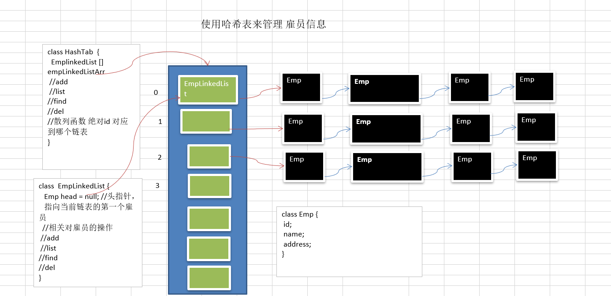

## 1.哈希表介绍

散列表（Hash table，也叫哈希表），是根据关键码值(Key value)而直接进行访问的数据结构。也就是说，它通过把关键码值映射到表中一个位置来访问记录，以加快查找的速度。这个映射函数叫做散列函数，存放记录的数组叫做散列表。
15   111 % 15


## 2.问题

有一个公司,当有新的员工来报道时,要求将该员工的信息加入(id,性别,年龄,名字,住址..),当输入该员工的id时,要求查找到该员工的 所有信息.

要求: 
不使用数据库,,速度越快越好=>哈希表(散列)
添加时，保证按照id从低到高插入  [课后思考：如果id不是从低到高插入，但要求各条链表仍是从低到高，怎么解决?]
使用链表来实现哈希表, 该链表不带表头[即: 链表的第一个结点就存放雇员信息] 
思路分析并画出示意图
代码实现[增删改查(显示所有员工，按id查询)]



## 3.代码实现

```java
package cn.smallmartial.hashTable;

import java.util.HashMap;
import java.util.Scanner;

/**
 * @Author smallmartial
 * @Date 2019/6/13
 * @Email smallmarital@qq.com
 */
public class HashTableDemo {

    public static void main(String[] args) {
        //创建hash表
        HashTab hashTab = new HashTab(7);

        //写一个简单的菜单
        String key = "";
        Scanner scanner = new Scanner(System.in);
        while(true) {
            System.out.println("add:  添加雇员");
            System.out.println("list: 显示雇员");
            System.out.println("find: 查找雇员");
            System.out.println("exit: 退出系统");

            key = scanner.next();
            switch (key) {
                case "add":
                    System.out.println("输入id");
                    int id = scanner.nextInt();
                    System.out.println("输入名字");
                    String name = scanner.next();
                    //创建 雇员
                    Emp emp = new Emp(id, name);
                    hashTab.add(emp);
                    break;
                case "list":
                    hashTab.list();
                    break;
                case "find":
                    System.out.println("请输入要查找的id");
                    id = scanner.nextInt();
                    hashTab.findEmpById(id);
                    break;
                case "exit":
                    scanner.close();
                    System.exit(0);
                default:
                    break;
            }
        }
    }
}
//创建hashTab
class HashTab{
    private  int size;
    private EmpLinkedList[] empLinkedListArray;

    public HashTab(int size) {
        this.size = size;
        empLinkedListArray = new EmpLinkedList[size];

        for (int i = 0; i < size; i++) {
             empLinkedListArray[i] = new EmpLinkedList();
        }

    }

    //添加雇员
    public void add(Emp emp){
        //根据员工ID 添加到哪条联
        int hashFun = hashFun(emp.id);
        empLinkedListArray[hashFun].add(emp);

    }
    
    //遍历链表
    public void list(){
        for (int i = 0; i < size; i++) {
            empLinkedListArray[i].list(i);
        }
    }

    //根据输入的id,查找雇员
    public void findEmpById(int id) {
        //使用散列函数确定到哪条链表查找
        int empLinkedListNO = hashFun(id);
        Emp emp = empLinkedListArray[empLinkedListNO].findEmpById(id);
        if(emp != null) {//找到
            System.out.printf("在第%d条链表中找到 雇员 id = %d\n", (empLinkedListNO + 1), id);
        }else{
            System.out.println("在哈希表中，没有找到该雇员~");
        }
    }
    public int hashFun(int id){
        return id % size;
    }
}
//表示雇员
class Emp {
    public int id;
    public String name;
    public Emp next;

    public Emp(int id, String name) {
        this.id = id;
        this.name = name;
    }
}
//表示链表
class EmpLinkedList{
    private Emp head;

    public void add(Emp emp){
        if (head == null){
            head = emp;
            return;
        }

        Emp curEmp = head;
        while (true){
            if (curEmp.next == null){
                break;
            }
            curEmp = curEmp.next;
        }
        curEmp.next = emp;
    }

    //遍历
    public void list(int no){
        if (head == null){
            System.out.println("第"+no+"前链表为空");
            return;
        }
        System.out.print("第"+no+"链表信息为：");
        Emp curEmp = head;
        while (true){
            System.out.print(curEmp.id+"=>"+curEmp.name);
            if (curEmp.next == null){
                break;
            }
            curEmp = curEmp.next;
        }
        System.out.println();
    }

    //根据id查找雇员
    //如果查找到，就返回Emp, 如果没有找到，就返回null
    public Emp findEmpById(int id) {
        //判断链表是否为空
        if(head == null) {
            System.out.println("链表为空");
            return null;
        }
        //辅助指针
        Emp curEmp = head;
        while(true) {
            if(curEmp.id == id) {//找到
                break;//这时curEmp就指向要查找的雇员
            }
            //退出
            if(curEmp.next == null) {//说明遍历当前链表没有找到该雇员
                curEmp = null;
                break;
            }
            curEmp = curEmp.next;//以后
        }

        return curEmp;
    }
}
```

