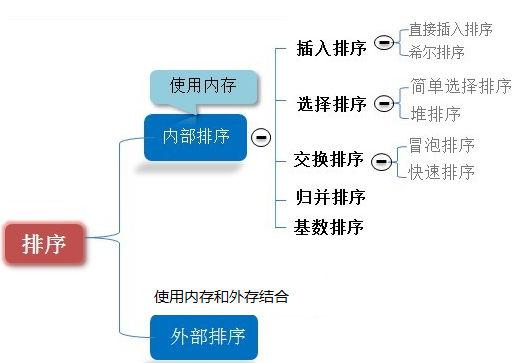
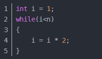

## 1.排序算法介绍

- 排序也称排序算法(Sort Algorithm)，排序是将一组数据，依指定的顺序进行排列的过程。

- 排序的分类：

  - 1) 内部排序:
    指将需要处理的所有数据都加载到内部存储器中进行排序。

  - 2) 外部排序法：
    数据量过大，无法全部加载到内存中，需要借助外部存储进行
    排序。

  - 3) 常见的排序算法分类(见右图):

    

## 2.算法的时间复杂度

### 2.1度量一个程序(算法)执行时间的两种方法

- 事后统计的方法这种方法可行, 但是有两个问题：一是要想对设计的算法的运行性能进行评测，需要实际运行该程序；二是所得时间的统计量依赖于计算机的硬件、软件等环境因素, 这种方式，要在同一台计算机的相同状态下运行，才能比较那个算法速度更快。

- 事前估算的方法通过分析某个算法的时间复杂度来判断哪个算法更优.

### 2.2时间频度

- 时间频度：一个算法花费的时间与算法中语句的执行次数成正比例，哪个算法中语句执行次数多，它花费时间就多。一个算法中的语句执行次数称为语句频度或时间频度。记为T(n)。
  - 忽略常数项
  - 忽略低次项
  - 忽略系数

### 2.3时间复杂度

- 一般情况下，算法中的基本操作语句的重复执行次数是问题规模n的某个函数，用T(n)表示，若有某个辅助函数f(n)，使得当n趋近于无穷大时，T(n) / f(n) 的极限值为不等于零的常数，则称f(n)是T(n)的同数量级函数。记作 T(n)=Ｏ( f(n) )，称Ｏ( f(n) )  为算法的渐进时间复杂度，简称时间复杂度。

- T(n) 不同，但时间复杂度可能相同。 如：T(n)=n²+7n+6 与 T(n)=3n²+2n+2 它们的T(n) 不同，但时间复杂度相同，都为O(n²)。

- 计算时间复杂度的方法：

  用常数1代替运行时间中的所有加法常数  T(n)=n²+7n+6  => T(n)=n²+7n+1
  修改后的运行次数函数中，只保留最高阶项  T(n)=n²+7n+1 => T(n) = n²
  去除最高阶项的系数 T(n) = n² => T(n) = n² => O(n²)

### 2.4常见的时间复杂度

- 常数阶O(1)

  无论代码执行了多少行，只要是没有循环等复杂结构，那这个代码的时间复杂度就都是O(1)

  

  上述代码在执行的时候，它消耗的时候并不随着某个变量的增长而增长，那么无论这类代码有多长，即使有几万几十万行，都可以用O(1)来表示它的时间复杂度。

- 对数阶O(**log*****2******n***)

  

  说明：在while循环里面，每次都将 i 乘以 2，乘完之后，i 距离 n 就越来越近了。假设循环x次之后，i 就大于 2 了，此时这个循环就退出了，也就是说 2 的 x 次方等于 n，那么 x = log2n也就是说当循环 log2n 次以后，这个代码就结束了。因此这个代码的时间复杂度为：O(log2n)  。 O(log2n) 的这个2 时间上是根据代码变化的，i = i * 3 ，则是 O(log3n) .

- 线性阶O(n)

  

  **说明**：这段代码，for循环里面的代码会执行n遍，因此它消耗的时间是随着n的变化而变化的，因此这类代码都可以用O(n)来表示它的时间复杂度

- 线性对数阶O(n**log*****2******n***)

  

  **说明**：线性对数阶O(nlogN) 其实非常容易理解，将时间复杂度为O(logn)的代码循环N遍的话，那么它的时间复杂度就是n *O(logN)，也就是了O(nlogN)

- 平方阶O(n^2)

  ​		

  **说明**：平方阶O(n²) 就更容易理解了，如果把 O(n) 的代码再嵌套循环一遍，它的时间复杂度就是
  O(n²)，这段代码其实就是嵌套了2层n循环，它的时间复杂度就是O(n*n)，即O(n²) 如果将其中一层循环的n改成m，那它的时间复杂度就变成了O(m*n)

- 立方阶O(n^3)

- k次方阶O(n^k)

- 指数阶O(2^n)

> 常见的算法时间复杂度由小到大依次为：Ο(1)＜Ο(log2n)＜Ο(n)＜Ο(nlog2n)＜Ο(n2)＜Ο(n3)＜ Ο(nk) ＜Ο(2n) ，随着问题规模n的不断增大，上述时间复杂度不断增大，算法的执行效率越低
> 从图中可见，我们应该尽可能避免使用指数阶的算法

### 2.5平均时间复杂度和最坏时间复杂度

- 平均时间复杂度是指所有可能的输入实例均以等概率出现的情况下，该算法的运行时间。
- 最坏情况下的时间复杂度称最坏时间复杂度。一般讨论的时间复杂度均是最坏情况下的时间复杂度。 这样做的原因是：最坏情况下的时间复杂度是算法在任何输入实例上运行时间的界限，这就保证了算法的运行时间不会比最坏情况更长。
- 平均时间复杂度和最坏时间复杂度是否一致，和算法有关(如图:)。

## 3.算法的空间复杂度简介

- 类似于时间复杂度的讨论，一个算法的空间复杂度(Space Complexity)定义为该算法所耗费的存储空间，它也是问题规模n的函数。
- 空间复杂度(Space Complexity)是对一个算法在运行过程中临时占用存储空间大小的量度。有的算法需要占用的临时工作单元数与解决问题的规模n有关，它随着n的增大而增大，当n较大时，将占用较多的存储单元，例如快速排序和归并排序算法就属于这种情况
- 在做算法分析时，主要讨论的是时间复杂度。从用户使用体验上看，更看重的程序执行的速度。一些缓存产品(redis, memcache)和算法(基数排序)本质就是用空间换时间.