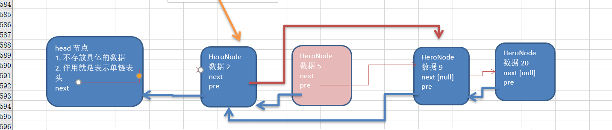

# 数据结构之双向链表

## 1.双向链表

### 1.1双向链表创建示意图



分析 双向链表的遍历，添加，修改，删除的操作思路===》代码实现：

- 1) 遍历 方和 单链表一样，只是可以向前，也可以向后查找
- 2) 添加 (默认添加到双向链表的最后)
  - (1) 先找到双向链表的最后这个节点
  - (2) temp.next = newHeroNode
  - (3) newHeroNode.pre = temp;
- 3) 修改 思路和 原来的单向链表一样.
- 4) 删除
  - (1) 因为是双向链表，因此，我们可以实现自我删除某个节点
  - (2) 直接找到要删除的这个节点，比如temp
  - (3)  temp.pre.next = temp.next
  - (4) temp.next.pre = temp.pre;

### 1.2代码实现

```java
package cn.smallmartial.demo;

/**
 * @Author smallmartial
 * @Date 2019/6/3
 * @Email smallmarital@qq.com
 */
public class DoubleLinkedListDemo {
    public static void main(String[] args) {
        //测试
        System.out.println("双向链表测试：");
        HeroNode2 hero1 = new HeroNode2(1, "小武", "smallmartial");
        HeroNode2 hero2 = new HeroNode2(2,"宋江","及时雨");
        HeroNode2 hero3 = new HeroNode2(3,"吴用","智多星");
        HeroNode2 hero4 = new HeroNode2(4,"林冲","豹子头");
        HeroNode2 hero5 = new HeroNode2(5,"鲁智深","花和尚");

        DoubleLinkedList doubleLinkedList = new DoubleLinkedList();
        doubleLinkedList.add(hero1);
        doubleLinkedList.add(hero2);
        doubleLinkedList.add(hero3);
        doubleLinkedList.add(hero4);
        doubleLinkedList.add(hero5);
        //显示
        doubleLinkedList.list();

        //修改
        HeroNode2 newHeroNode = new HeroNode2(1, "doudou", "smallmartial");
        doubleLinkedList.update(newHeroNode);
        System.out.println("修改后链表：");
        doubleLinkedList.list();

        //删除
        doubleLinkedList.delete(3);
        System.out.println("删除后的链表：");
        doubleLinkedList.list();

    }
}

//创建一个双向链表类
class DoubleLinkedList{
    //首先初始化一个头节点
    private HeroNode2 head= new HeroNode2(0,"","");

    //返回头节点
    public HeroNode2 getHead(){
        return head;
    }

    //遍历一个双向链表
    public void list(){
        //判断链表是否为空
        if (head.next == null){
            System.out.println("链表为空：");
            return;
        }
        //因为head节点不能动，所有需要一个辅助变量遍历
        HeroNode2 temp = head.next;
        while (true){
            if (temp == null){
                break;
            }
            //输出节点信息
            System.out.println(temp);
            //将temp后移
            temp = temp.next;
        }
    }

    public void add(HeroNode2 heroNode){
        //因为head节点不能动，所有需要一个辅助遍历temp
        HeroNode2 temp = head;
        //遍历链表，找到最后
        while (true){
            //尾节点next = null, 如果temp == null 则找到
            if (temp.next == null){
                break;
            }
            //如果没有找点将 temp 后移
            temp = temp.next;
        }
        //当退出while循环时，temp就指向了链表的最后
        //形成一个双向链表
        temp.next = heroNode;
        heroNode.pre = temp;
    }

    //修改一个节点内容
    public void update(HeroNode2 newHeroNode){
        //判断是否为空
        if (head.next == null){
            System.out.println("链表为空：");
            return;
        }

        //定义一个辅助变量
        HeroNode2 temp = head.next;
        boolean flag = false;//表示是否找到该节点
        while (true){
            if (temp == null){
                break;//遍历完
            }
            if (temp.no == newHeroNode.no){
                //找到
                flag = true;
                break;
            }
            temp = temp.next;

        }
        //根据flag判断是否要修改的节点
        if (flag){
            temp.name = newHeroNode.name;
            temp.nickName = newHeroNode.nickName;
        }else {
            System.out.println("未找到该节点"+newHeroNode.no);
        }
    }

    //从双向链表删除一个节点

    /**
     * 4) 删除
     *
     * - (1) 因为是双向链表，因此，我们可以实现自我删除某个节点
     * - (2) 直接找到要删除的这个节点，比如temp
     * - (3)  temp.pre.next = temp.next
     * - (4) temp.next.pre = temp.pre;
     * @param no
     */
    public void delete(int no){
        //判断当前链表是否为空
        if (head.next == null){
            System.out.println("链表为空：");
            return;
        }
        HeroNode2 temp = head.next;//辅助指针
        boolean flag = false;//标志是否找到
        while (true){
            if (temp == null){
                break;
            }
            if (temp.no == no){
                flag = true;//已经找到
                break;
            }
            temp = temp.next;//遍历
        }
        if (flag){
            //删除
            //temp.next = temp.next.next;
            temp.pre.next = temp.next;
            if (temp.next != null){
                temp.next.pre  = temp.pre;
            }
        }else {
            System.out.println("未找到删除的节点"+no);
        }
    }
}

//定义heroNode，每个HeroNode对象就是一个节点
class HeroNode2 {
    public int no;
    public String name;
    public String nickName;
    public HeroNode2 pre;//指向前一个节点
    public HeroNode2 next;//指向下一个节点

    public HeroNode2(int no, String name, String nickName) {
        this.no = no;
        this.name = name;
        this.nickName = nickName;
    }

    @Override
    public String toString() {
        return "HeroNode{" +
                "no=" + no +
                ", name='" + name + '\'' +
                ", nickName='" + nickName + '\'' +
                '}';
    }
}


```

### 1.3 运行结果


