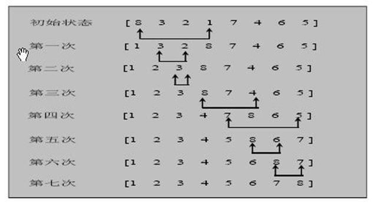
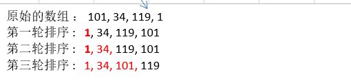
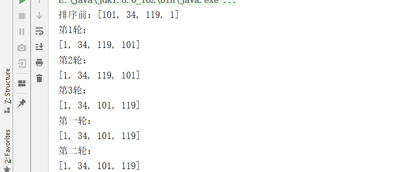
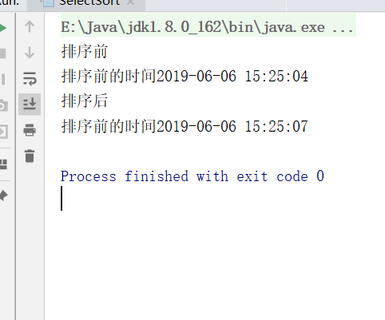

## 1.基本介绍

选择式排序也属于内部排序法，是从欲排序的数据中，按指定的规则选出某一元素，再依规定交换位置后达到排序的目的。

## 2.选择排序思想

选择排序（select sorting）也是一种简单的排序方法。它的基本思想是：第一次从arr[0]~arr[n-1]中选取最小值，与arr[0]交换，第二次从arr[1]~arr[n-1]中选取最小值，与arr[1]交换，第三次从arr[2]~arr[n-1]中选取最小值，与arr[2]交换，…，第i次从arr[i-1]~arr[n-1]中选取最小值，与arr[i-1]交换，…, 第n-1次从arr[n-2]~arr[n-1]中选取最小值，与arr[n-2]交换，总共通过n-1次，得到一个按排序码从小到大排列的有序序列。

## 3.选择排序思路分析



### 3.1思路图解



说明：
1. 选择排序一共有 数组大小 - 1 轮排序
2. 每1轮排序，又是一个循环, 循环的规则(代码)
2.1先假定当前这个数是最小数
2.2 然后和后面的每个数进行比较，如果发现有比当前数更小的数，就重新确定最小数，并得到下标
2.3 当遍历到数组的最后时，就得到本轮最小数和下标
2.4 交换 

### 3.2 代码实现

```java
package cn.smallmartial.sort;

import java.util.Arrays;

/**
 * @Author smallmartial
 * @Date 2019/6/6
 * @Email smallmarital@qq.com
 */
public class SelectSort {
    public static void main(String[] args) {
        int[] arr = {101, 34, 119, 1};
        System.out.println("排序前："+Arrays.toString(arr));
        selectSort(arr);
    }
    //选择排序
    public static void selectSort(int[] arr){

        //使用嵌套循环
        for (int i = 0; i < arr.length - 1; i++) {
            int minIndex = i;
            int min = arr[i];

            for (int j = i + 1; j < arr.length; j++) {
                if (min >arr[j]){
                    min = arr[j];
                    minIndex = j;
                }
            }
            //将最小值，放到arr[0],即交换
            if(minIndex != i){
                arr[minIndex] = arr[i];
                arr[i] = min;
            }

            System.out.println("第"+(i+1)+"轮：");
            System.out.println(Arrays.toString(arr));
        }


        //逐步推导
        int minIndex = 0;
        int min = arr[0];

        for (int j = 0 + 1; j < arr.length; j++) {
            if (min >arr[j]){
                min = arr[j];
                minIndex = j;
            }
        }
        //将最小值，放到arr[0],即交换
        if(minIndex != 0){
            arr[minIndex] = arr[0];
            arr[0] = min;
        }

        System.out.println("第一轮：");
        System.out.println(Arrays.toString(arr));

        //第二轮
         minIndex = 1;
         min = arr[1];

        for (int j = 1 + 1; j < arr.length; j++) {
            if (min >arr[j]){
                min = arr[j];
                minIndex = j;
            }
        }
        //将最小值，放到arr[0],即交换
        if(minIndex != 1){
            arr[minIndex] = arr[1];
            arr[1] = min;
        }
        System.out.println("第二轮：");
        System.out.println(Arrays.toString(arr));

        //第三轮
        minIndex = 2;
        min = arr[2];

        for (int j = 2 + 1; j < arr.length; j++) {
            if (min >arr[j]){
                min = arr[j];
                minIndex = j;
            }
        }
        //将最小值，放到arr[0],即交换
        if(minIndex !=2){
            arr[minIndex] = arr[2];
            arr[2] = min;
        }
        System.out.println("第二轮：");
        System.out.println(Arrays.toString(arr));
    }
}

```

运行结果：



### 3.3测试八万数据

```java
    public static void main(String[] args) {
        //int[] arr = {101, 34, 119, 1};
        int[] arr = new int[80000];
        for (int i = 0; i < arr.length -1 ; i++) {
            arr[i] = (int)(Math.random()*80000);
        }
        System.out.println("排序前");
       // System.out.println("排序前："+Arrays.toString(arr));
        Date data = new Date();
        SimpleDateFormat simpleDateFormat = new SimpleDateFormat("yyyy-MM-dd HH:mm:ss");
        String dataStr = simpleDateFormat.format(data);
        System.out.println("排序前的时间"+dataStr);
        selectSort(arr);
        System.out.println("排序后");
        //System.out.println("排序后："+Arrays.toString(arr));
        Date data2 = new Date();
        // SimpleDateFormat simpleDateFormat = new SimpleDateFormat("yyyy-MM-dd HH:mm:ss");
        String data2Str = simpleDateFormat.format(data2);
        System.out.println("排序前的时间"+data2Str);

    }
```

运行结果;



