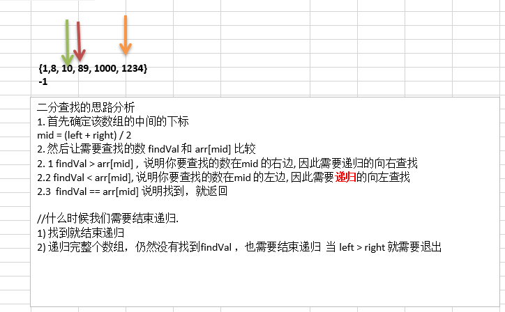
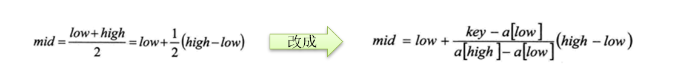
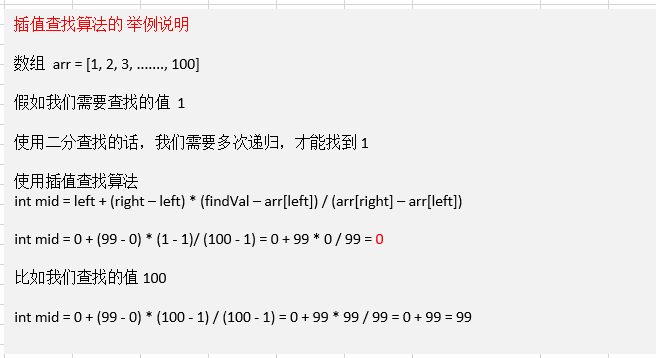

# 查找算法

	在java中，我们常用的查找有四种:
	1) 顺序(线性)查找
	2) 二分查找/折半查找
	3) 插值查找
	4) 斐波那契查找
##  1顺序查找

```java
package cn.smallmartial.search;

/**
 * @Author smallmartial
 * @Date 2019/6/11
 * @Email smallmarital@qq.com
 */
public class SepSearch {
    public static void main(String[] args) {
        int arr[] = {1,3,22,-1,90};
        int index = sepSearch(arr,11);
        if (index == -1){
            System.out.println("没有找到");
        }else {
            System.out.println("下标"+index);
        }
    }

    /**
     * 找到一个即返回
     * @param arr
     * @param value
     * @return
     */
    public static int sepSearch(int[] arr ,int value){
        for (int i = 0; i < arr.length; i++) {
            if (arr[i] == value){
                return i;
            }
        }
        return -1;
    }
}

```

## 2二分查找

### 2.1二分查找思路分析



### 2.2代码实现

```java
package cn.smallmartial.search;

/**
 * @Author smallmartial
 * @Date 2019/6/11
 * @Email smallmarital@qq.com
 */
//二分查找 前提是 数组有序
public class BinarySearch {
    public static void main(String[] args) {
        int arr[] = {1,8, 10, 89, 1000, 1234};

        int resIndex = binarySerch(arr,0,arr.length-1,-1000);
        System.out.println("resIndex = "+resIndex);
    }

    public static int binarySerch(int[] arr,int left, int right, int finalVal){

        if(left > right){
            return -1;
        }
        int mid = (left + right)/2;
        int midVal = arr[mid];

        if (finalVal > midVal){//向右遍历
            return binarySerch(arr,mid+1,right,finalVal);
        }else if(finalVal < midVal){//向左遍历
            return binarySerch(arr,left,right-1,finalVal);
        }else {
            return mid;
        }
    }
}

```

## 3插值查找

### 3.1插值查找原理介绍:

​	

- 插值查找算法类似于二分查找，不同的是插值查找每次从自适应mid处开始查找。
- 将折半查找中的求mid 索引的公式 , low 表示左边索引left, high表示右边索引right.key 就是前面我们讲的  findVal



- int mid = low + (high - low) * (key - arr[low]) / (arr[high] - arr[low])  ;/*插值索引*/对应前面的代码公式：int mid = left + (right – left) * (findVal – arr[left]) / (arr[right] – arr[left])

- 举例说明插值查找算法 1-100 的数组

  

### 3.2代码实现

```java
package cn.smallmartial.search;

import java.util.ArrayList;
import java.util.Arrays;

/**
 * @Author smallmartial
 * @Date 2019/6/11
 * @Email smallmarital@qq.com
 */
public class InsertVauleSerch {
    public static void main(String[] args) {
        int[] arr = new int[100];
        for (int i = 0; i < 100; i++) {
            arr[i] = i+1;
        }
     //   System.out.println(Arrays.toString(arr));
        int index = insertVauleSearch(arr,0,arr.length - 1,100);
        System.out.println("index = "+ index);
    }

    public static  int insertVauleSearch(int[] arr, int left ,int right ,int findVal){
        System.out.println("查找次数");
        if (left > right || findVal < arr[0] || findVal > arr[arr.length - 1 ]){
            return -1;
        }
        //求出mid
        int mid = left + (right - left) * (findVal - arr[left]) / (arr[right] - arr[left]);
        int midVal = arr[mid];

        if (findVal > midVal){ //向右递归
           return insertVauleSearch(arr,mid+1,right,findVal) ;
        }else if(findVal < midVal){
            return insertVauleSearch(arr,left,right-1,findVal);
        }else {
            return mid;
        }

    }
}

```

## 4.斐波那契(黄金分割法)查找算法

### 4.1基本介绍

- 黄金分割点是指把一条线段分割为两部分，使其中一部分与全长之比等于另一部分与这部分之比。取其前三位数字的近似值是0.618。由于按此比例设计的造型十分美丽，因此称为黄金分割，也称为中外比。这是一个神奇的数字，会带来意向不大的效果。
- 斐波那契数列 {1, 1, 2, 3, 5, 8, 13, 21, 34, 55 } 发现斐波那契数列的两个相邻数 的比例，无限接近 黄金分割值0.618

### 4.2斐波那契(黄金分割法)查找算法

斐波那契(黄金分割法)原理:
斐波那契查找原理与前两种相似，仅仅改变了中间结点（mid）的位置，mid不再是中间或插值得到，而是位于黄金分割点附近，即mid=low+F(k-1)-1（F代表斐波那契数列），如下图所示


对F(k-1)-1的理解：
由斐波那契数列 F[k]=F[k-1]+F[k-2] 的性质，可以得到 （F[k]-1）=（F[k-1]-1）+（F[k-2]-1）+1 。该式说明：只要顺序表的长度为F[k]-1，则可以将该表分成长度为F[k-1]-1和F[k-2]-1的两段，即如上图所示。从而中间位置为mid=low+F(k-1)-1           

类似的，每一子段也可以用相同的方式分割
但顺序表长度n不一定刚好等于F[k]-1，所以需要将原来的顺序表长度n增加至F[k]-1。这里的k值只要能使得F[k]-1恰好大于或等于n即可，由以下代码得到,顺序表长度增加后，新增的位置（从n+1到F[k]-1位置），都赋为n位置的值即可。

### 4.3代码实现

```java
package cn.smallmartial.search;

import java.util.Arrays;

/**
 * @Author smallmartial
 * @Date 2019/6/11
 * @Email smallmarital@qq.com
 */
public class FibSearch {
    public static int maxSize = 20;

    public static void main(String[] args) {
        int[] arr ={ 1,8,10,89,1000,1234};
        System.out.println("index="+fibSearch(arr,1234));
    }
    //斐波那契数列
    public static int[] fib(){
        int[]  f = new int[maxSize];
        f[0] = 1;
        f[1] = 1;
        for (int i = 2; i < maxSize; i++) {
            f[i] = f[i - 1] + f[ i -2 ];
        }
        return f;
    }

    public static int fibSearch(int[] a, int key){
        int low = 0;
        int high = a.length - 1;
        int k = 0; //表示斐波那契分割数值的下标
        int mid = 0; //存放mid值
        int f[] = fib();

        while (high > f[k] -1){
            k++;
        }

        int[] temp = Arrays.copyOf(a,f[k]);
        for (int i = high + 1; i < temp.length; i++) {
            temp[i] = a[high];
        }

        while (low <= high){
            mid = low +f[k -1] -1;
            if (key < temp[mid]){
                high =  mid - 1;
                k--;
            }else if(k >temp[mid]){
                low = mid + 1;
                k -= 2;
            }else {
                if (mid <= high){
                    return mid;
                }else {
                    return high;
                }
            }
        }
        return  -1;
    }
}

```

