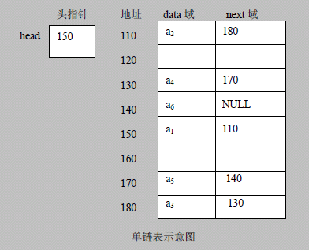
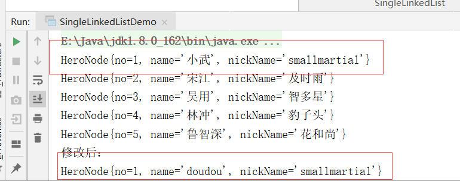

## 1. 链表介绍

链表是有序的列表，但是它在内存中是存储如下：



- 1)链表是以节点的方式来存储,是链式存储

- 2)每个节点包含 data 域， next 域：指向下一个节点.

- 3)如图：发现链表的**各个节点不一定是连续存储**.

- 4)链表分带头节点的链表和没有头节点的链表，根据实际的需求来确定

## 2.单链表介绍

单链表(带头结点) 逻辑结构示意图如下：


### 2.1单链表创建示意图


```java
class HeroNode {
  int no
  String name;
  String nickName
  HeroNode next
}

```


- 添加（创建）

1. 先创建一个head 头节点， 作用就是表示单链表的头

2. 后面我们每添加一个节点，就直接加入到  链表的最后

- 遍历：

1. 通过一个辅助变量遍历，帮助遍历整个链表

### 2.2代码实现

```java
package cn.smallmartial.demo;

/**
 * @Author smallmartial
 * @Date 2019/6/2
 * @Email smallmarital@qq.com
 */
public class SingleLinkedListDemo {
    public static void main(String[] args) {
        //测试
        //先创建节点
        HeroNode hero1 = new HeroNode(1, "小武", "smallmartial");
        HeroNode hero2 = new HeroNode(2,"宋江","及时雨");
        HeroNode hero3 = new HeroNode(3,"吴用","智多星");
        HeroNode hero4 = new HeroNode(4,"林冲","豹子头");
        HeroNode hero5 = new HeroNode(5,"鲁智深","花和尚");

        //创建链表
        SingleLinkedList singleLinkedList = new SingleLinkedList();
        //加入
        singleLinkedList.add(hero1);
        singleLinkedList.add(hero2);
        singleLinkedList.add(hero3);
        singleLinkedList.add(hero4);
        singleLinkedList.add(hero5);
        //显示
        singleLinkedList.list();

    }
}

//定义SingleLinkedList
class SingleLinkedList{
    //首先初始化一个头节点
    private HeroNode head= new HeroNode(0,"","");
    //添加节点到单项链表
    /**
     *
     * 实现思路，当不考虑编号数据时：
     * 1.找到当前链表的最后节点
     * 2.将最后这个节点的next，指向新的节点
     */

    public void add(HeroNode heroNode){
        //因为head节点不能动，所有需要一个辅助遍历temp
        HeroNode temp = head;
        //遍历链表，找到最后
        while (true){
            //尾节点next = null, 如果temp == null 则找到
            if (temp.next == null){
                break;
            }
            //如果没有找点将 temp 后移
            temp = temp.next;
        }
        //当退出while循环时，temp就指向了链表的最后
        //将最后的节点指向新的节点
        temp.next = heroNode;
    }

    //显示链表
    public void list(){
        //判断链表是否为空
        if (head.next == null){
            System.out.println("链表为空：");
            return;
        }
        //因为head节点不能动，所有需要一个辅助变量遍历
        HeroNode temp = head.next;
        while (true){
            if (temp == null){
                break;
            }
            //输出节点信息
            System.out.println(temp);
            //将temp后移
            temp = temp.next;
        }

    }
}
//定义heroNode，每个HeroNode对象就是一个节点
class HeroNode {
    public int no;
    public String name;
    public String nickName;
    public HeroNode next;//指向下一个节点

    public HeroNode(int no, String name, String nickName) {
        this.no = no;
        this.name = name;
        this.nickName = nickName;
    }

    @Override
    public String toString() {
        return "HeroNode{" +
                "no=" + no +
                ", name='" + name + '\'' +
                ", nickName='" + nickName + '\'' +
                '}';
    }
}


```

运行结果：


### 2.3单链表按顺序插入创建示意图


需要按照编号的顺序添加：
1. 首先找到新添加的节点的位置, 是通过辅助变量(指针), 通过遍历来搞定
2. 新的节点.next = temp.next
3. 将temp.next = 新的节点

### 2.4代码实现

```java
package cn.smallmartial.demo;

/**
 * @Author smallmartial
 * @Date 2019/6/2
 * @Email smallmarital@qq.com
 */
public class SingleLinkedListDemo {
    public static void main(String[] args) {
        //测试
        //先创建节点
        HeroNode hero1 = new HeroNode(1, "小武", "smallmartial");
        HeroNode hero2 = new HeroNode(2,"宋江","及时雨");
        HeroNode hero3 = new HeroNode(3,"吴用","智多星");
        HeroNode hero4 = new HeroNode(4,"林冲","豹子头");
        HeroNode hero5 = new HeroNode(5,"鲁智深","花和尚");

        //创建链表
        SingleLinkedList singleLinkedList = new SingleLinkedList();
        //加入
//        singleLinkedList.add(hero1);
//        singleLinkedList.add(hero2);
//        singleLinkedList.add(hero3);
//        singleLinkedList.add(hero4);
//        singleLinkedList.add(hero5);


        singleLinkedList.addByOrder(hero1);
        singleLinkedList.addByOrder(hero4);
        singleLinkedList.addByOrder(hero2);
        singleLinkedList.addByOrder(hero5);
        singleLinkedList.addByOrder(hero3);

        //显示
        singleLinkedList.list();

    }
}

//定义SingleLinkedList
class SingleLinkedList{
    //首先初始化一个头节点
    private HeroNode head= new HeroNode(0,"","");
    //添加节点到单项链表
    /**
     *
     * 实现思路，当不考虑编号数据时：
     * 1.找到当前链表的最后节点
     * 2.将最后这个节点的next，指向新的节点
     */

    public void add(HeroNode heroNode){
        //因为head节点不能动，所有需要一个辅助遍历temp
        HeroNode temp = head;
        //遍历链表，找到最后
        while (true){
            //尾节点next = null, 如果temp == null 则找到
            if (temp.next == null){
                break;
            }
            //如果没有找点将 temp 后移
            temp = temp.next;
        }
        //当退出while循环时，temp就指向了链表的最后
        //将最后的节点指向新的节点
        temp.next = heroNode;
    }
    //第二种方式在添加英雄时，根据排名将英雄插入到指定位置(如果有这个排名，则添加失败，并给出提示)
    public void addByOrder(HeroNode heroNode){
        //因为head节点不能动，所有需要一个辅助变量遍历
        //因为单链表，因为我们找到的temp是位于添加位置的前一个节点，否则无法插入
        HeroNode temp = head;
        boolean flag = false;//标志添加的编号是否存在，默认为false
        while (true){
            if (temp.next == null){//说明temp已经在链表的最后
                break;
            }
            if (temp.next.no > heroNode.no){//位置找到，就在temp的后面插入
                break;
            }else if (temp.next.no == heroNode.no){//说明添加的编号已经存在
                flag = true;
                break;
            }
            temp = temp.next;//后移，遍历当前链表
        }
        //判断flag的值
        if(flag){//不能添加，说明编号已经存在
            System.out.println("插入的编号已经存在"+heroNode.no);

        }else {
            //插入到链表中
            heroNode.next = temp.next;
            temp.next = heroNode;
        }
    }

    //显示链表
    public void list(){
        //判断链表是否为空
        if (head.next == null){
            System.out.println("链表为空：");
            return;
        }
        //因为head节点不能动，所有需要一个辅助变量遍历
        HeroNode temp = head.next;
        while (true){
            if (temp == null){
                break;
            }
            //输出节点信息
            System.out.println(temp);
            //将temp后移
            temp = temp.next;
        }

    }
}
//定义heroNode，每个HeroNode对象就是一个节点
class HeroNode {
    public int no;
    public String name;
    public String nickName;
    public HeroNode next;//指向下一个节点

    public HeroNode(int no, String name, String nickName) {
        this.no = no;
        this.name = name;
        this.nickName = nickName;
    }

    @Override
    public String toString() {
        return "HeroNode{" +
                "no=" + no +
                ", name='" + name + '\'' +
                ", nickName='" + nickName + '\'' +
                '}';
    }
}


```

###  2.5修改节点

```java
   //修改节点的信息，根据no修改，即no不能改变
    //根据新的节点 no修改
    public void update(HeroNode newHeroNode){
        //判断是否为空
        if (head.next == null){
            System.out.println("链表为空：");
            return;
        }

        //定义一个辅助变量
        HeroNode temp = head.next;
        boolean flag = false;//表示是否找到该节点
        while (true){
            if (temp == null){
                break;//遍历完
            }
            if (temp.no == newHeroNode.no){
                //找到
                flag = true;
                break;
            }
            temp = temp.next;

        }
        //根据flag判断是否要修改的节点
        if (flag){
            temp.name = newHeroNode.name;
            temp.nickName = newHeroNode.nickName;
        }else {
            System.out.println("未找到该节点"+newHeroNode.no);
        }
    }
```

运行结果



### 2.6删除节点思路


从单链表中删除一个节点的思路
1.  我们先找到 需要删除的这个节点的前一个节点 temp
2.  temp.next = temp.next.next
3. 被删除的节点，将不会有其它引用指向，会被垃圾回收机制回收

### 2.7代码实现

```java
 /**
     * 删除节点
     * 1.heaa不能动，我们需要一个temp的辅助节点找到待删除节点的前一节点
     *2. temp.next.no 和需要删除节点的no进行比较
     *
     */

    public void delete(int no){
        HeroNode temp = head;
        boolean flag = false;//标志是否找到
        while (true){
            if (temp.next == null){
                break;
            }
            if (temp.next.no == no){
                flag = true;//已经找到
                break;
            }
            temp = temp.next;//遍历
        }
        if (flag){
            //删除
            temp.next = temp.next.next;
        }else {
            System.out.println("未找到删除的节点"+no);
        }
    }

```

