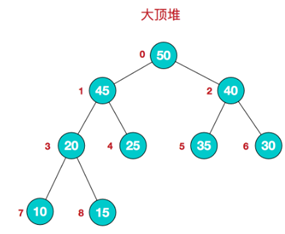
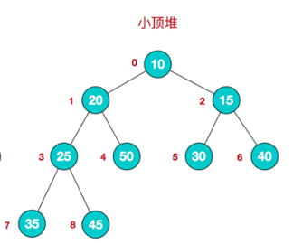

## 1.堆排序基本介绍

- 堆排序是利用堆这种数据结构而设计的一种排序算法，堆排序是一种选择排序，它的最坏，最好，平均时间复杂度均为O(nlogn)，它也是不稳定排序。

- 堆是具有以下性质的完全二叉树：每个结点的值都大于或等于其左右孩子结点的值，称为大顶堆, 注意 : 没有要求结点的左孩子的值和右孩子的值的大小关系。

- 每个结点的值都小于或等于其左右孩子结点的值，称为小顶堆

- 大顶堆举例说明

  

- 小顶堆举例说明

  


## 2.排序的基本思想

- 将待排序序列构造成一个大顶堆
- 此时，整个序列的最大值就是堆顶的根节点。
- 将其与末尾元素进行交换，此时末尾就为最大值。
- 然后将剩余n-1个元素重新构造成一个堆，这样会得到n个元素的次小值。如此反复执行，便能得到一个有序序列了。

## 3.代码

```java
package cn.smallmartial.tree;

import java.util.Arrays;

/**
 * @Author smallmartial
 * @Date 2019/6/17
 * @Email smallmarital@qq.com
 */
public class HeapSort {
    public static void main(String[] args) {
        //数组升序排列
        int arr[] = {4,6,8,5,9};
        int temp =0;
//        adjustHeap(arr,1,arr.length);
//        System.out.println("第一次"+ Arrays.toString(arr));//4.9.8.5,6.
//
//        adjustHeap(arr,0,arr.length);
//        System.out.println("第二次"+Arrays.toString(arr));

        for (int i = arr.length/2 -1; i >=0 ; i--) {
            adjustHeap(arr,i,arr.length);
        }
        for (int j = arr.length -1; j >0; j--) {
            temp =  arr[j];
            arr[j] = arr[0];
            arr[0] =temp;
            adjustHeap(arr,0,j);

        }
        System.out.println(Arrays.toString(arr));
    }
    //编写一个堆排序的方法
    public static void heapSort(int arr[]){
        System.out.println("堆排序");
    }
    //将一个数组调整成一个大顶堆

    public static void adjustHeap(int arr[],int i, int length){
        int temp = arr[i];

        for (int k = i*2 + 1; k < length; k=k*2+1) {
            if (k+1 <length && arr[k] <arr[k+1]){
                k++;
            }
            if (arr[k] >temp){
                arr[i] = arr[k];
                i = k;
            }else {
                break;
            }
        }

        arr[i] = temp;
    }
}

```

