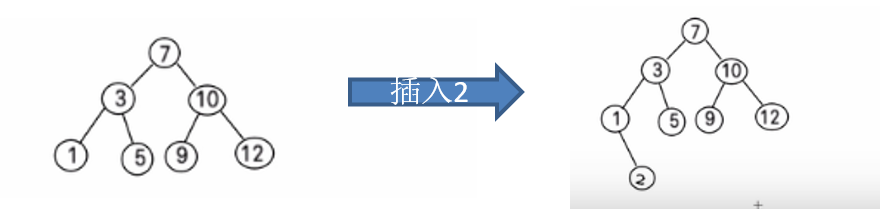
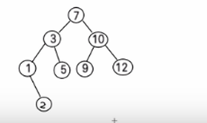

# 二叉排序数

## 1.二叉排序树介绍

二叉排序树：BST: (Binary Sort(Search) Tree), 对于二叉排序树的任何一个非叶子节点，要求左子节点的值比当前节点的值小，右子节点的值比当前节点的值大。

**特别说明**：如果有相同的值，可以将该节点放在左子节点或右子节点

比如针对前面的数据 (7, 3, 10, 12, 5, 1, 9) ，对应的二叉排序树为：



代码实现：

```java
package cn.smallmartial.binarySortTree;

/**
 * @Author smallmartial
 * @Date 2019/6/21
 * @Email smallmarital@qq.com
 */
public class BinarySortTreeDemo {
    public static void main(String[] args) {
        int[] arr = {7,3,10,12,5,1,9};
        BinarySortTree binarySortTree = new BinarySortTree();
        for (int i = 0; i < arr.length; i++) {
            binarySortTree.add(new Node(arr[i]));
        }
        System.out.println("中序遍历二叉树");
        binarySortTree.infixOrder();
    }
}
//创建二叉排序树
class BinarySortTree{
    private Node root;
    //添加节点的方法
    public void add(Node node){
        if (root == null){
            root = node;
        }else {
            root.add(node);
        }
    }
    //中序遍历
    public void infixOrder(){
        if (root != null){
            root.infixOrder();
        }else {
            System.out.println("二叉树为空，不能遍历");
        }
    }
}

//创建Node结点
class Node{

    int value;
    Node left;
    Node right;

    public Node(int value) {
        this.value = value;
    }

    @Override
    public String toString() {
        return "Node{" +
                "value=" + value +
                '}';
    }

    //添加节点方法
    public void add(Node node){
        if (node == null){
            return;
        }

        //判断传入结点的值，和当前子树的根节点的关系
        if (node.value < this.value){
            //如果当前左子节点为null
            if (this.left == null){
                this.left = node;
            }else {
                this.left.add(node);
            }
        }else {
            if (this.right == null){
                this.right = node;
            }else {
                this.right.add(node);
            }
        }
    }

    //中序遍历
    public void infixOrder(){
        if (this.left != null){
            this.left.infixOrder();
        }

        System.out.println(this);

        if (this.right !=null){
            this.right.infixOrder();
        }

    }

}
```

## 2.二叉排序树的删除

二叉排序树的删除情况比较复杂，有下面三种情况需要考虑

1)删除叶子节点 (比如：2, 5, 9, 12)

2)删除只有一颗子树的节点 (比如：1)

3)删除有两颗子树的节点. (比如：7, 3，10 )



### 2.1思路分析

- 第一种情况:
  删除叶子节点 (比如：2, 5, 9, 12)
  思路
  (1) 需求先去找到要删除的结点  targetNode
  (2)  找到targetNode 的 父结点 parent 
  (3)  确定 targetNode 是 parent的左子结点 还是右子结点
  (4)  根据前面的情况来对应删除
  左子结点 parent.left = null
  右子结点 parent.right = null;

- 第二种情况: 删除只有一颗子树的节点 比如 1
  思路
  (1) 需求先去找到要删除的结点  targetNode
  (2)  找到targetNode 的 父结点 parent 
  (3) 确定targetNode 的子结点是左子结点还是右子结点
  (4) targetNode 是 parent 的左子结点还是右子结点
  (5) 如果targetNode 有左子结点

  5.1 如果 targetNode 是 parent 的左子结点
  parent.left = targetNode.left;
  5.2  如果 targetNode 是 parent 的右子结点
  parent.right = targetNode.left;
  (6) 如果targetNode 有右子结点
  6.1 如果 targetNode 是 parent 的左子结点
  parent.left = targetNode.right;
  6.2 如果 targetNode 是 parent 的右子结点
  parent.right = targetNode.right

  

- 情况三 ： 删除有两颗子树的节点. (比如：7, 3，10 )
  思路
  (1) 需求先去找到要删除的结点  targetNode
  (2)  找到targetNode 的 父结点 parent 
  (3)  从targetNode 的右子树找到最小的结点
  (4) 用一个临时变量，将 最小结点的值保存 temp = 11
  (5)  删除该最小结点
  (6)  targetNode.value = temp

### 2.2代码实现

```java
package cn.smallmartial.binarySortTree;

/**
 * @Author smallmartial
 * @Date 2019/6/21
 * @Email smallmarital@qq.com
 */
public class BinarySortTreeDemo {
    public static void main(String[] args) {
        int[] arr = {7,3,10,12,5,1,9,2};
        BinarySortTree binarySortTree = new BinarySortTree();
        for (int i = 0; i < arr.length; i++) {
            binarySortTree.add(new Node(arr[i]));
        }
        System.out.println("中序遍历二叉树");
        binarySortTree.infixOrder();

       // binarySortTree.delNode(2);
        //binarySortTree.delNode(5);
      //  binarySortTree.delNode(1);
        binarySortTree.delNode(7);

        System.out.println("删除键节点后");
        binarySortTree.infixOrder();
    }
}
//创建二叉排序树
class BinarySortTree{
    private Node root;

    //查找要删除的节点
    public Node search(int value){
        if (root == null){
            return null;
        }else {
            return root.search(value);
        }
    }

    //查找父节点
    public Node searchParent(int value){
        if (root == null){
            return null;
        }else {
            return root.searchParent(value);
        }
    }

    /**
     *
     * @param node 传入节点 作为二叉排序树的根节点
     * @return
     */
    public int delRightTreeMin(Node node){
        Node target = node;
        while (target.left != null){
            target = target.left;
        }
        //删除最小节点
        delNode(target.value);
        return target.value;
    }

    //删除节点
    public void delNode(int value){
        if (root == null){
            return;
        }else {
            Node targetNode = search(value);
            if (targetNode == null){
                return;
            }

            if (root.left == null && root.right == null){
                root = null;
                return;
            }

            //去找到targetNode的父节点
            Node parent = searchParent(value);

            if (targetNode.left == null && targetNode.right == null){
                //判断targetNode是父节点的左子节点还是右子节点
                if (parent.left != null && parent.left.value == value){
                    parent.left  = null;
                }else if (parent.right != null && parent.right.value == value){
                    parent.right = null;
                }
            }else if (targetNode.left!= null && targetNode.right !=null){//删除有2颗子树的节点
                int minVal = delRightTreeMin(targetNode.right);
                targetNode.value = minVal;
            }else {//删除只有一颗子树的节点
            if (targetNode.left !=null){
                if (parent.left.value == value){
                    parent.left = targetNode.left;
                }else {
                    parent.right = targetNode.left;
                }
            }else {
                if (parent.left.value == value){
                    parent.left = targetNode.right;
                }else {
                    parent.right = targetNode.right;
                }
            }

            }
        }


    }

    //添加节点的方法
    public void add(Node node){
        if (root == null){
            root = node;
        }else {
            root.add(node);
        }
    }
    //中序遍历
    public void infixOrder(){
        if (root != null){
            root.infixOrder();
        }else {
            System.out.println("二叉树为空，不能遍历");
        }
    }
}

//创建Node结点
class Node{

    int value;
    Node left;
    Node right;

    public Node(int value) {
        this.value = value;
    }

    /**
     *查找删除的节点
     * @param value
     * @return
     */
    //查找删除节点
    public Node search(int value){
        if (value == this.value){
            return this;
        }else  if(value <this.value){//如果查找当前的值小于当前节点，向左递归查找
            //如果左子节点为空
            if (this.left == null){
                return null;
            }
            return this.left.search(value);
        }else {//如果查找当前的值不小于当前节点，向小递归查找
            if (this.right == null){
                return null;
            }
            return this.right.search(value);

        }
    }
    //查找要删除节点的父节点
    public Node searchParent(int value){
        if (this.left != null && this.left.value == value ||(this.right != null && this.right.value == value)){
            return this;
        }else {
            //如果查找的值小于当前结点的值，并且当前节点的左子节点不为空
            if (value < this.value && this.left != null){
                return this.left.searchParent(value);
            }else if (value >= this.value && this.right != null){
                return this.right.searchParent(value);
            }else {
                return null;
            }
        }
    }

    @Override
    public String toString() {
        return "Node{" +
                "value=" + value +
                '}';
    }

    //添加节点方法
    public void add(Node node){
        if (node == null){
            return;
        }

        //判断传入结点的值，和当前子树的根节点的关系
        if (node.value < this.value){
            //如果当前左子节点为null
            if (this.left == null){
                this.left = node;
            }else {
                this.left.add(node);
            }
        }else {
            if (this.right == null){
                this.right = node;
            }else {
                this.right.add(node);
            }
        }
    }

    //中序遍历
    public void infixOrder(){
        if (this.left != null){
            this.left.infixOrder();
        }

        System.out.println(this);

        if (this.right !=null){
            this.right.infixOrder();
        }

    }

}
```

