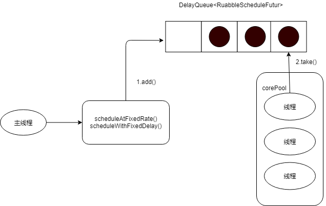

## Java并发编程基础（十一）

## 1.ScheduledThreadPoolExectuor

ScheduledThreadPoolExectuor继续自ThreadPoolExecutor.它主要用来在给定的延迟线程之后运行任务，或者定期执行任务。Timer对应的是单个后台线程，而ScheduledThreadPoolExecutor可以在构造函数中指定多个对应的后台线程数。

## 2.ScheduledThreadPoolExectuor运行机制



DelayQueue是一个无界队列，所以ThreadPoolExecutor的maximunPoolSize在Scheduled-ThreadPoolExecutor中没有什么意义。

## 2.1执行流程

1.当调用ScheduledThreadPoolExectuor的scheduleAtFixRate()方法或者scheduleWithFixedDelay()方法时，会向ScheduledThreadPoolExectuor的DelayQueue添加一个实现了RuabbleScheduleFutur接口的ScheduledFutureTask.

2.线程池中的线程从DelayQueue中获取ScheduledFutureTask，然后执行任务。

## 2.2跟ThreadPoolExectuor的区别

- 使用DelayQueue作为任务队列
- 获取任务的方式不同
- 执行周期任务后，增加了额外的处理机制

## 3.ScheduledThreadPoolExectuor运行机制

ScheduledFutureTask主要包含3个成员变量：

- long型成员变量time,表示这个任务将要被执行的具体时间。
- long型成员变量sequenceNumber,表示这个任务添加ScheduledThreadPoolExectuor中的序号
- long型成员变量period,表示任务执行的间隔周期。


- 1.线程1从DelayQueue中获取已到期的ScheduledFutureTask(DelayQueue.take()).到期任务是ScheduledFutureTask的time大于等于当前时间。
- 线程1执行这个ScheduledFutureTask。
- 线程1修改ScheduledFutureTask的time变量为下次将要被执行的时间
- 线程1把修改的time之后的SchedledFutureTask放回DelayQueue(DelayQueue.add())

### 3.1DelayQueue.take()源码实现

```java
public E take() throws InterruptedException {
        final ReentrantLock lock = this.lock;
        lock.lockInterruptibly();
        try {
            for (;;) {
                E first = q.peek();
                if (first == null)
                    available.await();
                else {
                    long delay = first.getDelay(NANOSECONDS);
                    if (delay <= 0)
                        return q.poll();
                    first = null; // don't retain ref while waiting
                    if (leader != null)
                        available.await();
                    else {
                        Thread thisThread = Thread.currentThread();
                        leader = thisThread;
                        try {
                            available.awaitNanos(delay);
                        } finally {
                            if (leader == thisThread)
                                leader = null;
                        }
                    }
                }
            }
        } finally {
            if (leader == null && q.peek() != null)
                available.signal();
            lock.unlock();
        }
    }
```

> 执行示意图如下：


1. 获取锁
2. 获取周期任务
   - 如果PriorityQueue为空，当前线程到Condition中等待。否则执行2.2
   - 如果PriorityQueue的头元素的time时间比当前时间大，到Condition中等待到time时间；否则执行2.3
   - 获取PriorityQueue的头元素2.3.1,如果PriorityQueue不为空，则唤醒在Condition中等待的所有线程
3. 释放Lock

### 3.2DelayQueue.add()源码实现

```java
public boolean offer(E e) {
        final ReentrantLock lock = this.lock;
        lock.lock();
        try {
            q.offer(e);
            if (q.peek() == e) {
                leader = null;
                available.signal();
            }
            return true;
        } finally {
            lock.unlock();
        }
    }
```

> 执行示意图如下：


1. 获取Lock
2. 添加任务
   - 向PriorityQueue添加任务
   - 如果2.1中添加的任务是PriorityQueue的头元素，唤醒在Condition中等待的线程
3. 释放锁

## 往期回顾

1. 
2.    
3.  
4.  
5.  
6.  
7.  
8.  
9.  
10.  


