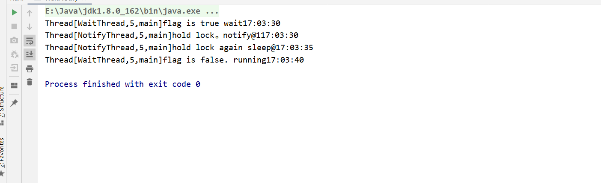
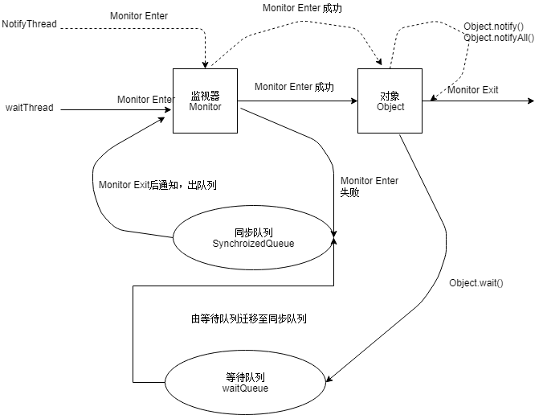
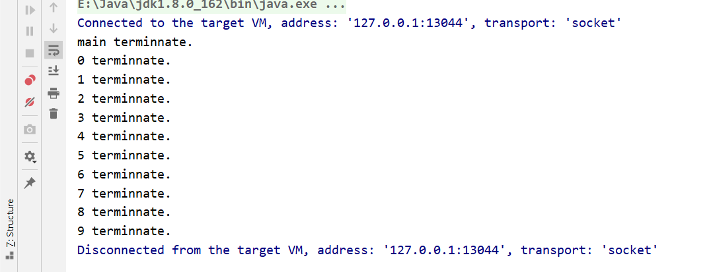
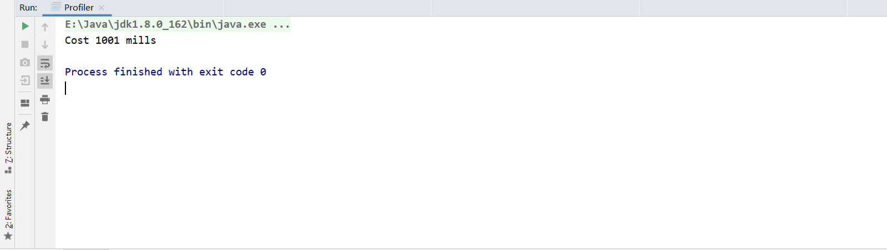

# Java并发基础（三）

## 1.等待/通知机制

等待/通知的相关方法是任意java对象都具备的，因为这些方法被定义在所有对象的超类``java.lang.Object``

- notify()
- notifyAll()
- wait(long)
- wait(long,int)

等待/通知机制是指一个线程A调用了对象O的wait()方法进入等待状态，而另一个线程B调用了对象O的notify()或者notifyAll()方法，线程A收到通知后从对象O的wait()的方法返回，进而执行后续的操作。

```java
package cn.smallmartial.concurrency;

import java.text.SimpleDateFormat;
import java.util.Date;

/**
 * @Author smallmartial
 * @Date 2019/8/24
 * @Email smallmarital@qq.com
 */
public class WaitNotify {
    static boolean flag = true;
    static Object lock = new Object();

    public static void main(String[] args) {
        Thread waitThread = new Thread(new Wait(), "WaitThread");
        waitThread.start();
        Thread notifyThread = new Thread(new Notify(), "NotifyThread");
        notifyThread.start();
    }

    static class Wait implements Runnable{

        @Override
        public void run() {
            //加锁 拥有lock的Monitor
            synchronized (lock){
                //当条件不满足时，继续wait等待，同时释放lock锁
                while (flag){
                    try {
                        System.out.println(Thread.currentThread()+"flag is true wait"+
                                new SimpleDateFormat("HH:mm:ss").format(new Date()));
                        lock.wait();
                    } catch (InterruptedException e) {
                        e.printStackTrace();
                    }
                }
                //条件满足时，完成工作
                System.out.println(Thread.currentThread()+"flag is false. running"+
                        new SimpleDateFormat("HH:mm:ss").format(new Date()));

            }
        }
    }

    static class Notify implements Runnable{

        @Override
        public void run() {
            //加锁 拥有lock的montior
            synchronized (lock){
                //获取lock的锁，然后进行通知，通知时不会释放lock的锁
                //直到当前线程释放了lock后，waitThread才能从wait方法中返回
                System.out.println(Thread.currentThread()+"hold lock。notify@1"+
                        new SimpleDateFormat("HH:mm:ss").format(new Date()));
                lock.notifyAll();
                flag = false;
                SleepUtils.second(5);
            }
            //再次加锁
            synchronized (lock){
                System.out.println(Thread.currentThread()+"hold lock again sleep@"+
                        new SimpleDateFormat("HH:mm:ss").format(new Date()));
                SleepUtils.second(5);
            }
        }
    }
}

```



等待/通知机制依托于同步机制，其目的是确保等待线程wait()返回时能够感知到线程对变量做出的修改

> 等待/通知示意图



## 2.等待/通知的经典范式

等待方（消费者）遵循以下原则

1. 获取对象的锁

2. 如果条件不满足时，那么调用对象的wait()方法，被通知仍要检查条件

3. 条件满足则执行对应的逻辑

   ```java
   synchronized(对象){
       while(条件不满足时){
           对象.wait()
       }
       对象处理的逻辑
   }
       
   ```

通知方（生产者）遵循如下原则

1. 获取对象的锁

2. 改变条件

3. 通知所有等待在对象上的线程

   ```java
   synchronized(对象){
       改变条件
       对象。notifyAll();
       
   }
   ```

## 3.Thread.join（）使用

如果一个线程A执行了thread.join（）的语句，其含义是：当前线程A等待thread线程终止之后才能从thread.join返回。

```java
package cn.smallmartial.concurrency;

import java.util.concurrent.TimeUnit;

/**
 * @Author smallmartial
 * @Date 2019/8/24
 * @Email smallmarital@qq.com
 */
public class Join {
    public static void main(String[] args) throws InterruptedException {
        Thread previous = Thread.currentThread();
        for (int i = 0; i < 10; i++) {
            Thread thread = new Thread(new Domino(previous), String.valueOf(i));
            thread.start();
            previous = thread;
        }
        TimeUnit.SECONDS.sleep(5);
        System.out.println(Thread.currentThread().getName()+" terminnate.");
    }

    static class Domino implements Runnable{
        private Thread thread;

        public Domino(Thread thread) {
            this.thread = thread;
        }

        @Override
        public void run() {
            try {
                thread.join();
            } catch (InterruptedException e) {
                e.printStackTrace();
            }
            System.out.println(Thread.currentThread().getName()+" terminnate.");
        }
    }
}

```



每个线程终止的前提条件是前驱线程的终止，每个线程等待前驱线程终止后，才能从join方法返回。

## 4.ThreadLocal使用

ThreadLocal即线程变量，是一个以ThreadLocal对象为键，任意对象为值的存储结构。这个对象可以被附带在线程上，也就是说一个线程可以根据一个ThreadLocal对象查询到绑定在这个线程上的一个值。

```java
package cn.smallmartial.concurrency;

import java.util.concurrent.TimeUnit;

/**
 * @Author smallmartial
 * @Date 2019/8/24
 * @Email smallmarital@qq.com
 */
public class Profiler {
    private static final ThreadLocal<Long> TIME_THREADLOCAL = new ThreadLocal<Long>(){
        protected Long initialValue(){
            return System.currentTimeMillis();
        }
    };

    public static final void begin(){
        TIME_THREADLOCAL.set(System.currentTimeMillis());
    }

    public static final long end(){
        return System.currentTimeMillis()-TIME_THREADLOCAL.get();
    }

    public static void main(String[] args) throws InterruptedException {
        Profiler.begin();
        TimeUnit.SECONDS.sleep(1);
        System.out.println("Cost "+Profiler.end()+" mills");
    }
}

```



`

