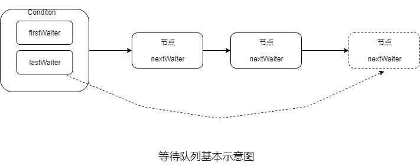
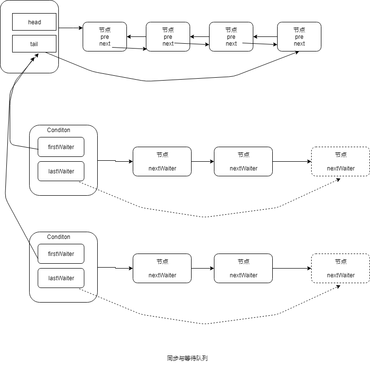
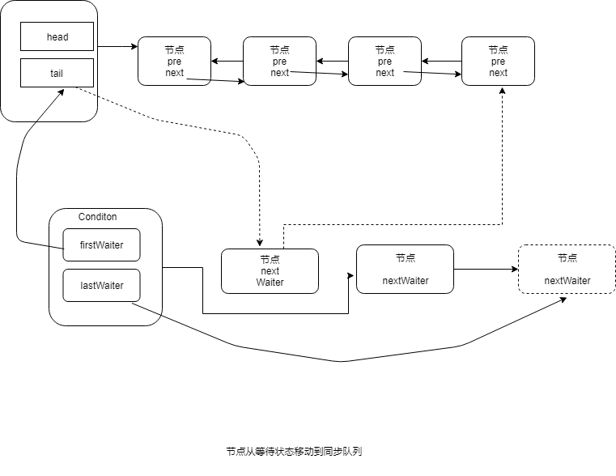
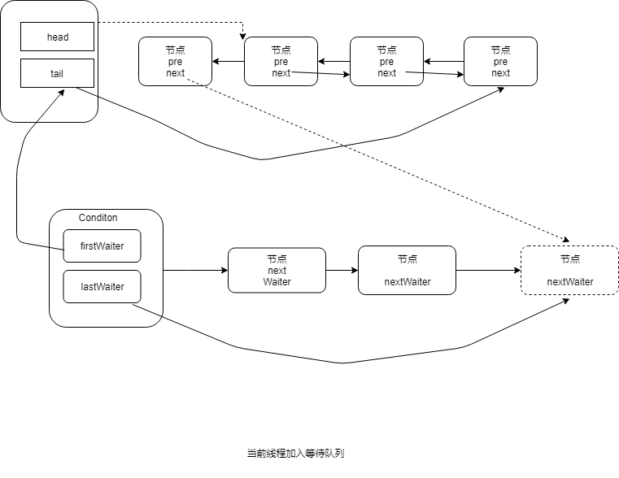

##  Java并发基础（六）

## 1.Condition接口

- 任意一个java对象都拥有一组监视器方法，主要包括wait()、wait(long timeout)、notify()以及notifyAll()方法。这些方法与synchronized同步关键字配合，可以实现等待和通知模式。

- Condition接口提供了类似的监视方法。


## 2.示例

```java
package cn.smallmartial.concurrency;

import java.util.concurrent.locks.Condition;
import java.util.concurrent.locks.Lock;
import java.util.concurrent.locks.ReentrantLock;

/**
 * @Author smallmartial
 * @Date 2019/8/27
 * @Email smallmarital@qq.com
 */
public class ConditionUseCase {
    Lock lock = new ReentrantLock();
    Condition condition = lock.newCondition();
    
    public void conditionWait() throws InterruptedException {
        lock.lock();
        try {
            condition.await();
        } finally {
            lock.unlock();
        }
    }
    
    public void conditionSignal() throws InterruptedException{
        lock.lock();
        try {
            condition.notify();
        } finally {
            lock.unlock();
        }
    }
    
}

```

当调用await()方法后，当前线程会释放锁并且在此等待，而其他线程调用Condition对象的signal（）方法，通知当前线程后，当前线程才能从await()方法返回，并且再返回前已经获取锁。

## 3.Condition的实现和分析

## 3.1等待队列

- 等待队列是一个FIFO的队列，在队列中的每一个节点都包含了一个线程的引用，该线程是在Conditon对象上等待的线程，如果一个线程调用了Condition.await(）方法，那么该线程将会释放锁、构造成节点加入等待队列并进入等待状态。

- 一个Conditon包含一个等待队列，Conditon拥有首节点和尾节点，当前线程调用Conditon.await()方法，将会以当前线程构造节点，并将节点从尾部加入等待队列。

  



- 在Object对象上，一个对象拥有一个同步队列和等待队列

  

## 3.2等待

调用Conditon的await()方法时，会使当前线程进入等待队列并释放锁，同时线程状态变为等待状态。

```java
        public final void await() throws InterruptedException {
            if (Thread.interrupted())
                throw new InterruptedException();
            Node node = addConditionWaiter();
            long savedState = fullyRelease(node);
            int interruptMode = 0;
            while (!isOnSyncQueue(node)) {
                LockSupport.park(this);
                if ((interruptMode = checkInterruptWhileWaiting(node)) != 0)
                    break;
            }
            if (acquireQueued(node, savedState) && interruptMode != THROW_IE)
                interruptMode = REINTERRUPT;
            if (node.nextWaiter != null) // clean up if cancelled
                unlinkCancelledWaiters();
            if (interruptMode != 0)
                reportInterruptAfterWait(interruptMode);
        }
```


## 3.3通知

调用signal方法时，会唤醒在等待队列中等待时间最长的节点（首节点），在唤醒 之前会将节点加入到首队列中。

