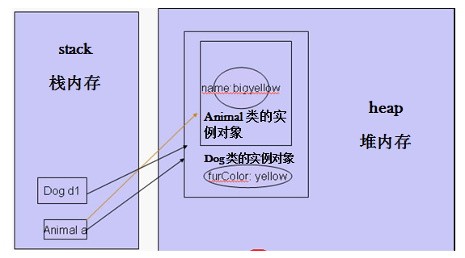
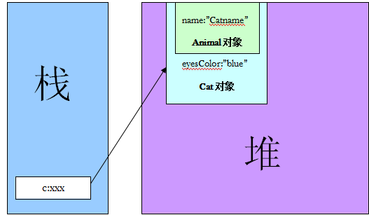
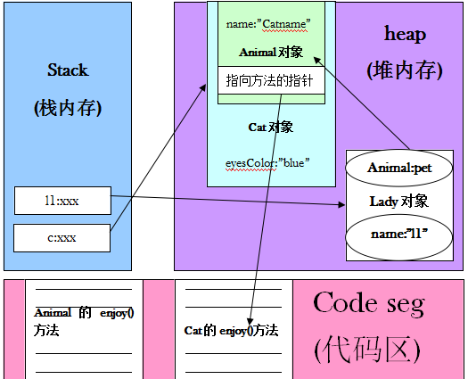

# Java基础知识点（二）

## 1.方法的重写

- 在子类中可以根据需求对基类中继承的方法进行重写
- 重写方法必须和被重写方法具有相同的方法名称，参数列表和返回类型
- 重写方法不能使用比被重写方法更严格的访问权限

```java
class Person{
    private int age;
    private String name;
    
    public void setAge(int age){
        this.age = age;
    }
    public void setName(String name){
        this.name = name;
    }
    public int getAge(){
        return age;
    }
    public String getName(){
        return name;
    }
    
    public String getInfo(){
        return "Name is:"+name+",Age is "+age;
    }
}
class Student extends Person{
    private String school;
    
    public void setSchool(String school){
        this.school = school;
    }
    public String getSchool(){
        return school;
    }
    public String getInfo(){
        return "Name is:"+getName()+",Age is "+getAge()+",School is:"+school;
    }
}
public class TestOverRide{
    public static void main (String args[]){
        Student student = new Student();
        Person person = new Person();
        person.setAge(1000);
        person.setName("lili");
        
        student.setAge(23);
        student.setName("vic");
        student.setSchool("shnu");
        
        System.out.println(person.getInfo());
        System.out.println(student.getInfo());
    }
}
```


## 2.super关键字

- 在java中使用`super`来引用基类的成分

```java
class Animal{
   public void move(){
      System.out.println("动物可以移动");
   }
}
 
class Dog extends Animal{
   public void move(){
      super.move(); // 应用super类的方法
      System.out.println("狗可以跑和走");
   }
}
 
public class TestDog{
   public static void main(String args[]){
 
      Animal b = new Dog(); // Dog 对象
      b.move(); //执行 Dog类的方法
 
   }
}
```

## 3.继承中的构造方法

- 子类的构造的过程中必须使用其基类的构造方法
- 子类可以在自己的构造方法中使用super调用其基本的构造方法
  - 使用this调用本类中的另外构造方法
  - 如果调用super,必须写在子类构造方法的第一行
- 如果子类的构造方法中没有显示的调用基类的构造方法，则系统默认调用的基类无参数的构造方法
- 如果子类的构造方法中既没有显示的调用基类的构造方法，而基类中又没有无参的构造方法，则编译出错

## 4.Object类

- Object类是所有java类的根基类

```java
public class Persion{
  ...
}
//等价于：
public class Person extends Object{
  
}

```

## 5.toString方法

- Object类中定义有`public String toString()的方法，其返回值是String类型，描述当前对象的有关信息`
- 在进行String与其他类型连接操作时，将自动调用该对象类的toString方法。
- 可以根据需要在用户自定义类中重写toString()方法。

```java
public class TestDog{
   public static void main(String args[]){
 
      Dog d = new Dog(); // Dog 对象
      System.out.println("d:="+d);
 
   }
}
//对toString方法进行重写
class Dog(){
    public String toString(){
    	return "I'm a cool Dog";    
    }
}
```

## 6.equals方法

- `public boolean equals(Object object)`方法，提供定义对象是否相等的逻辑。
- Object的equals方法定义为：x.equals(y)当x和y是同一个对象时应该返回true,否则返回false.
- 可以根据需要在用户自定义的类型中重写equals方法

```java
public class TestEquals{
   public static void main(String[] args){
       Cat c1 = new Cat(1,2,3);
       Cat c2 = new Cat(1,2,3);
       System.out.println(c1.equals(c2));
   }
}
class Cat(){
    int color;
    int height;
    int weight;
    
    public Cat(int color ,int height, int weight){
        this.color = color;
        this.height = height;
        this,weight = weight;
    }
    
    public boolean equals(Object obj){
        if(obj == null){
            return false;
        }else{
            if(obj instanceof cat){
                Cat c = (Cat) obj;
                if(c.color == this.color &&c.height == 				this.height && c.weight == this.weight){
                    return true;
                }
            }
        }
       return false; 
    }
}
```

## 7.对象转型（casting）

- 一个基类的引用类型变量可以指向其子类的对象
- 一个基类的引用不可以访问其子类对象新增的成员（属性和方法）
- 可以使用引用变量instanceof类名来判断引用型变量所指向的对象是否属于该类或者该类的子类。
- 子类的对象可以当作基类的对象来使用称作为向上转型，反之称作为向下转型。

```java
/**
 * 父类Animal
 * @author gacl
 *
 */
class Animal {

    public String name;

    public Animal(String name) {
        this.name = name;
    }
}

/**
 * 子类Cat继承Animal
 * @author gacl
 *
 */
class Cat extends Animal {

    /**
     * Cat添加自己独有的属性
     */
    public String eyeColor;

    public Cat(String n, String c) {
        super(n);//调用父类Animal的构造方法
        this.eyeColor = c;
    }
}

/**
 * 子类Dog继承Animal
 * @author gacl
 *
 */
class Dog extends Animal {
    /**
     * Dog类添加自己特有的属性
     */
    public String furColor;

    public Dog(String n, String c) {
        super(n);//调用父类Animal的构造方法
        this.furColor = c;
    }

}

/**
 * 下面是这三个类的测试程序
 * @author gacl
 *
 */
public class TestClassCast {

    /**
     * @param args
     */
    public static void main(String[] args) {

        Animal a = new Animal("name");
        Cat c = new Cat("catname","blue");
        Dog d = new Dog("dogname", "black");
        /**
         * a instanceof Animal这句话的意思是a是一只动物吗？
         * a是Animal这个类里面的是一个实例对象，所以a当然是一只动物，其结果为true。
         */
        System.out.println(String.format("a instanceof Animal的结果是%s",a instanceof Animal));//true
        /**
         * c是Cat类的实例对象的引用，即c代表的就是这个实例对象，
         * 所以“c是一只动物”打印出来的结果也是true。
         * d也一样，所以“d是一只动物”打印出来的结果也是true。
         */
        System.out.println(String.format("c instanceof Animal的结果是%s",c instanceof Animal));//true
        System.out.println(String.format("d instanceof Animal的结果是%s",d instanceof Animal));//true
        /**
         * 这里判断说“动物是一只猫”，不符合逻辑，所以打印出来的结果是false。
         */
        System.out.println(String.format("a instanceof Cat的结果是%s",a instanceof Cat));
        /**
         * 这句话比较有意思了，a本身是Animal类的实例对象的引用，
         * 但现在这个引用不指向Animal类的实例对象了，而是指向了Dog这个类的一个实例对象了，
         * 这里也就是父类对象的引用指向了子类的一个实例对象。
         */
        a = new Dog("bigyellow", "yellow");
        System.out.println(a.name);//bigyellow
        /**
         * 这里的furColor属性是子类在继承父类的基础上新增加的一个属性，是父类没有的。
         * 因此这里使用父类的引用对象a去访问子类对象里面新增加的成员变量是不允许的，
         * 因为在编译器眼里，你a就是Animal类对象的一个引用对象，你只能去访问Animal类对象里面所具有的name属性，
         * 除了Animal类里面的属性可以访问以外，其它类里面的成员变量a都没办法访问。
         * 这里furColor属性是Dog类里面的属性，因此你一个Animal类的引用是无法去访问Dog类里面的成员变量的，
         * 尽管你a指向的是子类Dog的一个实例对象，但因为子类Dog从父类Animal继承下来，
         * 所以new出一个子类对象的时候，这个子类对象里面会包含有一个父类对象，
         * 因此这个a指向的正是这个子类对象里面的父类对象，因此尽管a是指向Dog类对象的一个引用，
         * 但是在编译器眼里你a就是只是一个Animal类的引用对象，你a就是只能访问Animal类里面所具有的成员变量，
         * 别的你都访问不了。
         * 因此一个父类(基类)对象的引用是不可以访问其子类对象新增加的成员(属性和方法)的。
         */
        //System.out.println(a.furColor);
        System.out.println(String.format("a指向了Dog，a instanceof Animal的结果是%s",a instanceof Animal));//true
        /**
         * 这里判断说“a是一只Dog”是true。
         * 因为instanceof探索的是实际当中你整个对象到底是什么东西，
         * 并不是根据你的引用把对象看出什么样来判断的。
         */
        System.out.println(String.format("a instanceof Dog的结果是%s",a instanceof Dog));//true
        /**
         * 这里使用强制转换，把指向Animal类的引用对象a转型成指向Dog类对象的引用，
         * 这样转型后的引用对象d1就可以直接访问Dog类对象里面的新增的成员了。
         */
        Dog d1 = (Dog)a;
        System.out.println(d1.furColor);//yellow
    }

}
```

内存模型

```java
public class TestClassCast {

    public void  f(Animal a) {
        System.out.println(a.name);
        if (a instanceof Cat) {
            Cat cat = (Cat)a;
            System.out.println(cat.eyeColor+" eye");
        }else if (a instanceof Dog) {
            Dog dog = (Dog)a;
            System.out.println(dog.furColor+" fur");
        }
    }
    
    /**
     * @param args
     */
    public static void main(String[] args) {
        Animal a = new Animal("name");
        Cat c = new Cat("catname","blue");
        Dog d = new Dog("dogname", "black");
        TestClassCast testClassCast = new TestClassCast();
        testClassCast.f(a);
        testClassCast.f(c);
        testClassCast.f(d);
    }
}
```

>**对象转型可以使父类对象的引用可以指向子类对象，给程序带来了比较好的可扩展性：我们可以在一个方法的参数里面定义父类的引用，然后实际当中传的时候传的是子类的对象，然后我们再在方法里面判断这个传过来的子类对象到底属于哪个子类，然后再去执行这个子类里面的方法或者调用这个子类里面的成员变量，因此程序的可扩展性比单独定义好多个方法要好一些。**不过这个可扩展性还没有达到最好，使用多态就可以让程序的扩展性达到极致。

## 8.多态和动态绑定

- 动态绑定是指在执行期间判断所引用对象的实际类型，根据其实际的类型调用其相应的方法
- 多态3个必要条件
  - 要用继承
  - 要有重写
  - 父类引用指向子类对象

```java
package javastudy.summary;

class Animal {

    private String name;

    Animal(String name) {
        this.name = name;
    }

    public void enjoy() {
        System.out.println("动物的叫声……");
    }
}


class Cat extends Animal {

    private String eyesColor;

    Cat(String n, String c) {
        super(n);
        eyesColor = c;
    }

    public void enjoy() {
        System.out.println("我养的猫高兴地叫了一声……");
    }
}

class Dog extends Animal {

    private String furColor;

    Dog(String n, String c) {

        super(n);
        furColor = c;
    }

    public void enjoy() {
        System.out.println("我养的狗高兴地叫了一声……");
    }
}

class Bird extends Animal {

    Bird() {

        super("bird");
    }

    public void enjoy() {
        System.out.println("我养的鸟高兴地叫了一声……");
    }
}

class Lady {

    private String name;
    private Animal pet;

    Lady(String name, Animal pet) {
        this.name = name;
        this.pet = pet;
    }


    public void myPetEnjoy() {
        pet.enjoy();
    }
}

public class TestPolymoph {
    public static void main(String args[]) {

        Cat c = new Cat("Catname", "blue");
        Dog d = new Dog("Dogname", "black");
        Bird b = new Bird();

        Lady l1 = new Lady("l1", c);
        Lady l2 = new Lady("l2", d);
        Lady l3 = new Lady("l3", b);

        l1.myPetEnjoy();
        l2.myPetEnjoy();
        l3.myPetEnjoy();
    }
}
```

> 图解多态

　首先从main方法的第一句话开始分析：Cat c = new Cat("Catname","blue");



接着看这句话：Lady l1 = new Lady(“l1”,c);



> 动态绑定是面向对象的核心，如果没有动态绑定，那么面向对象绝对不可能发展得像现在这么流行，所以动态绑定是面向对象核心中的核心

