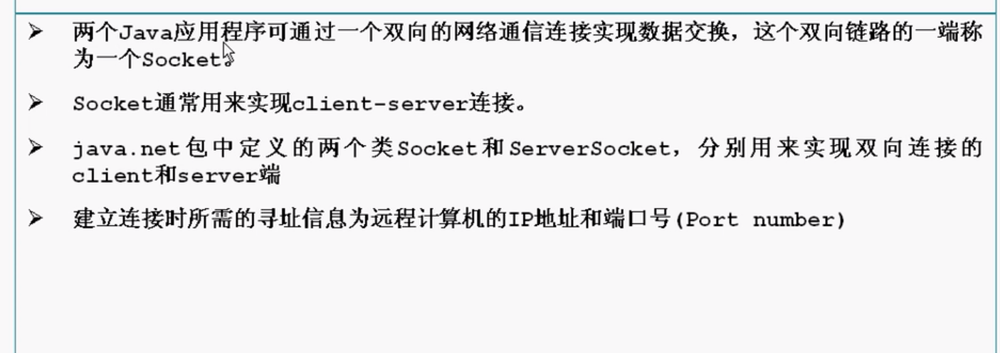

# 1.Socket



- tcp端口 udp端口分开
- 每一个端口65536个

> server

```java
import java.io.DataInputStream;
import java.io.InputStream;
import java.net.*;

import com.sun.corba.se.spi.activation.Server;

import jdk.nashorn.internal.objects.annotations.Where;

public class TCPServer{
    public static void main(String[] args) throws Exception {
        ServerSocket ss = new ServerSocket(6666); 

        while(true){
            Socket s = ss.accept();
            DataInputStream dis = new DataInputStream(s.getInputStream());
            System.out.println(dis.readUTF());
            dis.close();
            //System.out.println("hello world");
        }

        //System.out.println("hello world");
    }
}
```

> client

```java
import java.io.DataOutputStream;
import java.io.OutputStream;
import java.net.*;
public class TCPClient{
    public static void main(String[] args) throws Exception{
        Socket s = new Socket("127.0.0.1",6666);
        OutputStream os = s.getOutputStream();
        DataOutputStream dos = new DataOutputStream(os);
        dos.writeUTF("hello server");
        dos.flush();
        dos.close();
        s.close();
    }
}
```

运行结果


## 