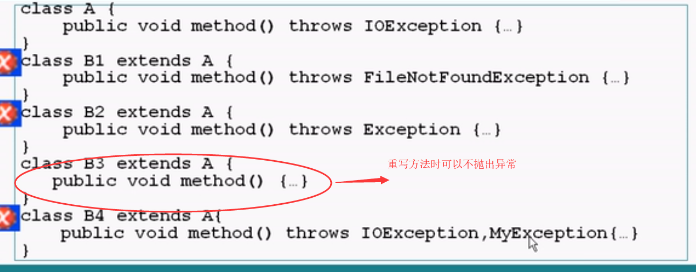

# Java基础知识学习（三）

## 1.抽象类

- 用abstract关键字修饰一个类时，这个类叫做抽象类，用abstract修饰一个方法时，该方法叫做抽象方法
- 含有抽象方法的类必须声明为抽象类，抽象类必须被继承，抽象方法必须被重新
- 抽象类不能被实例化
- 抽象方法只需声明，而不需实现

## 2.final关键字

- final的变量值不能够被改变
  - final的成员变量
  - final的局部变量
- final的方法不能够被重写
- final的类不能够被继承

## 3.接口

- 接口是抽象方法和常量值的定义的集合
- 从本质上将，接口是一种特殊的抽象类，这种抽象类中只包含常量和方法的定义，而没有变量和方法的实现

- 接口特性
  - 接口可以多重实现：
  - 接口中声明的属性默认为public static final 的，也只能是public static final的
  - 接口中只能定义抽象方法，而且这些方法默认为public的，也只能是public的
  - 接口可以继承其他的接口，并添加新的属性和抽象方法
- 多个无关的类可以实现同一个接口
- 一个类可以实现多个无关的接口
- 与继承关系类似，接口与实现类之间存在多态性

```java
 /**
  * java中定义接口
  */
 public interface JavaInterfaces {
 
 }
```

## 4.异常的概念


> 异常分类图


- Error:称为错误，由java虚拟机产生并抛出，包括动态链接失败，虚拟机报错等，程序对其不做处理。
- Exception:所有异常类的父类，其子类对应了各种各样可能出现的异常事件，一般需要用户显示的声明或者捕获（如IOException）
- Runtime Exception: 特殊的异常，系统自动检测并交由他们的缺省的异常程序处理。

> 异常捕获处理


> 使用自定义的异常

- 通过继承java.lang.Exception类声明自己的异常类
- 在方法适当的位置生成自定义异常的实例，并用throw语句抛出
- 在方法的声明部分用throws语句声明该方法可能抛出的异常

```java
/**
 * 自定义的一个异常类MyException，且是从Exception类继承而来
 */
public class MyException extends Exception {

    private int id;

    /**
     * 自定义异常类的构造方法
     * @param message
     * @param id
     */
    public MyException(String message,int id) {
        super(message);//调用父类Exception的构造方法
        this.id = id;
    }
    
    /**
     * 获取异常的代码
     * @return
     */
    public int getId() {
        return id;
    }
    
}
```

> 声明并抛出异常

- 重写方法需要抛出与原方法所抛出的异常类型一致的异常或者不抛出



> 异常处理总结


## 5.数组

> 数据基本概念

- 数组可以看成是多个相同类型数据组合，对这些数据的统一管理。
- 数组变量属引用类型，数组也可以看成是对象，数组中的每个元素相当于该对象的成员变量。
- 数组的元素可以是任何数据类型，包括基本类型和引用类型。
- C和C++中的数组都可以分配在栈上面，而JAVA中的数组是只能分配在堆上面的，因为JAVA中的数组是引用类型。

> 一维数组

一维数组的声明方式有2种：

- 格式一：数组元素类型  数组名[ ];  即type var[ ];
- 格式二：数组元素类型[ ] 数组名; 即type[ ] var;
- 格式二声明数组的方法与C#上声明一维数组的方法一样。

例如：int a1[ ];   int[ ] a2;

​       double b[ ];

​       person[ ] p1;  String s1[ ];

**注意JAVA语言中声明数组时不能指定其长度**(数组中的元素个数）

​       如：int a[5]; 这样声明一维数组是非法的。

 >元素为引用类型的数据

`注意: 元素为引用数据类型的数组中的每一个元素都需要实例化`

```java
class Date{
    int year; int month; int day;
    Date(int y, int m ,int d ){
        year = y;
        month = m;
        day = d ;
    }
}
```


> 数组初始化

- 动态初始化，数组定义与数组元素分配空间和赋值的操作分开进行。

```java
public class Test{
    public static void main(String args[ ]){
    int a[ ];  //定义数组，即声明一个int类型的数组a[ ]
    a=new int[3];  //给数组元素分配内存空间。
    a[0]=3; a[1]=9; a[2]=8;  //给数组元素赋值。
    Date days[ ];
    days=new Date[3];
    days[0]=new Date(1, 4, 2004);
    days[1]=new Date(2, 4, 2004);
    days[2]=new Date(3, 4, 2004);
    } 
}

class Date{
    int year, month, day;
    Date(int y, int m, int d){
        year = y ;
        month = m ;
        day = d ;
    }
}
```

> 数组元素的引用

- 定义并用运算符new为之分配内存空间后，才可以引用数组中的每个元素，数组元素的引用方式为：**arrayName[index]，** index为数组元素下标，可以是整型常量或整型表达式。如a[3], b[i], c[6\*i]。

-  数组元素下标从0开始；长度为n的数组的合法下标取值范围为0 ～ n—1。

-  每个数组都有一个属性length指明它的长度，例如：a.length的值为数组a的长度(元素个数)。

> 二维数组


> 理解java中各个维度的数据模型


## 6.String 类

- java.lang.String类代表`不可变`的字符序列

- "xxx"为该类的一个对象

- String类常见的构造方法

  

> 静态重载方法:valueOf 可以将基本类型转换为字符类型


## 6.StringBuffer类


- java.lang.StringBuffer代表可变的字符序列

- StringBuffer和String类似，但是StringBuffer可以对其字符串进行改变

- 常见的构造方法

  

```java
public class Test{
  public static void main(String args[]){
    StringBuffer sBuffer = new StringBuffer("菜鸟教程官网：");
    sBuffer.append("www");
    sBuffer.append(".smallmartial");
    sBuffer.append(".cn");
    System.out.println(sBuffer);  
  }
}
```

## 7. Math类


## 8.File类


```java
import java.io.*;
public class FileList{
    public static void main(String[] args){
        File f = new File("d:/A");
        System.out.println(f.getName());
        tree(f,1);
    }
    
    private static void tree(File f,int level){
        
        String preStr = "";
        for(int i = 0; i < level; i++ ){
            preStr +="    ";
        }
        
        File[] childs = f.listFiles()；
        for(int i=0;i<childs.length;i++){
            System.out.println(preStr + Childs[i].getName());
            if(childs[i].isDirectory()){
                tree(childs[i],level + 1);
            }
        }    
        
    }
}
```

## 9.Enum类型

- 只能够取特定的值的一个
- 使用enum关键字
- 是java.lang.Enum类型

```java
public class TestEnum{
    public enum MyColor{ red, green ,blue};

    public static void main(String[] args){
        MyColor m = MyColor.red;
        switch (m) {
            case red:
                System.out.println("red");
                break;
             case green:   
                System.out.println("green");
                break;
            case blue:
                System.out.println("blue");
                break;
            default:
                break;
        }
        System.out.println(m);
    }
}

```


