# java基础知识学习（六）-多线程机制

## 1 .线程的基本概念

- 线程是一个程序内部的顺序控制流
- 线程和进程的区别：
  - 每个进程都有独立的代码和数据空间（进程上下文），进程间的切换有较大的开销
  - 线程可以看成轻量级的进程，同一类线程共享代码和数据空间，每个线程有独立的运行栈和程序计数器（PC），线程切换的开销小。
  - 多进程：在操作系统中能同时运行多个任务。
  - 多线程：在同一个应用的程序中有多个顺序流同时执行
- java的线程是通过java.lang.Thread类实现的
- VM启动时会有一个由主方法所定义的线程
- 可以通过创建Thread的实例来创建新的线程
- 每个线程都是通过某个特定的Thread对象所对应的方法run()来完成其操作的，方法run()称之为线程体
- 通过调用Thread类的start方法来启动一个线程

> 线程是一个程序里面不同的执行路径
>
> 每一个分支都叫做一个线程，main()叫做主分支，也叫做主线程

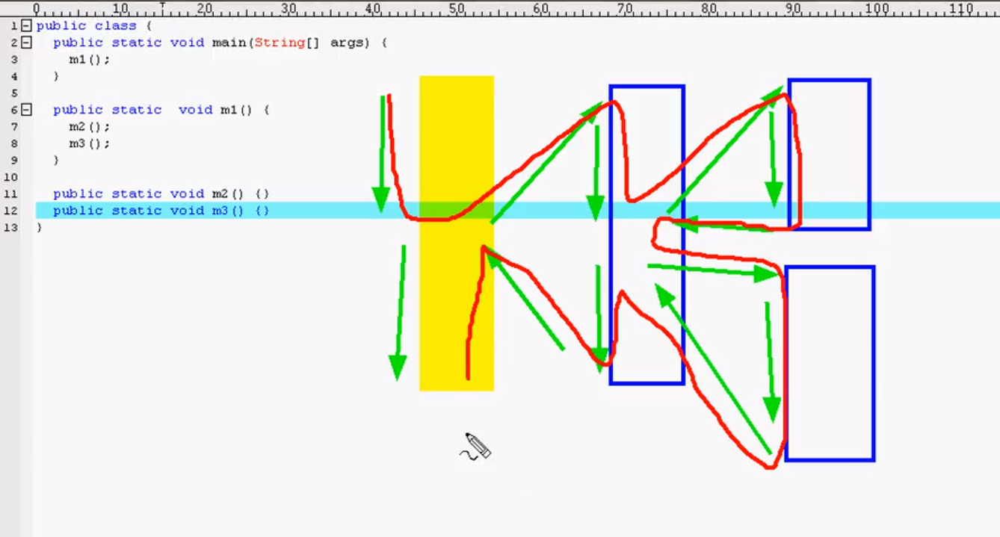


## 2.进程与线程的区别

- 进程：**进程是一个**具有一定独立功能的程序关于某个数据集合的一次运行活动。 它**是**操作系统动态执行的基本单元，在传统的操作系统中，**进程**既是基本的分配单元，也是基本的执行单元。 程序**是**指令和数据的有序集合，其本身没有任何运行的含义，**是一个静态的概念**。 而**进程是**程序在处理机上的一次执行过程，它**是一个**动态的概念。
- 线程：一个进程里面有一个主线程叫main()方法，是一个程序里面的，一个进程里面不同的执行路径。
- 在同一个时间点上，一个CPU只能支持一个线程在执行。因为CPU运行的速度很快，因此我们看起来的感觉就像是多线程一样

## 3.线程的创建和启动

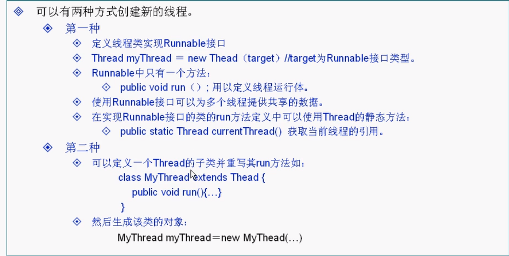

> 使用Runable接口来从创建和启动线程

```java
import java.io.*;

public class Test{
    public static void main(String args[]){
        Runner1 r1 = new Runner1();//这里new了一个线程类的对象出来
        Thread t = new Thread(r1);//要启动一个新的线程就必须new一个Thread对象出来
        t.start();//启动新开辟的线程，新线程执行的是run()方法，新线程与主线程会一起并行执行
        for(int i=0;i<10;i++){
            System.out.println("maintheod："+i);
        }
    }
}


/*定义一个类用来实现Runnable接口，实现Runnable接口就表示这个类是一个线程类*/
class Runner1 implements Runnable{
    public void run(){
        for(int i=0;i<10;i++){
            System.out.println("Runner1："+i);
        }
    }

}


```

运行结果：

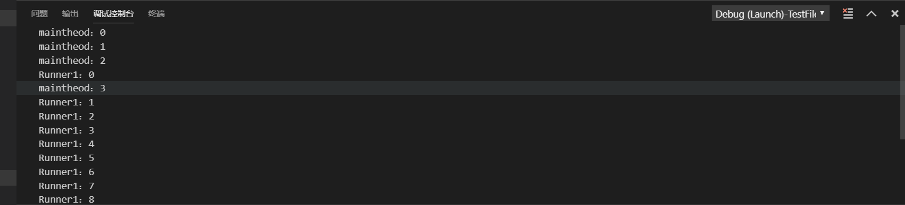

> 继承Thread类，并重写run()方法创建和启动线程

```java
import java.io.*;

public class Test{
    public static void main(String args[]){
        Runner1 r1 = new Runner1();//这里new了一个线程类的对象出来
        r1.start();
        //Thread t = new Thread(r1);//要启动一个新的线程就必须new一个Thread对象出来
        //r1.run();
      //  t.start();//启动新开辟的线程，新线程执行的是run()方法，新线程与主线程会一起并行执行
        for(int i=0;i<10;i++){
            System.out.println("maintheod："+i);
        }
    }
}


/*定义一个类用来实现Runnable接口，实现Runnable接口就表示这个类是一个线程类*/
//class Runner1 implements Runnable{
class Runner1 extends Thread{
    public void run(){
        for(int i=0;i<10;i++){
            System.out.println("Runner1："+i);
        }
    }

}


```

运行结果：

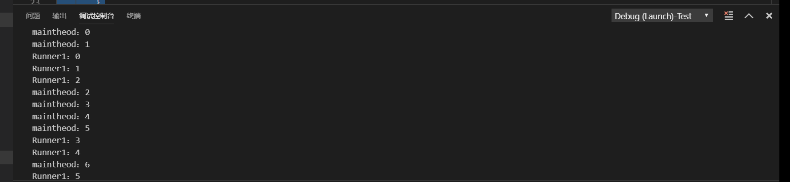

## 4.线程状态转换

> 操作系统三态模型

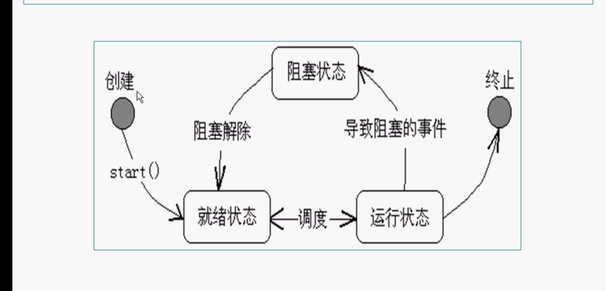

> 线程控制的基本方法

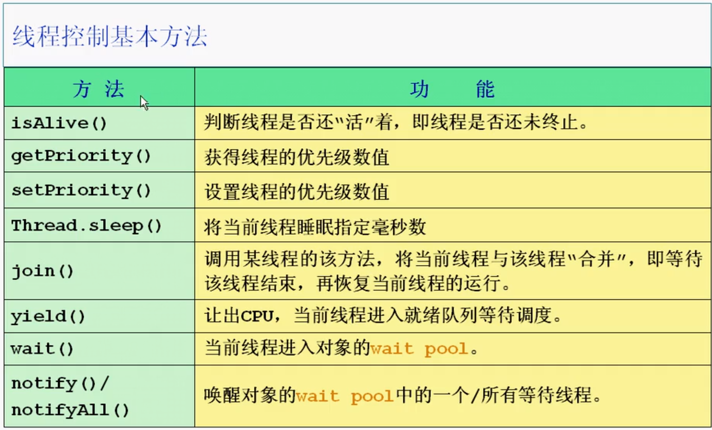

> sleep/join/yield方法

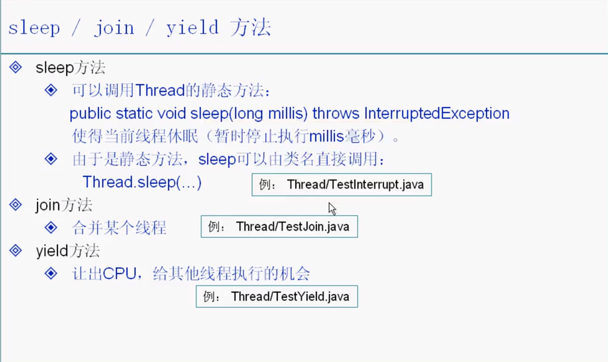

> sleep方法应用范例

```java
import java.io.*;
import java.util.*;
public class Test{public static void main(String args[]){
    MyThread thread = new MyThread();
    thread.start();//调用start()方法启动新开辟的线程
    try {

        MyThread.sleep(10000);
        System.out.println("主线程睡眠了10秒种后再次启动了");
   
    } catch (InterruptedException e) {
        e.printStackTrace();
    }

    thread.flag=false;//改变循环条件，结束死循环

}
}

class MyThread extends Thread {
boolean flag = true;// 定义一个标记，用来控制循环的条件

public void run() {

    while (flag) {
        System.out.println("==========" + new Date().toLocaleString() + "===========");
        try {

            sleep(1000);//睡眠的时如果被打断就会抛出InterruptedException异常
    
        } catch (InterruptedException e) {

            return;
       
        }
    }
    }
}

```

运行结果：

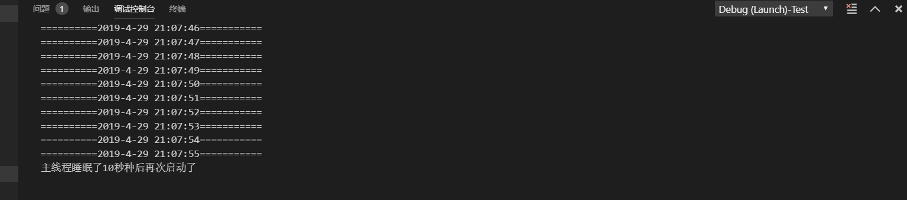

> join方法使用范例

```java
import java.io.*;
import java.util.*;
public class Test{ public static void main(String args[]) {
    MyThread2 thread2 = new MyThread2("mythread");
    // 在创建一个新的线程对象的同时给这个线程对象命名为mythread
    thread2.start();// 启动线程
    try {
        thread2.join();// 调用join()方法合并线程，将子线程mythread合并到主线程里面
        // 合并线程后，程序的执行的过程就相当于是方法的调用的执行过程
    } catch (InterruptedException e) {
        e.printStackTrace();
    }
    for (int i = 0; i <= 5; i++) {
        System.out.println("I am main Thread");
    }
}
}

class MyThread2 extends Thread {
MyThread2(String s) {
    super(s);

}

public void run() {
    for (int i = 1; i <= 5; i++) {
        System.out.println("I am a\t" + getName());

        try {
            sleep(1000);// 让子线程每执行一次就睡眠1秒钟
        } catch (InterruptedException e) {
            return;
        }
    }
}
}
```

运行结果

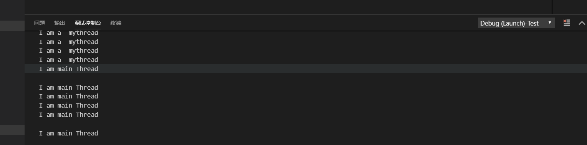

>yeild方法使用范例

```java
import java.io.*;
import java.util.*;
public class Test{
    public static void main(String args[]) {
        MyThread3 t1 = new MyThread3("t1");

        MyThread3 t2 = new MyThread3("t2");
        t1.start();// 启动子线程t1
        t2.start();// 启动子线程t2
        for (int i = 0; i <= 5; i++) {
            System.out.println("I am main Thread");
        }
    }
}

class MyThread3 extends Thread {
    MyThread3(String s) {
        super(s);
    }

    public void run() {
        for (int i = 1; i <= 5; i++) {
            System.out.println(getName() + "：" + i);
            if (i % 2 == 0) {
                yield();// 当执行到i能被2整除时当前执行的线程就让出来让另一个在执行run()方法的线程来优先执行
    
            }
        }
    }
}
```

运行结果：

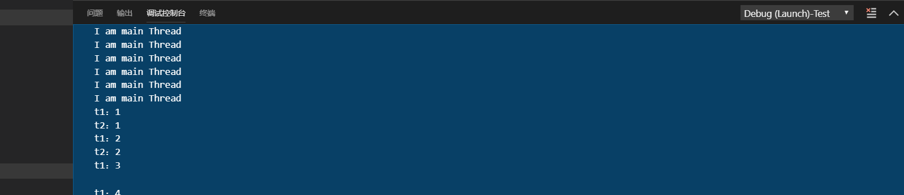

## 5.线程的优先级

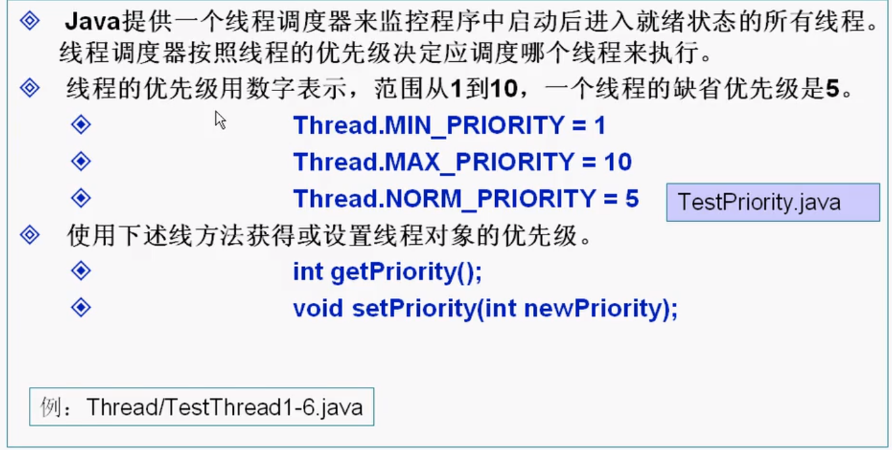

```java
public class TestThread6 {
    public static void main(String args[]) {
        MyThread4 t4 = new MyThread4();
        MyThread5 t5 = new MyThread5();
        Thread t1 = new Thread(t4);
        Thread t2 = new Thread(t5);
        t1.setPriority(Thread.NORM_PRIORITY + 3);// 使用setPriority()方法设置线程的优先级别，这里把t1线程的优先级别进行设置
        /*
         * 把线程t1的优先级(priority)在正常优先级(NORM_PRIORITY)的基础上再提高3级 
         * 这样t1的执行一次的时间就会比t2的多很多 　　　　
         * 默认情况下NORM_PRIORITY的值为5
         */
        t1.start();
        t2.start();
        System.out.println("t1线程的优先级是：" + t1.getPriority());
        // 使用getPriority()方法取得线程的优先级别，打印出t1的优先级别为8
    }
}

class MyThread4 implements Runnable {
    public void run() {
        for (int i = 0; i <= 1000; i++) {
            System.out.println("T1：" + i);
        }
    }
}

class MyThread5 implements Runnable {
    public void run() {
        for (int i = 0; i <= 1000; i++) {
            System.out.println("===============T2：" + i);
        }
    }
}
```

## 6.线程同步

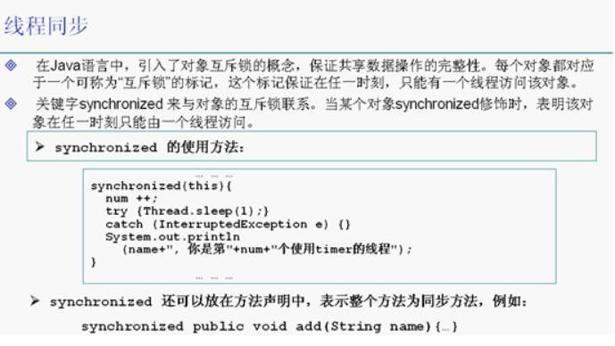

> synchronized关键字的使用

```java
import java.util.*;
public class Test implements Runnable {
    Timer timer = new Timer();

    public static void main(String args[]) {
    
        Test test = new Test();
        Thread t1 = new Thread(test);
        Thread t2 = new Thread(test);
        t1.setName("t1");// 设置t1线程的名字
        t2.setName("t2");// 设置t2线程的名字
        t1.start();
        t2.start();
    }

    public void run() {
        timer.add(Thread.currentThread().getName());
    }
}

class Timer {
    private static int num = 0;

    public synchronized void add(String name) {// 在声明方法时加入synchronized时表示在执行这个方法的过程之中当前对象被锁定
       // synchronized (this) {
            /*
             * 使用synchronized(this)来锁定当前对象，这样就不会再出现两个不同的线程同时访问同一个对象资源的问题了 只有当一个线程访问结束后才会轮到下一个线程来访问
             */
            num++;
            try {
                Thread.sleep(1);
            } catch (InterruptedException e) {
                e.printStackTrace();
            }
            System.out.println(name + "：你是第" + num + "个使用timer的线程");
        }
   // }
}
```

> 线程死锁问题

```java
/*这个小程序模拟的是线程死锁的问题*/
public class TestDeadLock implements Runnable {
    public int flag = 1;
    static Object o1 = new Object(), o2 = new Object();

    public void run() {
        System.out.println(Thread.currentThread().getName() + "的flag=" + flag);
        /*
         * 运行程序后发现程序执行到这里打印出flag以后就再也不往下执行后面的if语句了 
         * 程序也就死在了这里，既不往下执行也不退出
         */

        /* 这是flag=1这个线程 */
        if (flag == 1) {
            synchronized (o1) {
                /* 使用synchronized关键字把对象01锁定了 */
                try {
                    Thread.sleep(500);
                } catch (InterruptedException e) {
                    e.printStackTrace();
                }
                synchronized (o2) {
                    /*
                     * 前面已经锁住了对象o1，只要再能锁住o2，那么就能执行打印出1的操作了 
                     * 可是这里无法锁定对象o2，因为在另外一个flag=0这个线程里面已经把对象o1给锁住了 
                     * 尽管锁住o2这个对象的线程会每隔500毫秒睡眠一次，可是在睡眠的时候仍然是锁住o2不放的
                     */
                    System.out.println("1");
                }
            }
        }
        /*
         * 这里的两个if语句都将无法执行，因为已经造成了线程死锁的问题 
         * flag=1这个线程在等待flag=0这个线程把对象o2的锁解开， 
         * 而flag=0这个线程也在等待flag=1这个线程把对象o1的锁解开 
         * 然而这两个线程都不愿意解开锁住的对象，所以就造成了线程死锁的问题
         */

        /* 这是flag=0这个线程 */
        if (flag == 0) {
            synchronized (o2) {
                /* 这里先使用synchronized锁住对象o2 */
                try {
                    Thread.sleep(500);
                } catch (InterruptedException e) {
                    e.printStackTrace();
                }
                synchronized (o1) {
                    /*
                     * 前面已经锁住了对象o2，只要再能锁住o1，那么就能执行打印出0的操作了 可是这里无法锁定对象o1，因为在另外一个flag=1这个线程里面已经把对象o1给锁住了 尽管锁住o1这个对象的线程会每隔500毫秒睡眠一次，可是在睡眠的时候仍然是锁住o1不放的
                     */
                    System.out.println("0");
                }
            }
        }
    }

    public static void main(String args[]) {
        TestDeadLock td1 = new TestDeadLock();
        TestDeadLock td2 = new TestDeadLock();
        td1.flag = 1;
        td2.flag = 0;
        Thread t1 = new Thread(td1);
        Thread t2 = new Thread(td2);
        t1.setName("线程td1");
        t2.setName("线程td2");
        t1.start();
        t2.start();
    }
}
```

运行结果：


> 生产者消费者问题

```java
import jdk.nashorn.internal.runtime.regexp.joni.exception.InternalException;

public class ProducerConsumer{
    public static void main(String[] args) {
        SyncStack ss = new SyncStack();
        Producer p = new  Producer(ss);
        Consumer c = new Consumer(ss);

        new Thread(p).start();
        new Thread(c).start();
    }
}

class WoTou{
    int id;
    WoTou(int id){
        this.id = id;
    }

    public String toString(){
        return "WoToU:"+id;
    }
}

class SyncStack{
    int index = 0 ;
    WoTou[] arrWT = new WoTou[6];

    public synchronized void push(WoTou wt){
        while(index == arrWT.length){
            try {
                this.wait();
            } catch (InterruptedException e) {
                e.printStackTrace();
            }
       

        }
        this.notify();//唤醒一个正在等待的进程
        arrWT[index] = wt;
        index++;
    }

    public synchronized WoTou pop(){
        while(index == 0){
        try {
                this.wait();
            } catch (InterruptedException e) {
                e.printStackTrace();
            }
        }
        this.notify();
        index--;
        return arrWT[index];
    }
 }

 class Producer implements Runnable{
     SyncStack ss = null;

     Producer(SyncStack ss){
         this.ss = ss;
     }

     public void run(){
         for (int i = 0; i < 20; i++) {
             WoTou wt = new WoTou(i);
             ss.push(wt);
             System.out.println("生产了："+wt);
             try {
                 Thread.sleep((int)(Math.random()*1000));
             } catch (InterruptedException e) {
                 e.printStackTrace();
             }
         }
     }

 }

 class Consumer implements Runnable{
    SyncStack ss = null;

    Consumer(SyncStack ss){
        this.ss = ss;
    }

    public void run(){
        for (int i = 0; i < 20; i++) {
            WoTou wt = ss.pop();
            System.out.println("消费了："+wt);
            try {
                Thread.sleep((int)(Math.random()*1000));
            } catch (InterruptedException e) {
                e.printStackTrace();
            }
        }
    }

}
```

运行结果：

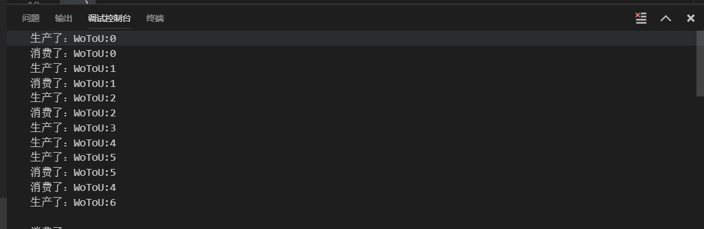
## 7.Socket

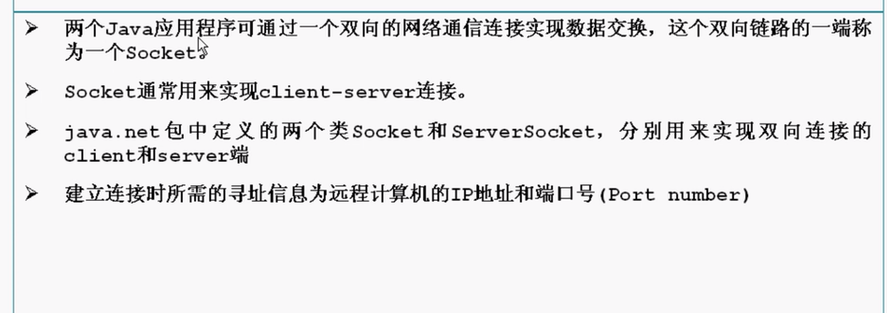

- tcp端口 udp端口分开
- 每一个端口65536个

> server

```java
import java.io.DataInputStream;
import java.io.InputStream;
import java.net.*;

import com.sun.corba.se.spi.activation.Server;

import jdk.nashorn.internal.objects.annotations.Where;

public class TCPServer{
    public static void main(String[] args) throws Exception {
        ServerSocket ss = new ServerSocket(6666); 

        while(true){
            Socket s = ss.accept();
            DataInputStream dis = new DataInputStream(s.getInputStream());
            System.out.println(dis.readUTF());
            dis.close();
            //System.out.println("hello world");
        }

        //System.out.println("hello world");
    }
}
```

> client

```java
import java.io.DataOutputStream;
import java.io.OutputStream;
import java.net.*;
public class TCPClient{
    public static void main(String[] args) throws Exception{
        Socket s = new Socket("127.0.0.1",6666);
        OutputStream os = s.getOutputStream();
        DataOutputStream dos = new DataOutputStream(os);
        dos.writeUTF("hello server");
        dos.flush();
        dos.close();
        s.close();
    }
}
```

运行结果

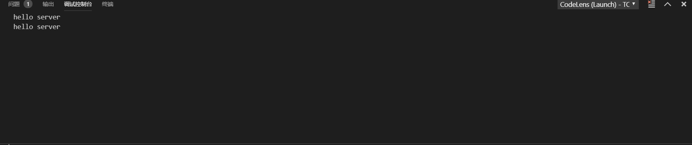

## 