# java 基础知识学习（五）

## 1.java流输入输出原理

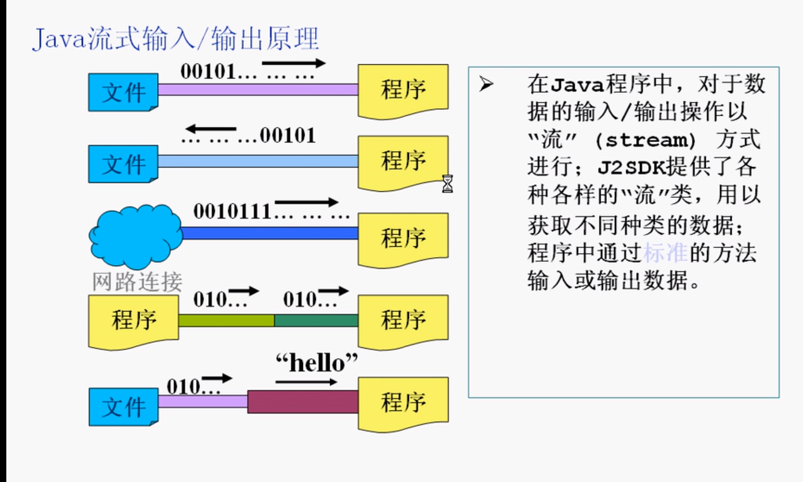


## 2.输入和输出流分类

- java.io包中定义了多个流类型来实现输入和输出功能
  - 按数据流的方向不同可以分为输入流和输chuliu
  - 按处理数据单位的不同可以分为字节流和字符流
  - 按照功能不同可以分为节点流和处理流
- java sdk所提供的所有流的类型位于java.io包，分别继承自以下四种抽象流
  - 字节流 InputStream OutputStream
  - 字符流  Reader Writer

## 3.节点流和处理流

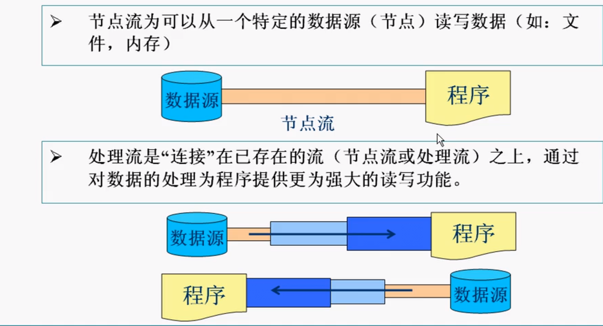

- 节点流类型

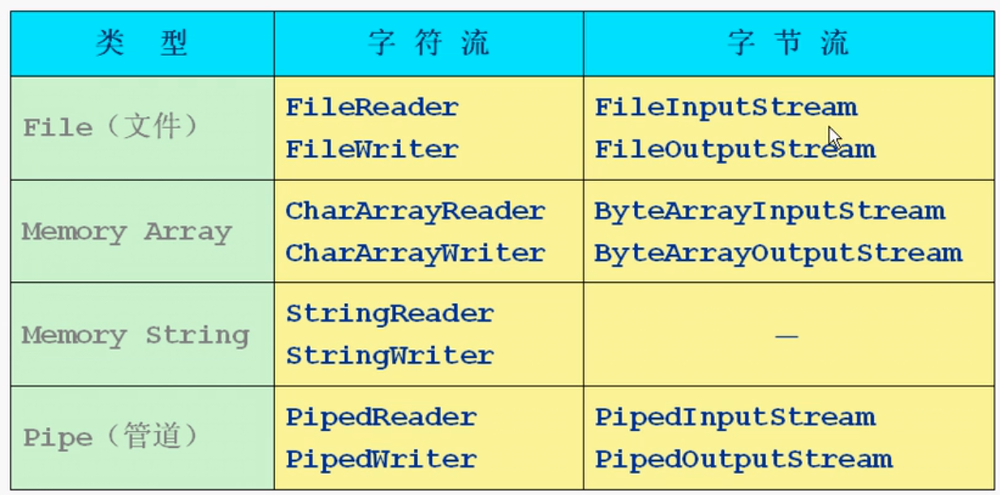

```java
import java.util.*;
import java.io.*;

public class Test{

    public static void main(String args[]) {
        int b = 0;// 使用变量b来装调用read()方法时返回的整数
        FileInputStream in = null;
        // 使用FileInputStream流来读取有中文的内容时，读出来的是乱码，因为使用InputStream流里面的read()方法读取内容时是一个字节一个字节地读取的，而一个汉字是占用两个字节的，所以读取出来的汉字无法正确显示。
        // FileReader in = null;//使用FileReader流来读取内容时，中英文都可以正确显示，因为Reader流里面的read()方法是一个字符一个字符地读取的，这样每次读取出来的都是一个完整的汉字，这样就可以正确显示了。
        try {
            in = new FileInputStream("C:\\Users\\Administrator\\Desktop\\img\\day5\\Test.java");
            // in = new FileReader("D:/java/io/TestFileInputStream.java");
        } catch (FileNotFoundException e) {
            System.out.println("系统找不到指定文件！");
            System.exit(-1);// 系统非正常退出
        }
        long num = 0;// 使用变量num来记录读取到的字符数
        try {// 调用read()方法时会抛异常，所以需要捕获异常
            while ((b = in.read()) != -1) {
                // 调用int read() throws Exception方法时，返回的是一个int类型的整数
                // 循环结束的条件就是返回一个值-1，表示此时已经读取到文件的末尾了。
                // System.out.print(b+"\t");//如果没有使用“(char)b”进行转换，那么直接打印出来的b就是数字，而不是英文和中文了
                System.out.print((char) b);
                // “char(b)”把使用数字表示的汉字和英文字母转换成字符输入
                num++;
            }
            in.close();// 关闭输入流
            System.out.println();
            System.out.println("总共读取了" + num + "个字节的文件");
        } catch (IOException e1) {
            System.out.println("文件读取错误！");
        }
    }
}
```


## 4.InputStream

- 继承自InputStream的流都是用于向程序中输入数据，且数据的单位为字节（8bit）;

- 基本方法

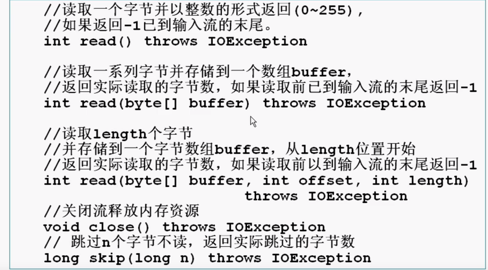

##  5.OutputSream

- 继承自OutputSteam的流是用于程序中输入数据，且数据的单位为字节。

- 基本方法

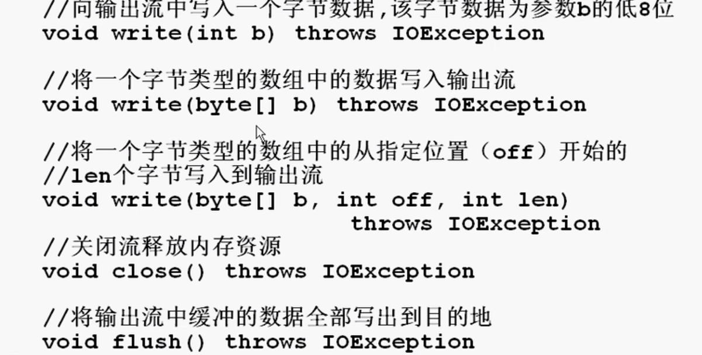

## 6.Reader

- 继承自Reader的流都是用于向程序中输入数据，且数据的单位为字符（16bit)
- 基本方法

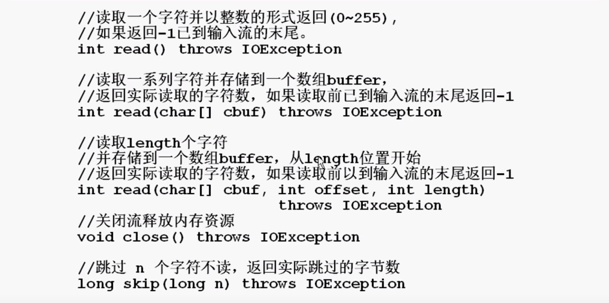


## 7.Writer

- 继承自Writer的流都是用于程序的输出数据，且数据单位为字符（16bit）
- 基本方法

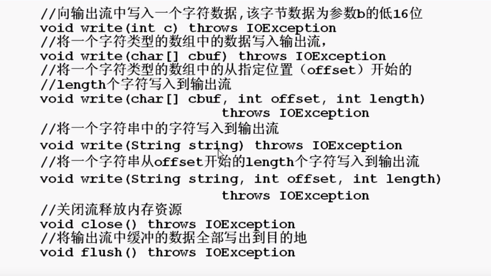

```java
import java.util.*;
import java.io.*;

public class Test{

    public static void main(String args[]){
        /*使用FileWriter输出流从程序把数据写入到Uicode.dat文件中
        使用FileWriter流向文件写入数据时是一个字符一个字符写入的*/
        FileWriter fw = null;
        try{
                fw = new FileWriter("D:/java/Uicode.dat");
                //字符的本质是一个无符号的16位整数
                //字符在计算机内部占用2个字节
                //这里使用for循环把0～60000里面的所有整数都输出
                //这里相当于是把全世界各个国家的文字都0～60000内的整数的形式来表示
                for(int c=0;c<=60000;c++){
                    fw.write(c);
                    //使用write(int c)把0～60000内的整数写入到指定文件内
                    //调用write()方法时，我认为在执行的过程中应该使用了“(char)c”进行强制转换，即把整数转换成字符来显示
                    //因为打开写入数据的文件可以看到，里面显示的数据并不是0～60000内的整数，而是不同国家的文字的表示方式
            }
            /*使用FileReader(字符流)读取指定文件里面的内容
            读取内容时是以一个字符为单位进行读取的*/
                int b = 0;
                long num = 0;
                FileReader fr = null;
                fr = new FileReader("D:/java/Uicode.dat");
                while((b = fr.read())!= -1){
                    System.out.print((char)b + "\t");
                    num++;
                }
                System.out.println();
                System.out.println("总共读取了"+num+"个字符");
        }catch(Exception e){
            e.printStackTrace();
        }
    }
}
```

## 8.缓存流

```java

import java.io.*;

public class TestBufferStream {
    public static void main(String args[]) {
        FileInputStream fis = null;
        try {
            fis = new FileInputStream("D:/java/TestFileInputStream.java");
            // 在FileInputStream节点流的外面套接一层处理流BufferedInputStream
            BufferedInputStream bis = new BufferedInputStream(fis);
            int c = 0;
            System.out.println((char) bis.read());
            System.out.println((char) bis.read());
            bis.mark(100);// 在第100个字符处做一个标记
            for (int i = 0; i <= 10 && (c = bis.read()) != -1; i++) {
                System.out.print((char) c);
            }
            System.out.println();
            bis.reset();// 重新回到原来标记的地方
            for (int i = 0; i <= 10 && (c = bis.read()) != -1; i++) {
                System.out.print((char) c);
            }
            bis.close();
        } catch (FileNotFoundException e) {
            e.printStackTrace();
        } catch (Exception e1) {
            e1.printStackTrace();
        }
    }
}
```

## 9.转换流

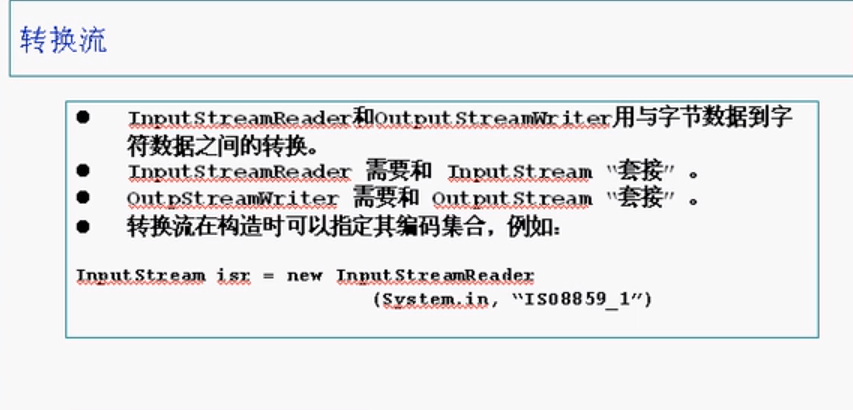

> 转换流非常的有用，它可以把一个字节流转换成一个字符流，转换流有两种，一种叫InputStreamReader，另一种叫OutputStreamWriter。InputStream是字节流，Reader是字符流，InputStreamReader就是把InputStream转换成Reader。OutputStream是字节流，Writer是字符流，OutputStreamWriter就是把OutputStream转换成Writer。把OutputStream转换成Writer之后就可以一个字符一个字符地通过管道写入数据了，而且还可以写入字符串。我们如果用一个FileOutputStream流往文件里面写东西，得要一个字节一个字节地写进去，但是如果我们在FileOutputStream流上面套上一个字符转换流，那我们就可以一个字符串一个字符串地写进去。

转换流代码：

```java
import java.io.*;

public class TestTransform1 {
    public static void main(String args[]) {
        try {
            OutputStreamWriter osw = new OutputStreamWriter(
                    new FileOutputStream("D:/java/char.txt"));
            osw.write("MircosoftsunIBMOracleApplet");
            System.out.println(osw.getEncoding());
            osw.close();
            osw = new OutputStreamWriter(new FileOutputStream(
                    "D:\\java\\char.txt", true), "ISO8859_1");
            
            osw.write("MircosoftsunIBMOracleApplet");
            System.out.println(osw.getEncoding());
            osw.close();

        } catch (Exception e) {
            e.printStackTrace();
        }
    }
}
```

运行结果：

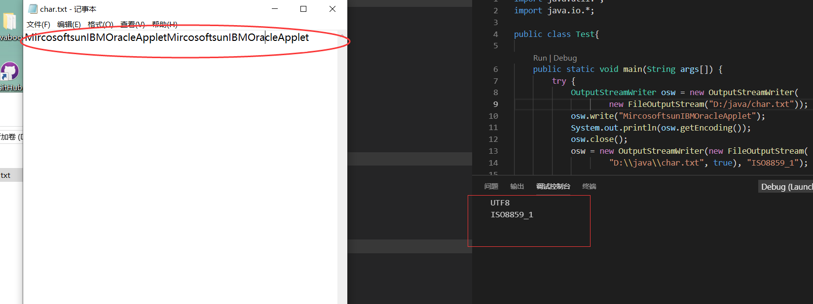

## 10.数据流

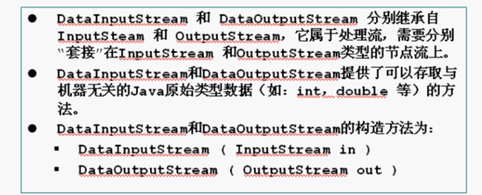

```java
import java.util.*;
import java.io.*;

public class Test{

    public static void main(String args[]) {
        ByteArrayOutputStream baos = new ByteArrayOutputStream();
        //在调用构造方法时，首先会在内存里面创建一个ByteArray字节数组
        DataOutputStream dos = new DataOutputStream(baos);
        //在输出流的外面套上一层数据流，用来处理int，double类型的数
        try{
            dos.writeDouble(Math.random());//把产生的随机数直接写入到字节数组ByteArray中
            dos.writeBoolean(true);//布尔类型的数据在内存中就只占一个字节
        ByteArrayInputStream bais = new ByteArrayInputStream(baos.toByteArray());
            System.out.println(bais.available());
            DataInputStream dis = new DataInputStream(bais);
            System.out.println(dis.readDouble());//先写进去的就先读出来，调用readDouble()方法读取出写入的随机数
            System.out.println(dis.readBoolean());//后写进去的就后读出来，这里面的读取顺序不能更改位置，否则会打印出不正确的结果
            dos.close();
            bais.close();
        }catch(Exception e){
                e.printStackTrace();
            }
    }

}
```

运行结果：

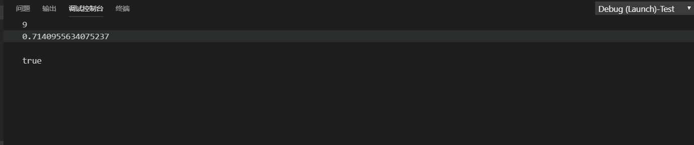

## 11.Print流

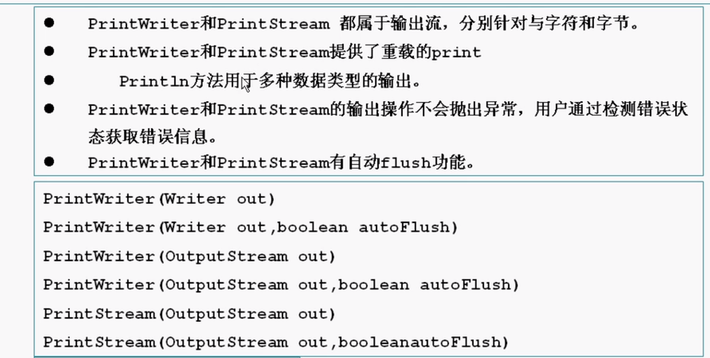

```java
import java.util.*;
import java.io.*;

public class Test{

    public static void main(String args[]) {
        PrintStream ps = null;
        try{
                FileOutputStream fos = new FileOutputStream("D:/java/log.txt");
                ps = new PrintStream(fos);//在输出流的外面套接一层打印流，用来控制打印输出
                if(ps != null){
                    System.setOut(ps);//这里调用setOut()方法改变了输出窗口，以前写System.out.print()默认的输出窗口就是命令行窗口.
                    //但现在使用System.setOut(ps)将打印输出窗口改成了由ps指定的文件里面，通过这样设置以后，打印输出时都会在指定的文件内打印输出
                    //在这里将打印输出窗口设置到了log.txt这个文件里面，所以打印出来的内容会在log.txt这个文件里面看到
                }
            for(char c=0;c<=60000;c++){
                    System.out.print(c+"\t");//把世界各国的文字打印到log.txt这个文件中去
                }
        }catch(Exception e){
            e.printStackTrace();
        }
    }

}
```

运行结果：

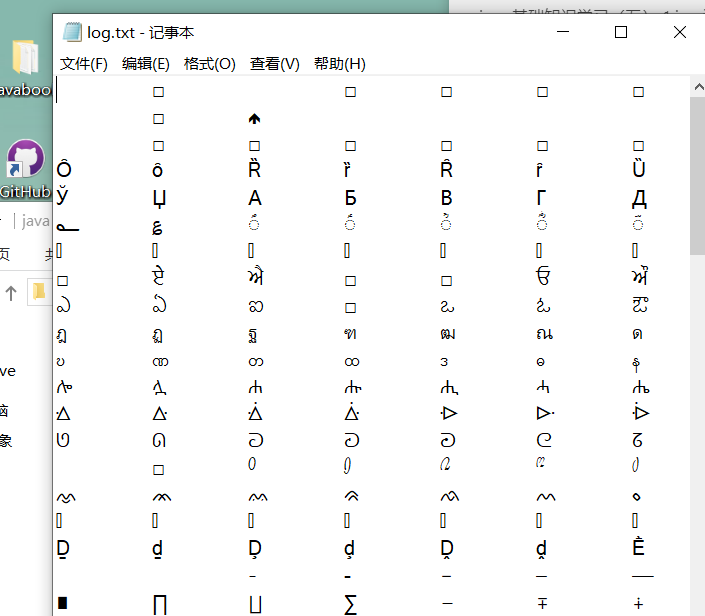

## 12.Object流

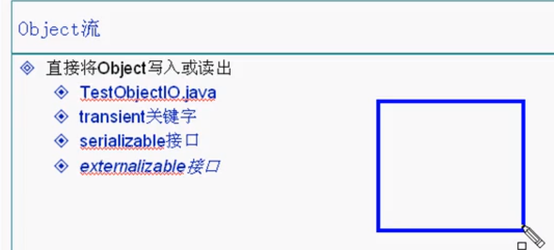

```java
import java.io.*;

public class Test{
    public static void main(String args[]) {
        T t = new T();
        t.k = 8;// 把k的值修改为8
        try {
            FileOutputStream fos = new FileOutputStream(
                    "D:/java/TestObjectIo.txt");
            ObjectOutputStream oos = new ObjectOutputStream(fos);
            // ObjectOutputStream流专门用来处理Object的，在fos流的外面套接ObjectOutputStream流就可以直接把一个Object写进去
            oos.writeObject(t);// 直接把一个t对象写入到指定的文件里面
            oos.flush();
            oos.close();
            FileInputStream fis = new FileInputStream(
                    "D:/java/TestObjectIo.txt");
            ObjectInputStream ois = new ObjectInputStream(fis);
            // ObjectInputStream专门用来读一个Object的
            T tRead = (T) ois.readObject();
            // 直接把文件里面的内容全部读取出来然后分解成一个Object对象，并使用强制转换成指定类型T
            System.out.print(tRead.i + "\t" + tRead.j + "\t" + tRead.d + "\t"
                    + tRead.k);
            ois.close();
        } catch (Exception e) {
            e.printStackTrace();
        }
    }

}

/*
 * 凡是要将一个类的对象序列化成一个字节流就必须实现Serializable接口
 * Serializable接口中没有定义方法，Serializable接口是一个标记性接口，用来给类作标记，只是起到一个标记作用。
 * 这个标记是给编译器看的，编译器看到这个标记之后就可以知道这个类可以被序列化 如果想把某个类的对象序列化，就必须得实现Serializable接口
 */
class T implements Serializable {
    // Serializable的意思是可以被序列化的
    int i = 10;
    int j = 9;
    double d = 2.3;
    //int k = 15;
     transient int k = 15;
    // 在声明变量时如果加上transient关键字，那么这个变量就会被当作是透明的，即不存在。
}
```

运行结果：

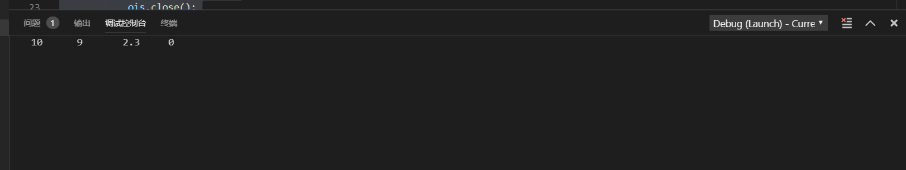

> 总结

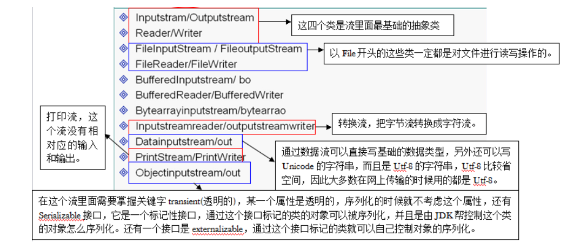

