# java基础知识学习（四）

## 1.容器API

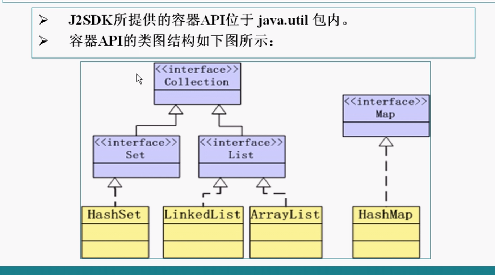

- Collection接口定义了存储一组对象的方法，其子接口的Set和List分别定义了储存方式
  - Set中的数据对象没有顺序且不可以重复
  - List中的数据对象有顺序且可以重复
- Map接口 定义了存储`key-value`键值对的方法

> Collection接口中所定义的方法

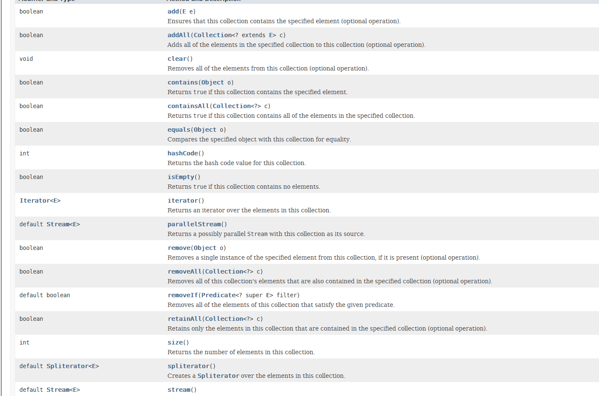

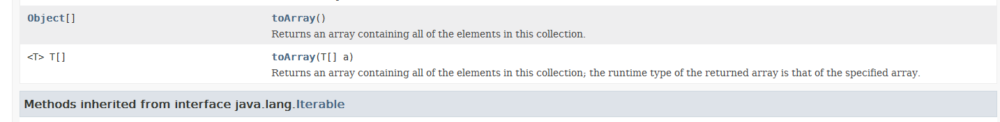

```java
import java.util.ArrayList;
import java.util.Collection;

public class Test{

    public static void main(String[] args) {
        Collection c = new ArrayList<>();
        //可以放入不同类型的对象
        c.add("hello");
      //  c.add(new Name("f1","l1"));
        c.add(new Integer(100));
        System.out.println(c.size());
        System.out.println(c);
    }
}

```

结果：

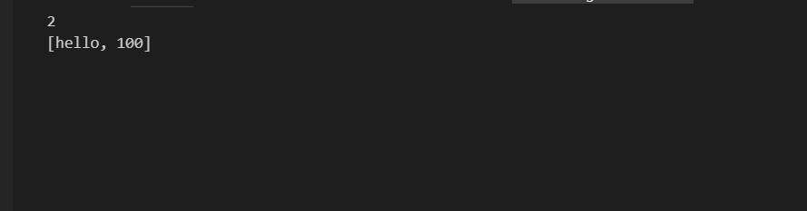

> 重写equals()方法为什么要重写hashcode()方法?

1. hashCode是不是重写需要看业务，开放开发人员可以重写这个方法，可能有这种情况，比如我们仅仅对比object的部分属性，就认为两者相等，而不对比其其他属性。
2. 重写java object hashCode方法，是为了在一些算法中避免我们不想要的冲突和碰撞。比如其HashMap，HashSet的使用中。

## 2.Iterator接口

- 所有实现了Collection接口的容器类中都有一个iterator方法以返回一个实现了Iterator接口的对象

- Iterator对象称作为为迭代器，用以方便的实现对容器内的遍历操作

- Iterator定义以下的方法：

  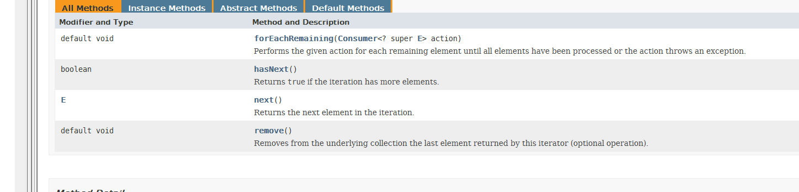

```java
import java.util.*;

public class Test{
    public static void main(String[] args)
    {
        List<String> list = new ArrayList<>();
        //List<String> list=new ArrayList<>();
        list.add("abc");
        list.add("edf");
        list.add("ghi");
        for(Iterator<String> it=list.iterator();it.hasNext();)
        {
            System.out.println(it.next());
        }
    }
}
```

## 3.List接口

- List接口是Collection的子接口，实现List接口的容器类中元素是有序的，而且可以重复操作。
- List容器中的元素都对应一个整数型的序号记载在其容器的位置，可以根据序号存取容器中的元素。
- List容器类有ArrayList,LinkedList;

## 4.List常用算法

- 类·`java.util.Collections`提供了一些静态方法实现了基于List容器的一些常用算法

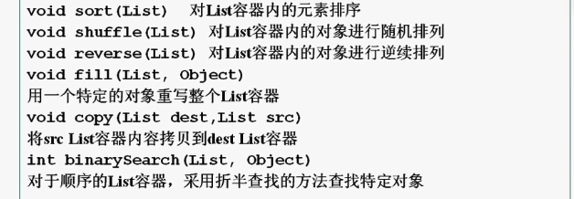


```java
import java.util.*;

public class Test{
    public static void main(String[] args)
    {
        List l1 = new LinkedList<>();
        List l2 = new LinkedList<>();
        for (int i = 0; i < 9; i++) {
            l1.add("a" +i);
        }
        System.out.println(l1);
        Collections.shuffle(l1);//随机排序
        System.out.println(l1);
        Collections.reverse(l1);//逆序
        System.out.println(l1);
        Collections.sort(l1);//排序
        System.out.println(l1);
        //折半查找
        System.out.println(Collections.binarySearch(l1, "a5"));


    }
}
```

运行结果：

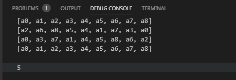

## 5.Comparable接口

- 所有可以`排序`的类都实现了java.lang.Comparable接口，Comparable接口中只有一个方法：`public int compareTo(Object obj)`;
  - 返回 0 表示this == obj
  - 返回正数表示 this > obj
  - 返回负数表示 this < obj
- 实现了Compareable接口的类通过实现compareTo方法而确定该类的排序方式

## 6.数据结构读写效率比较

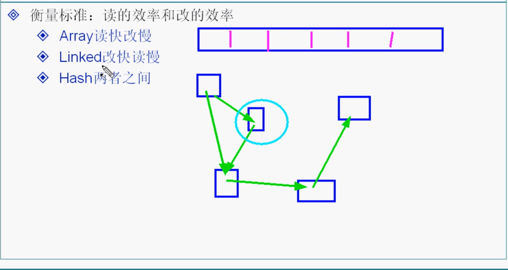

## 7.Map接口

- 实现map接口的类用来存储键值对

- Map接口中实现类有HashMap和TreeMap等

- Map类中存储键值对通过键来标识，所以键值不能重复

  ```java
  import java.util.*;
  public class Test{
      
      public static void main(String[] args) {
          Map m1 = new HashMap();
          Map m2 = new TreeMap();
          m1.put("one",1);
          m1.put("two",2);
          m1.put("three",3);
          m2.put("A",1);
          m2.put("B",2);
          System.out.println(m1.size());
          System.out.println(m1.containsKey("one"));
          if(m1.containsKey("two")){
              int i = (Integer) m1.get("two");
              System.out.println(i);
          }
      }
  }
  ```

  结果：

  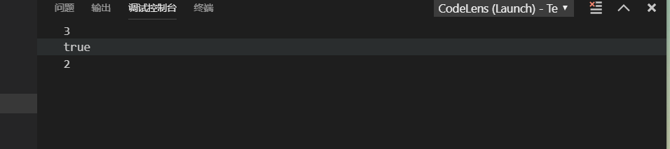

  

## 8.泛型

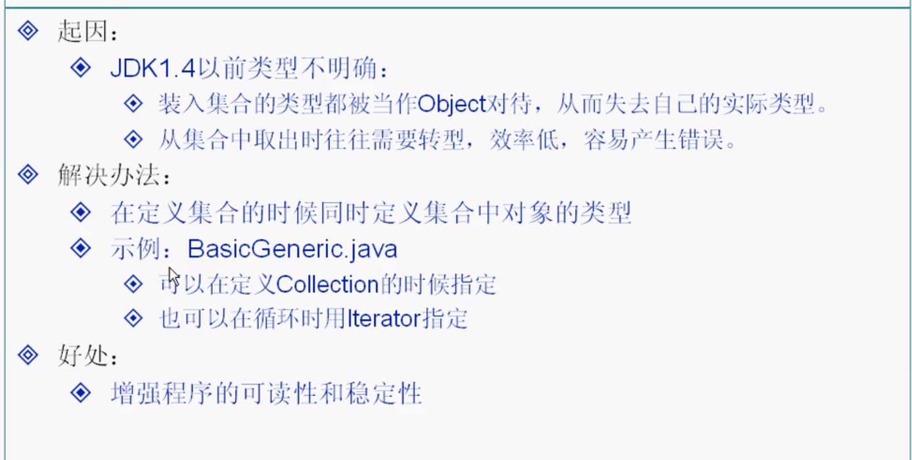

```java
import java.util.*;
public class Test{
    
    public static void main(String[] args) {
        //改写为泛型
        Map<String, Integer> m1 = new HashMap<String,Integer>();
        Map m2 = new TreeMap();
        m1.put("one",1);
        m1.put("two",2);
        m1.put("three",3);
        m2.put("A",1);
        m2.put("B",2);
        System.out.println(m1.size());
        System.out.println(m1.containsKey("one"));
        if(m1.containsKey("two")){
            //int i = (Integer) m1.get("two");
            int i = m1.get("two");
            System.out.println(i);
        }
    }
}
```

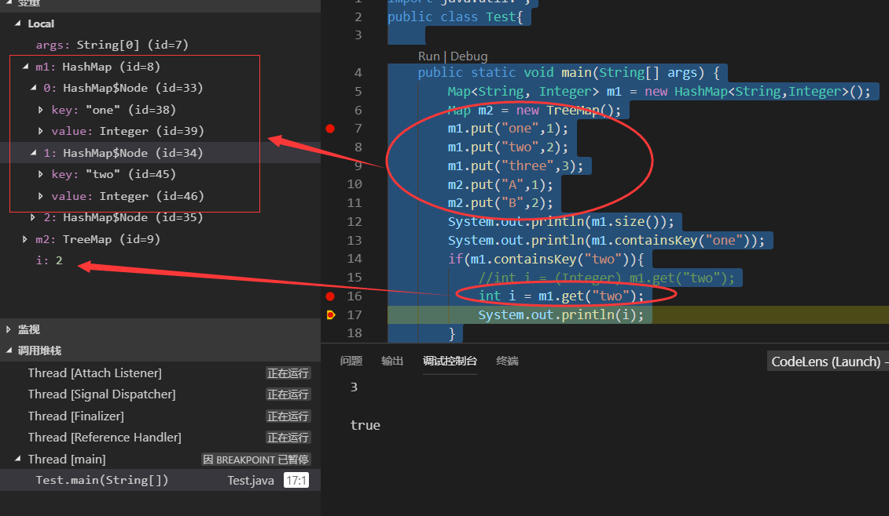

>  总结

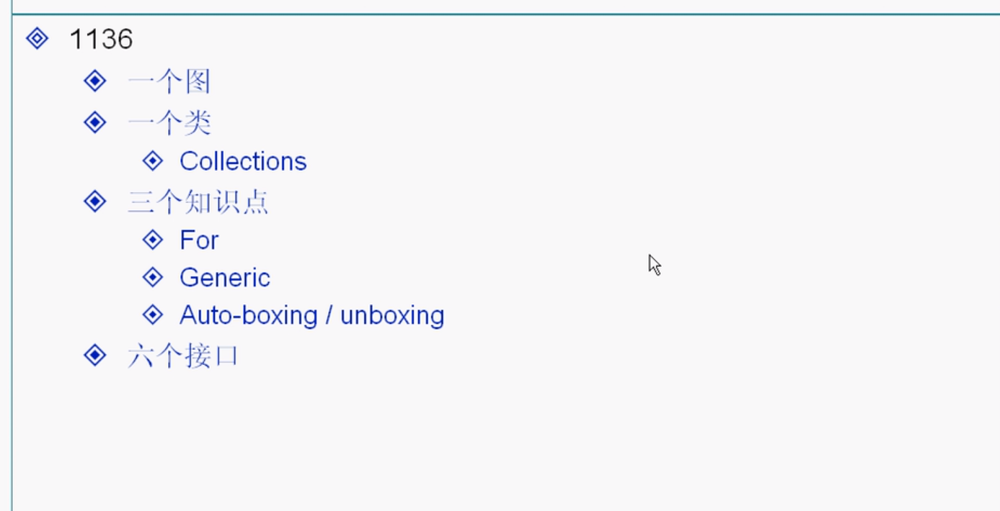