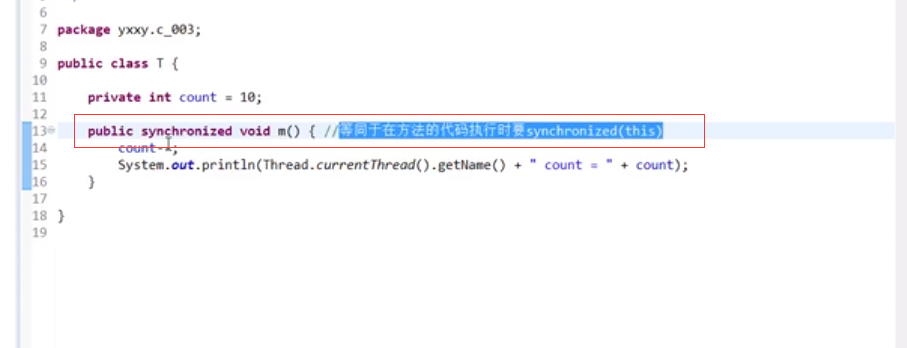
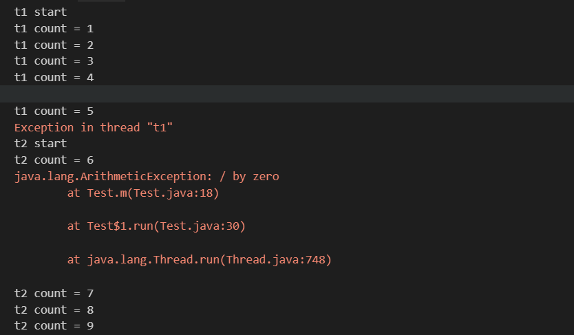
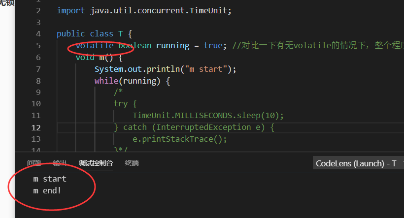
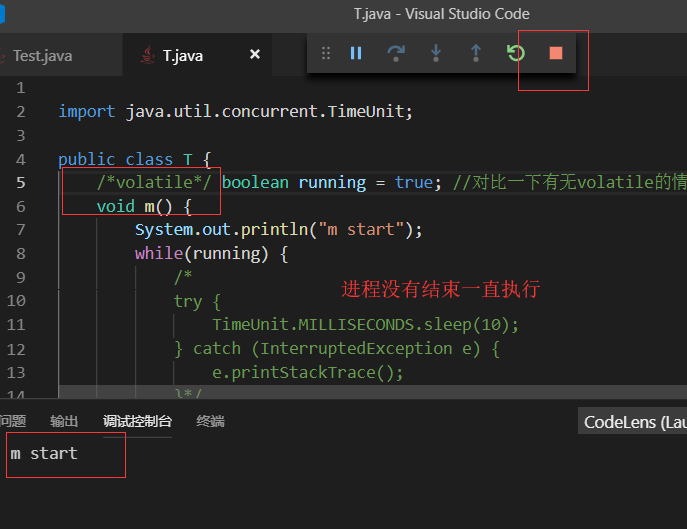
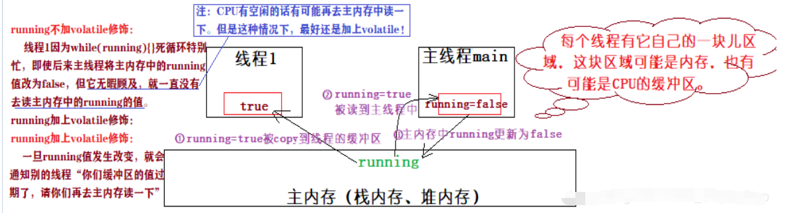
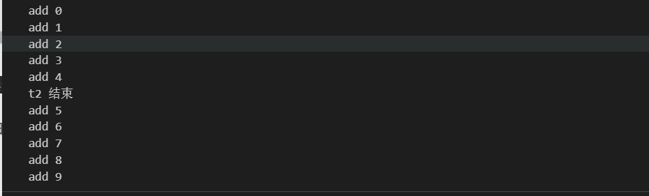

## 1. 基础的线程同步:synchronized

### 1.1synchronized示例

> 访问同一个变量的时候，可以加锁保证数据的一致性。该类中 this 锁定的是一个对象。


```java
public class T {
	
	private int count = 10;
	
	public void m() {
		synchronized(this) { //任何线程要执行下面的代码，必须先拿到this的锁
			count--;
			System.out.println(Thread.currentThread().getName() + " count = " + count);
		}
	}
	
}

```

简便写法：




>一个同步方法可以调用另外一个同步方法，一个线程已经拥有某个对象的锁，再次申请的时候仍然会得到该对象的锁. 
>
>也就是说synchronized获得的锁是可重入的
>
>这里是继承中有可能发生的情形，子类调用父类的同步方法

- 示例

```java
public class T {
	synchronized void m() {
		System.out.println("m start");
		try {
			TimeUnit.SECONDS.sleep(1);
		} catch (InterruptedException e) {
			e.printStackTrace();
		}
		System.out.println("m end");
	}
	
	public static void main(String[] args) {
		new TT().m();
	}
	
}

class TT extends T {
	@Override
	synchronized void m() {
		System.out.println("child m start");
		super.m();
		System.out.println("child m end");
	}
}
```

> 线程抛出异常后锁会释放吗？ 是

```java
/**
 * 程序在执行过程中，如果出现异常，默认情况锁会被释放
 * 所以，在并发处理的过程中，有异常要多加小心，不然可能会发生不一致的情况。
 * 比如，在一个web app处理过程中，多个servlet线程共同访问同一个资源，这时如果异常处理不合适，
 * 在第一个线程中抛出异常，其他线程就会进入同步代码区，有可能会访问到异常产生时的数据。
 * 因此要非常小心的处理同步业务逻辑中的异常
 */


import java.util.concurrent.TimeUnit;

public class T {
	int count = 0;
	synchronized void m() {
		System.out.println(Thread.currentThread().getName() + " start");
		while(true) {
			count ++;
			System.out.println(Thread.currentThread().getName() + " count = " + count);
			try {
				TimeUnit.SECONDS.sleep(1);
				
			} catch (InterruptedException e) {
				e.printStackTrace();
			}
			
			if(count == 5) {
				int i = 1/0; //此处抛出异常，锁将被释放，要想不被释放，可以在这里进行catch，然后让循环继续
				System.out.println(i);
			}
		}
	}
	
	public static void main(String[] args) {
		T t = new T();
		Runnable r = new Runnable() {

			@Override
			public void run() {
				t.m();
			}
			
		};
		new Thread(r, "t1").start();
		
		try {
			TimeUnit.SECONDS.sleep(3);
		} catch (InterruptedException e) {
			e.printStackTrace();
		}
		
		new Thread(r, "t2").start();
	}
	
}

```

运行结果：



### 1.2不要以字符常量作为锁的对象

示例：

```java
/**
 * 不要以字符串常量作为锁定对象
 * 在下面的例子中，m1和m2其实锁定的是同一个对象
 * 这种情况还会发生比较诡异的现象，比如你用到了一个类库，在该类库中代码锁定了字符串“Hello”，
 * 但是你读不到源码，所以你在自己的代码中也锁定了"Hello",这时候就有可能发生非常诡异的死锁阻塞，
 * 因为你的程序和你用到的类库不经意间使用了同一把锁
 */


public class T {
	
	String s1 = "Hello";
	String s2 = "Hello";

	void m1() {
		synchronized(s1) {
			
		}
	}
	
	void m2() {
		synchronized(s2) {
			
		}
	}

	

}
```


## 2.volatile关键字(无锁同步)

### 2.1.volatile的可见性

>volatile关键字 每个线程都有自己的一小块内存，执行的时候会把变量copy过来，修改了后在写回对象，
>
>执行m1方法的线程把 running读到内存里，与此同时主线程也把running读到内存，并进行修改，写回对象为false
>
>但是执行m1的线程里的内存一直都是true啊（因为太忙了没空去刷新）所以会形成死循环，
>
>volatile就是当running改了之后 *立马去通知其他线程，你们记得去主存刷新一下，一刷新，running为false，退出while循环。

示例：

```java

import java.util.concurrent.TimeUnit;

public class T {
	volatile boolean running = true; //对比一下有无volatile的情况下，整个程序运行结果的区别
	void m() {
		System.out.println("m start");
		while(running) {
			/*
			try {
				TimeUnit.MILLISECONDS.sleep(10);
			} catch (InterruptedException e) {
				e.printStackTrace();
			}*/
		}
		System.out.println("m end!");
	}
	
	public static void main(String[] args) {
		T t = new T();
		
		new Thread(t::m, "t1").start();
		
		try {
			TimeUnit.SECONDS.sleep(1);
		} catch (InterruptedException e) {
			e.printStackTrace();
		}
		
		t.running = false;
		
		
	}
	
}
```

运行结果：





> volatile 只保证原子性，而 synchronized 既保证可见性又保证原子性，但是synchronized太“重”了（效率很低）！



### 2.2.volatile不具备原子性

```java
import java.util.ArrayList;
import java.util.List;

public class T {
	volatile int count = 0; 
	void m() {
		for(int i=0; i<10000; i++) count++;
	}
	
	public static void main(String[] args) {
		T t = new T();
		
		List<Thread> threads = new ArrayList<Thread>();
		
		for(int i=0; i<10; i++) {
			threads.add(new Thread(t::m, "thread-"+i));
		}
		
		threads.forEach((o)->o.start());
		
		threads.forEach((o)->{
			try {
				o.join();
			} catch (InterruptedException e) {
				e.printStackTrace();
			}
		});
		
		System.out.println(t.count);
		
		
	}
	
}

```

运行结果：


### 2.3.synchronized既保证可见性又保证了原子性

```java
import java.util.ArrayList;
import java.util.List;


public class T {
	/*volatile*/ int count = 0;

	synchronized void m() { 
		for (int i = 0; i < 10000; i++)
			count++;
	}

	public static void main(String[] args) {
		T t = new T();

		List<Thread> threads = new ArrayList<Thread>();

		for (int i = 0; i < 10; i++) {
			threads.add(new Thread(t::m, "thread-" + i));
		}

		threads.forEach((o) -> o.start());

		threads.forEach((o) -> {
			try {
				o.join();
			} catch (InterruptedException e) {
				e.printStackTrace();
			}
		});

		System.out.println(t.count);

	}

}
```

运行结果：


### 2.4给容器list添加volatile方法

```java
import java.util.ArrayList;
import java.util.List;
import java.util.concurrent.TimeUnit;

/*给list添加volatile之后，t2能够接到通知，但t2线程的死循环很浪费CPU*/
public class MyContainer1 {

	/*volatile*/ List lists = new ArrayList();

	public void add(Object o) {
		lists.add(o);//add
	}

	public int size() {
		return lists.size();
	}
	
	public static void main(String[] args) {
		MyContainer1 c = new MyContainer1();

		new Thread(() -> {//该线程负责往list添加
			for(int i=0; i<10; i++) {
				c.add(new Object());
				System.out.println("add " + i);
				
				try {
					TimeUnit.SECONDS.sleep(1);
				} catch (InterruptedException e) {
					e.printStackTrace();
				}
			}
		}, "t1").start();
		
		new Thread(() -> {//该线程一直检测list的size,直到size等于5
			while(true) {//一直检测，浪费cpu
				if(c.size() == 5) {
					break;
				}
			}
			System.out.println("t2 结束");
		}, "t2").start();
	}
}

```

运行结果：



### 2.5使用wait（）和notify（）方法

> 当线程执行wait()方法时候，会释放当前的锁，然后让出CPU，进入等待状态。
>
> 当 notify/notifyAll() 被执行时，会唤醒一个或多个正处于等待状态的线程，然后继续往下执行，直到执行完synchronized 代码块的代码或是中途遇到wait() ，再次释放锁。

```java
import java.util.ArrayList;
import java.util.List;
import java.util.concurrent.TimeUnit;

public class MyContainer3 {

	//添加volatile，使t2能够得到通知
	volatile List lists = new ArrayList();

	public void add(Object o) {
		lists.add(o);
	}

	public int size() {
		return lists.size();
	}
	
	public static void main(String[] args) {
		MyContainer3 c = new MyContainer3();
		
		final Object lock = new Object();
		
		new Thread(() -> {
			synchronized(lock) {
				System.out.println("t2启动");
				if(c.size() != 5) {
					try {
						lock.wait();
					} catch (InterruptedException e) {
						e.printStackTrace();
					}
				}
				System.out.println("t2 结束");
			}
			
		}, "t2").start();
		
		try {
			TimeUnit.SECONDS.sleep(1);
		} catch (InterruptedException e1) {
			e1.printStackTrace();
		}

		new Thread(() -> {
			System.out.println("t1启动");
			synchronized(lock) {
				for(int i=0; i<10; i++) {
					c.add(new Object());
					System.out.println("add " + i);
					
					if(c.size() == 5) {
						lock.notify();
					}
					
					try {
						TimeUnit.SECONDS.sleep(1);
					} catch (InterruptedException e) {
						e.printStackTrace();
					}
				}
			}
		}, "t1").start();
		
		
	}
}

```

### 2.6 使用CountDownLatch（门闩）的await和countdown方法替代wait、notify方法来进行通知

```java
import java.util.ArrayList;
import java.util.List;
import java.util.concurrent.CountDownLatch;
import java.util.concurrent.TimeUnit;

public class MyContainer3 {

	// 添加volatile，使t2能够得到通知
	volatile List lists = new ArrayList();

	public void add(Object o) {
		lists.add(o);
	}

	public int size() {
		return lists.size();
	}

	public static void main(String[] args) {
		MyContainer3 c = new MyContainer3();

		CountDownLatch latch = new CountDownLatch(1);

		new Thread(() -> {
			System.out.println("t2启动");
			if (c.size() != 5) {
				try {
					latch.await();
					
					//也可以指定等待时间
					//latch.await(5000, TimeUnit.MILLISECONDS);
				} catch (InterruptedException e) {
					e.printStackTrace();
				}
			}
			System.out.println("t2 结束");

		}, "t2").start();

		try {
			TimeUnit.SECONDS.sleep(1);
		} catch (InterruptedException e1) {
			e1.printStackTrace();
		}

		new Thread(() -> {
			System.out.println("t1启动");
			for (int i = 0; i < 10; i++) {
				c.add(new Object());
				System.out.println("add " + i);

				if (c.size() == 5) {
					// 打开门闩，让t2得以执行
					latch.countDown();
				}

				try {
					TimeUnit.SECONDS.sleep(1);
				} catch (InterruptedException e) {
					e.printStackTrace();
				}
			}

		}, "t1").start();

	}
}
```


## 3.原子变量类（AtomXxx）

> 当更新一个变量的时候，多出现数据争用的时候可能出现所意想不到的情况。这时的一般策略是使用synchronized解决，因为synchronized能够保证多个线程不会同时更新该变量。然而，从jdk 5之后，提供了粒度更细、量级更轻，并且在多核处理器具有高性能的原子操作类。因为原子操作类把竞争的范围缩小到单个变量上，这可以算是粒度最细的情况了。
>
> 原子操作类相当于泛化的volatile变量，能够支持原子读取-修改-写操作。比如AtomicInteger表示一个int类型的数值，提供了get和set方法，这些volatile类型的变量在读取与写入上有着相同的内存语义。原子操作类共有13个类，在java.util.concurrent.atomic包下，可以分为四种类型的原子更新类：原子更新基本类型、原子更新数组类型、原子更新引用和原子更新属性。

- AtomicBoolean：原子更新布尔变量
- AtomicInteger：原子更新整型变量
- AtomicLong：原子更新长整型变量

```java
import java.util.ArrayList;
import java.util.List;
import java.util.concurrent.atomic.AtomicInteger;

public class T {
	/*volatile*/ //int count = 0;
	
	AtomicInteger count = new AtomicInteger(0); 

	/*synchronized*/ void m() { 
		for (int i = 0; i < 10000; i++)
			//if count.get() < 1000
			count.incrementAndGet(); //count++
	}

	public static void main(String[] args) {
		T t = new T();

		List<Thread> threads = new ArrayList<Thread>();

		for (int i = 0; i < 10; i++) {
			threads.add(new Thread(t::m, "thread-" + i));
		}

		threads.forEach((o) -> o.start());

		threads.forEach((o) -> {
			try {
				o.join();
			} catch (InterruptedException e) {
				e.printStackTrace();
			}
		});

		System.out.println(t.count);

	}

}
```

运行结果：

