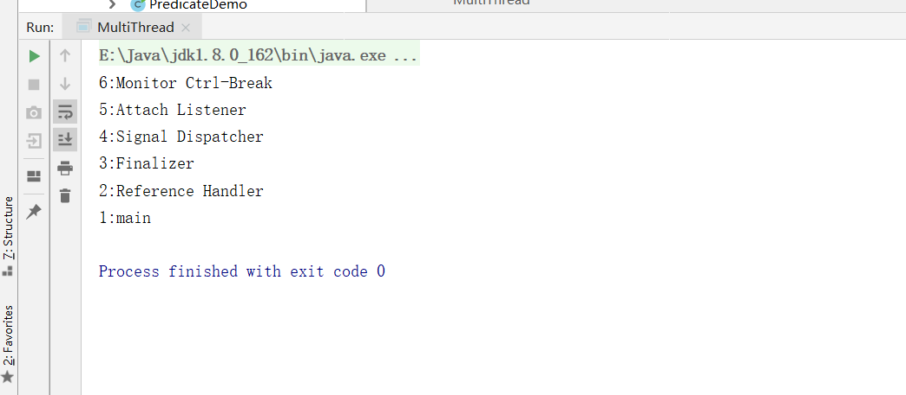

## 1.线程简介

### 1.1什么是线程

现代操作系统调度的最小单元是线程，也是轻量级线程，在一个进程中可以创建多个线程（而一个线程在一个时刻只能运行在一个处理器的核心上），这些线程都拥有各种的计数器、堆栈和局部变量等属性，并且可以访问共享的内存变量。``处理器在这些线程上高速切换 ，让使用者感觉这些线程是同步在执行的``。

> 使用jmx查看一个java线程包含哪些线程

```java
package cn.smallmartial.concurrency;

import java.lang.management.ManagementFactory;
import java.lang.management.ThreadInfo;
import java.lang.management.ThreadMXBean;

/**
 * @Author smallmartial
 * @Date 2019/8/22
 * @Email smallmarital@qq.com
 */
public class MultiThread {
    public static void main(String[] args) {
        ThreadMXBean threadMXBean = ManagementFactory.getThreadMXBean();
        ThreadInfo[] threadInfos = threadMXBean.dumpAllThreads(false, false);
        for (ThreadInfo threadInfo : threadInfos) {
            System.out.println(threadInfo.getThreadId()+":"+threadInfo.getThreadName());
        }
    }
}

```



> 一个java程序的运行不仅仅是main()方法的运行，而是main线程和其他多个线程在同时执行。

### 1.2为什么使用多线程

- 更多的处理器核心
- 更快的响应时间
- 更好的编程模型

### 1.3线程的优先级

- 现在操作系统采用时分的形式调度运行的线程，操作系统会分出一个个时间片，线程会被分配若干个时间片，当时间片用完则发生线程调度，并等着下次分配。

- 在java中通过变量``priority``来控制优先级，优先级默认范围1~10，通过``setProiority``方法来修改优先级，默认优先级是5。

  ```
  package cn.smallmartial.concurrency;
  
  import java.util.ArrayList;
  import java.util.concurrent.TimeUnit;
  
  /**
   * @Author smallmartial
   * @Date 2019/8/22
   * @Email smallmarital@qq.com
   */
  public class Priority {
      private static volatile boolean notStart = true;
      private static volatile boolean notEnd = true;
  
      public static void main(String[] args) throws Exception{
          ArrayList<Job> jobs = new ArrayList<Job>();
          for (int i = 0; i < 10; i++) {
              int priority = i < 5 ? Thread.MIN_PRIORITY : Thread.MAX_PRIORITY;
              Job job = new Job(priority);
              jobs.add(job);
              Thread thread = new Thread(job, "Thread:" + i);
              thread.setPriority(priority);
              thread.start();
          }
          notStart = false;
          TimeUnit.SECONDS.sleep(10);
          notEnd = false;
          for (Job job : jobs) {
              System.out.println("Job Priority:"+job.priority+"Count : "+job.jobCount);
          }
  
      }
  
      private static class Job implements Runnable {
          private int priority;
          private long jobCount;
  
          public Job(int priority) {
              this.priority = priority;
          }
  
          @Override
          public void run() {
              while (notStart){
                  Thread.yield();//yield, sleep 都能暂停当前线程，sleep 可以指定具体休眠的时间，而 yield 则依赖 CPU 的时间片划分
              }
              while (notEnd){
                  Thread.yield();
                  jobCount++;
              }
          }
      }
  }
  
  ```

  运行结果：

  

（个别系统，不依赖于线程的优先级--java并发编程艺术）