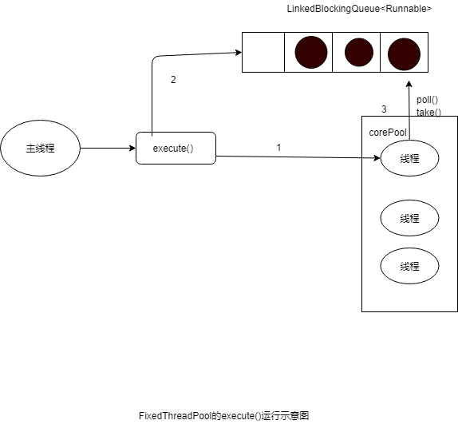
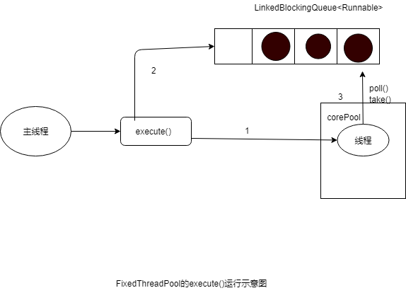

## Java并发编程基础（十）

## Exector最核心的框架是ThreadPoolExecutor,它是线程池的实现类，主要由以下组件构成

- corePool：核心线程池的大小

- maximunPool：最大线程池的大小

- BlockingQueue:用来暂时保存任务的工作队列

- RejectedExecutionHandler:当ThreadPoolExecutor已经关闭或者ThreadExecutor已经饱和（达到了最大线程池大小工作且工作队列已满），execute()方法将要调用的Handler

- 通过Executor框架的工具类可以创建3种类型的ThreadPoolExecutor。

  - FixedThreadPool
  - SingleThreadExecutor
  - CacheThreadPool

## 1.FixThreadPool详解：

  该线程池被成为可重用固定线程数的线程池。

```java
public static ExecutorService newFixedThreadPool(int nThreads) {
        return new ThreadPoolExecutor(nThreads, nThreads,
                                      0L, TimeUnit.MILLISECONDS,
                                      new LinkedBlockingQueue<Runnable>());
}
```

*创建一个线程池，该线程池重用固定数量的线程*在共享的无界队列中运行。在任何时候，最多* {@code nThreads}线程将是活动的处理任务。 *如果在所有线程都处于活动状态时提交了其他任务，*它们将在队列中等待，直到线程可用。 *如果任何线程在关闭之前由于执行期间的故障而终止*，如果需要执行后续任务，新的线程将取代它。

FixThreadPool示意圖：



示意图说明：

- 如果当前线程数小于corePoolSize,则创建新线程来执行任务
- 在线程池完成预热之后（当前运行的 线程数等于corePoolSize），则将任务加入LinkedBloockingQueue.
- 线程执行完1中的任务后，会在循环中反复从LinkedBlockQueue获取任务来执行。

## 2.SingleThreadExecutor是使用单个worker线程的Executor:

```java
public static ExecutorService newSingleThreadExecutor() {
        return new FinalizableDelegatedExecutorService
            (new ThreadPoolExecutor(1, 1,
                                    0L, TimeUnit.MILLISECONDS,
                                    new LinkedBlockingQueue<Runnable>()));
}
```



说明如下：

- 如果当前运行的线程少于corePoolSize(即线线程池中无运行的线程)，则创建一下线程来执行任务
- 在线程池完成预热之后，将任务加入LinkedBloockingQueue.
- 线程执行完成任务完1中任务后，会在一个无限循环中反复从LinkedBlockQueue获得任务执行任务

## 3.CachedThreadPool详情

CachedThreadPool是一个会根据需求创建新线程之后的线程池。

```java
    public static ExecutorService newCachedThreadPool() {
        return new ThreadPoolExecutor(0, Integer.MAX_VALUE,
                                      60L, TimeUnit.SECONDS,
                                      new SynchronousQueue<Runnable>());
    }
```


corePoolSize = 0，maximumPoolSize设置为Integer.MAX_VALUE，代表没有核心线程，非核心线程是无界的；keepAliveTime = 60L，空闲线程等待新任务的最长时间是60s；用了阻塞队列SynchronousQueue,是一个不存储元素的阻塞队列，每一个插入操作必须等待另一个线程的移除操作，同理一个移除操作也得等待另一个线程的插入操作完成；

执行过程如下：

- 1.首先执行SynchronousQueue.offer(Runnable task)。如果在当前的线程池中有空闲的线程正在执行SynchronousQueue.poll()，那么主线程执行的offer操作与空闲线程执行的poll操作配对成功，主线程把任务交给空闲线程执行。，execute()方法执行成功，否则执行步骤2

- 2.当线程池为空(初始maximumPool为空)或没有空闲线程时，配对失败，将没有线程执行SynchronousQueue.poll操作。这种情况下，线程池会创建一个新的线程执行任务。

- 3.在创建完新的线程以后，将会执行poll操作。当步骤2的线程执行完成后，将等待60秒，如果此时主线程提交了一个新任务，那么这个空闲线程将执行新任务，否则被回收。因此长时间不提交任务的CachedThreadPool不会占用系统资源。

SynchronousQueue是一个不存储元素阻塞队列，每次要进行offer操作时必须等待poll操作，否则不能继续添加元素。

## 4.各种阻塞队列的说明和比较：

Java并发包中的阻塞队列一共7个，当然他们都是线程安全的。

　　ArrayBlockingQueue：一个由数组结构组成的有界阻塞队列。 

　　LinkedBlockingQueue：一个由链表结构组成的有界阻塞队列。 

　　PriorityBlockingQueue：一个支持优先级排序的无界阻塞队列。 

　　DealyQueue：一个使用优先级队列实现的无界阻塞队列。 

　　SynchronousQueue：一个不存储元素的阻塞队列。 

　　LinkedTransferQueue：一个由链表结构组成的无界阻塞队列。 

　　LinkedBlockingDeque：一个由链表结构组成的双向阻塞队列。  