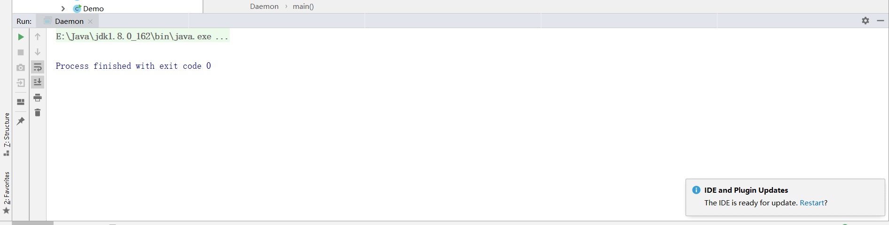
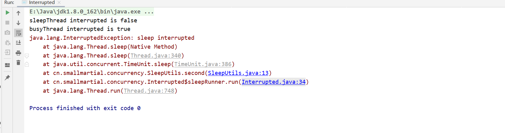
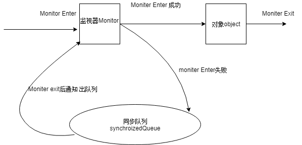

## java并发编程基础（二）

## 1.Daemon线程

Daemon是一个支持型线程，他主要被用作程序中后台调度以及支持性工作。

（Daemon属性需要在启动线程之前设置，不能在启动线程之后设置）

``Daemon`完成工作后，finally块不一定执行``

```java
package cn.smallmartial.concurrency;

/**
 * @Author smallmartial
 * @Date 2019/8/23
 * @Email smallmarital@qq.com
 */
public class Daemon {
    public static void main(String[] args) {
        Thread daemmonRunner = new Thread(new DaemonRunner(), "DaemmonRunner");
        daemmonRunner.setDaemon(true);
        daemmonRunner.start();
    }

    private static class DaemonRunner implements Runnable {
        @Override
        public void run() {
            try {
                SleepUtils.second(10);
            } catch (Exception e) {
                e.printStackTrace();
            }finally {
                System.out.println("finally run ...");
            }
        }
    }
}

```

``在构建Daemon线程时``，不能依靠finally块中的内容来确保执行关闭或者清理资源的逻辑

## 2.线程中断位

- 中断位可以理解为线程的一个标识位属性，他表示一个运行的线程是否被其他线程进行中断操作。线程可以通过isInterrupted()进行判段是否被中断，可以调用静态方法``Thread.interrupted``对当前线程的中断标识位进行复位。

- 在java虚拟机中 在抛出InterruptedException之前，会将中断位清除，isInterrupted()方法返回false。

  ```java
  package cn.smallmartial.concurrency;
  
  import java.util.concurrent.TimeUnit;
  
  /**
   * @Author smallmartial
   * @Date 2019/8/23
   * @Email smallmarital@qq.com
   */
  public class Interrupted {
      public static void main(String[] args) throws Exception {
          //不停的休眠
          Thread sleepThread = new Thread(new sleepRunner(), "sleepThread");
          sleepThread.setDaemon(true);
          //不停的运行
          Thread busyRunner = new Thread(new BusyRunner(), "BusyRunner");
          busyRunner.setDaemon(true);
          sleepThread.start();
          busyRunner.start();
          //休眠5秒 是两个线程充分运行
          TimeUnit.SECONDS.sleep(5);
          sleepThread.interrupt();
          busyRunner.interrupt();
          System.out.println("sleepThread interrupted is "+ sleepThread.isInterrupted());
          System.out.println("busyThread interrupted is "+busyRunner.isInterrupted());
          SleepUtils.second(2);
      }
  
      static class sleepRunner implements Runnable{
  
          @Override
          public void run() {
              while (true){
                  SleepUtils.second(10);
              }
          }
      }
  
      static class BusyRunner implements Runnable{
  
          @Override
          public void run() {
              while (true){
              }
          }
      }
  }
  
  ```

  



## 3.过期的suspend()、resume()和stop()

这些api不建议使用，在调用后、线程不会释放已占有的资源（比如锁），而是占有者资源进入睡眠状态，会引发死锁状态。

## 4.volatile和synchronized关键字

- java支持多个线程同时访问一个对象或者对象的成员变量，由于每个成员变量可以拥有这个变量的拷贝，所以在程序的执行过程中，一个线程看到的变量并不是最新的。
- 关键字``volatile`可以用来修饰字段（成员变量），目的告知程序任何对改变量的访问均需要从共享内存中获取，而对他的改变必须同步刷新回共享内存，它能保证所有线程对变量的可见性。
- 关键词synochronized可以修饰方法或者以同步块的形式使用，它主要确保多个线程在同一个时刻，只能有一个线程处于方法或者同步块中，它保证了线程对变量的可见性和排他性。

## 5.对象、对象的监视器、同步队列和执行线程之间的关系



任意线程对object访问时（synchronized保护），首先要获得Object的监视器，如果获取失败，线程则进入同步队列，线程状态变成blocked.当访问前驱object释放了锁，则该释放操作唤醒阻塞在同步队列的线程，使其重新尝试对监视器的获取。