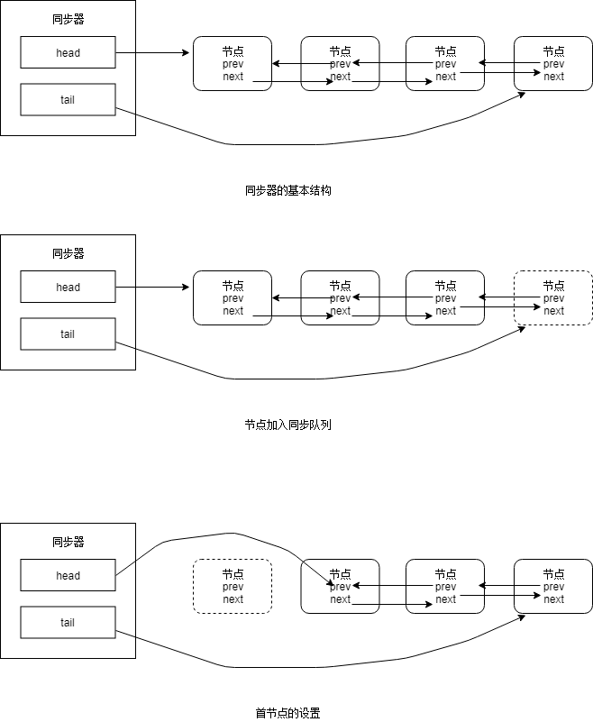
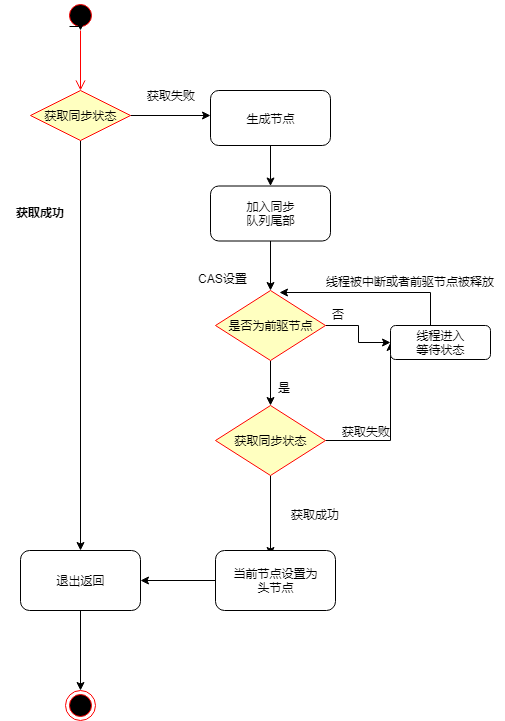

## Java中的锁

## 1.Lock接口

锁是用来控制多个线程访问共享资源的方式，一般来说，一个锁能够防止多个线程访问共享资源。在lock接口出现之前，java程序依靠synchroized关键字实现锁的功能，Loc接口拥有了获取锁与释放锁的可操作性，可中断的获取锁。

```java
package cn.smallmartial.concurrency;

import java.util.concurrent.locks.ReentrantLock;

/**
 * @Author smallmartial
 * @Date 2019/8/25
 * @Email smallmarital@qq.com
 */
public class LockUseCase {
    public static void main(String[] args) {
        ReentrantLock lock = new ReentrantLock();
        lock.lock();
        try{
            
        }finally {
            lock.unlock();
        }
    }
}

```

``在finally块中释放锁，目的保证在获取锁之后，最终能够被释放``

## 2.队列同步器

队列同步器是用来构建锁和其他同步组件的基础，它使用一个int成员变量表示同步状态，通过内置的FIFO队列来完成资源获取线程的排队工作。

同步器是实现锁的关键，在锁的实现中聚合同步器，利用同步器实现锁的语义。锁是面向使用者的，它定义了使用者与锁的交互接口，隐藏了实现细节；同步器面向的是锁的实现者，它简化了锁的实现方式，屏蔽了同步状态管理，线程的排队，等待与唤醒等底层操作。锁与同步器很好的隔离了使用者和实现者所关注的领域。

同步器主要使用方式是继承，子类通过继承同步器并实现它的抽象方法来管理同步器的状态：

- getState():获取当前的同步状态
- setState(int newState):设置当前同步器的状态
- compareAndSetState(int expect,int update):使用CAS设置当前状态，该方法能够保证状态设置的原子性。

同步器提供的模板方法分为3类：

- 独占式获取与释放同步状态
- 共享式获取与释放同步状态
- 查询同步队列中等待线程情况

```java
package cn.smallmartial.lock;

import sun.misc.Lock;

import java.util.concurrent.TimeUnit;
import java.util.concurrent.locks.AbstractQueuedLongSynchronizer;
import java.util.concurrent.locks.Condition;

/**
 * @Author smallmartial
 * @Date 2019/8/25
 * @Email smallmarital@qq.com
 */
public class Mutex extends Lock {
    //静态内部类 自定义同步器
    private static class Sync extends AbstractQueuedLongSynchronizer{
        //是否处于占用状态
        @Override
        protected boolean isHeldExclusively(){
            return getState() == 1;
        }
        //当状态为0的时候获取锁 同步器重写方法 独占式获取同步状态
        public boolean tryAcquire(int acquires){
            /**
             *  CAS的机制就相当于这种（非阻塞算法），CAS是由CPU硬件实现，所以执行相当快.
             *  CAS有三个操作参数：内存地址，期望值，要修改的新值，当期望值和内存当中的值进行比较不相等的时候，
             *  表示内存中的值已经被别线程改动过，这时候失败返回，当相等的时候，将内存中的值改为新的值，并返回成功。
             */
            if(compareAndSetState(0,1)){
                setExclusiveOwnerThread(Thread.currentThread());
                return true;
            }
            return false;
        }
        //释放锁，将状态设置为0 同步器重写方法 独占式释放同步状态
        protected boolean tryRelease(int relaeases){
            if (getState() == 0){
                throw new IllegalMonitorStateException();
            }
            setExclusiveOwnerThread(null);
            setState(0);
            return true;
        }
        //返回一个Condition,每个Condition都包含一个condition对列
        Condition newCondition(){
            return new ConditionObject();
        }

    }
    private final Sync sync = new Sync();

    public void lock1(){
        sync.acquire(1);
    }

    public boolean tryLock(){
        return sync.tryAcquire(1);
    }

    public void unlock1(){
        sync.release(1);
    }

    public Condition newCondition(){
        return sync.newCondition();
    }

    public boolean isLocked(){
        return sync.isHeldExclusively();
    }

    public boolean hasQueueTHreads(){
        return sync.hasQueuedThreads();
    }

    public void lockInterruptibly() throws InterruptedException{
        sync.acquireInterruptibly(1);
    }

    public boolean tryLock(long timeout, TimeUnit unit) throws InterruptedException{
        return sync.tryAcquireNanos(1,unit.toNanos(timeout));
    }

    public static void main(String[] args) {

    }
}

```

## 3.队列同步器的实现分析

### 3.1同步器



### 3.2独占式同步状态获取流程，acquire(int arg)方法调用流程。



### 3.3总结

在获取同步状态时，同步器维护一个同步队列，获取状态失败的线程都会被加入队列并在队列中进行自旋；移除队列（停止自旋的条件）是前驱节点为头节点且成功获取了同步状态。在释放锁同步状态时，同步器调用tryRelease(int arg)方法释放同步状态，然后唤醒头节点的后继节点。