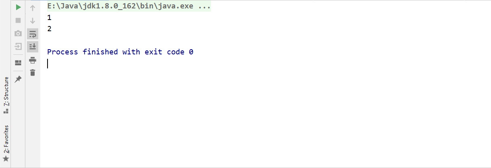
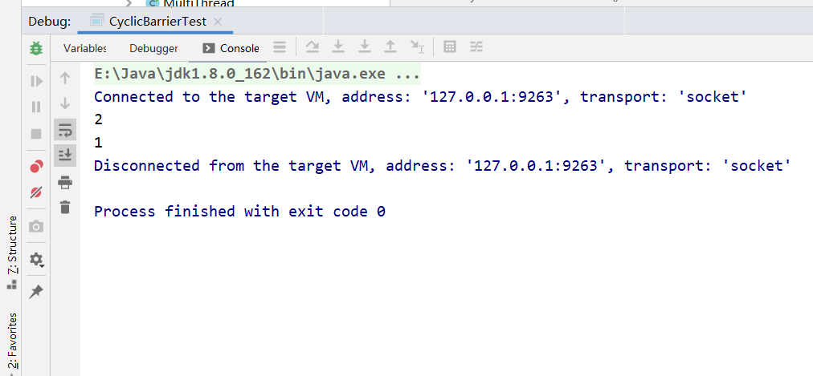

## java并发编程（八）

## 1.等待多线程完成的CountDownLatch

CountDown允许一个或者多个线程等待其他线程来完成工作。

```java
package cn.smallmartial.concurrency;

import sun.nio.ch.ThreadPool;

import java.util.concurrent.CountDownLatch;

/**
 * @Author smallmartial
 * @Date 2019/8/29
 * @Email smallmarital@qq.com
 */
public class JoinCounyDownLatchTest {

    static CountDownLatch c = new CountDownLatch(2);

    public static void main(String[] args) throws InterruptedException {
        new Thread(new Runnable() {
            @Override
            public void run() {
                System.out.println(1);
                c.countDown();
                System.out.println(2);
                c.countDown();
            }
        }).start();

        c.await();
        System.out.println(3);
    }
}
```

CountDownLatch的构造函数接受一个int类型的参数作为计数器，如果想等待N个点完成，就传入N。

当我们调用countDown方法时，N就会减少1，CountDownLatch的await方法就会阻塞当前线程，直到N为0。（计数器必须大于0，只是等于0的时候，计数器就是0.调用await方法时不会阻塞当前线程）

## 2.同步屏障CyclicBarrier

CyclicBarrier默认构造方法是CycicBarrier(int parties),其参数表示屏障拦截器的线程数量，每个线程调用await方法告诉CyclicBbarrier已到达屏障，然后当前线程被屏蔽

```java
package cn.smallmartial.concurrency;

import java.util.concurrent.BrokenBarrierException;
import java.util.concurrent.CyclicBarrier;

/**
 * @Author smallmartial
 * @Date 2019/8/29
 * @Email smallmarital@qq.com
 */
public class CyclicBarrierTest {
    static CyclicBarrier c = new CyclicBarrier(2);
    public static void main(String[] args) {
        new Thread(new Runnable() {
            @Override
            public void run() {
                try {
                    c.await();
                } catch (InterruptedException e) {
                    e.printStackTrace();
                } catch (BrokenBarrierException e) {
                    e.printStackTrace();
                }
                System.out.println(1);
            }
        }).start();

        try {
            c.await();
        } catch (InterruptedException e) {
            e.printStackTrace();
        } catch (BrokenBarrierException e) {
            e.printStackTrace();
        }
        System.out.println(2);
    }
}

```





因为主线程和子线程的调度任务是由CPU决定的，两个线程都有可能先执行，所以会产生以上两种结果。

>如果把 new CyclicBarrier(2)修改为3，则主线程和子线程会永远等待。

CyclicBarrier可以用于多线程计算数据，最后合并计算结果的场景。

3.CyclicBarrier和CountDown区别

- CountDown的计数器只能使用一次，而.CyclicBarrier的计数器可以使用reset重置。所以.CyclicBarrier可以处理更复杂的业务。
- .CyclicBarrier还提供其他的方法，如getNumberWaiting方法可以获取.CyclicBarrier阻塞线程的数量。isBroken判断是否被中断。

## 3.控制并发线程数的Semaphore

Semaphore是用来控制同时访问特定资源的线程数量，它通过协调各个线程，以保证合理的使用公共资源。

```java
package cn.smallmartial.concurrency;

import java.util.concurrent.Executor;
import java.util.concurrent.ExecutorService;
import java.util.concurrent.Executors;
import java.util.concurrent.Semaphore;


/**
 * @Author smallmartial
 * @Date 2019/8/29
 * @Email smallmarital@qq.com
 */
public class SemaphoreTest {
    private static final int THREAD_COUNT = 30;

    private static ExecutorService threadPool = Executors.newFixedThreadPool(THREAD_COUNT);

    private static Semaphore s = new Semaphore(10);

    public static void main(String[] args) {
        for (int i = 0; i < THREAD_COUNT; i++) {
            threadPool.execute(new Runnable() {
                @Override
                public void run() {
                    try {
                        s.acquire();
                        System.out.println("save data");
                        s.release();
                    } catch (InterruptedException e) {
                        e.printStackTrace();
                    }
                }
            });
        }
        threadPool.shutdown();
    }
}

```

## 4.线程间交换数据的Exchanger

Exchanger是一个用于线程间协作的工具类。Exchanger用于进行线程间的数据交换。它提供一个同步点，在这个同步点，两个线程可以交换彼此之间的数据。

```java
package cn.smallmartial.concurrency;

import java.util.concurrent.Exchanger;
import java.util.concurrent.ExecutorService;
import java.util.concurrent.Executors;

/**
 * @Author smallmartial
 * @Date 2019/8/29
 * @Email smallmarital@qq.com
 */
public class ExchangeTest {
    private static final Exchanger<String> exgr = new Exchanger<String>();
    //创建2个线程池
    private static ExecutorService threadPool = Executors.newFixedThreadPool(2);

    public static void main(String[] args) {
        threadPool.execute(new Runnable() {
            @Override
            public void run() {
                try {
                    String A = "test A";
                    exgr.exchange(A);
                } catch (InterruptedException e) {
                    e.printStackTrace();
                }
            }
        });

        threadPool.execute(new Runnable() {
            @Override
            public void run() {

                try {
                    String B = "test A";
                    String A  = exgr.exchange("B");
                    System.out.println("A和B数据是否一致："+A.equals(B)+" ,A录入的是："+A+" B录入的是："+B);
                } catch (InterruptedException e) {
                    e.printStackTrace();
                }
            }
        });
    }
}

```

- Exchanger可以用于遗传算法
- Exchanger也可以用于校对工作