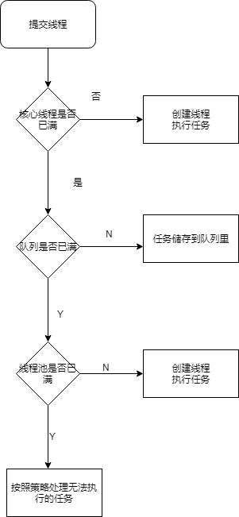
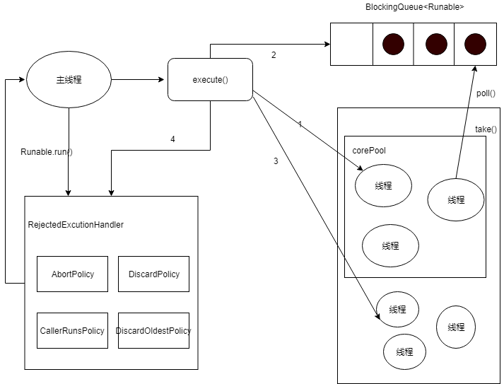

## Java并发编程（九）

## 1.java中的线程池

java中的线程池是运营最多的并发框架，几乎所有需要异步执行的程序都可以使用线程池。合理使用线程可以带来以下好处：

1. 降低资源消耗
2. 提高响应速度
3. 提高线程的可管理性

## 2.线程池实现的原理



1. 线程池判断核心线程池里面的线程是否都在执行，如果不是则创建新的线程，否则执行下一步
2. 线程池判断工作队列是否已满。如果工作队列未满，则将新提交的任务存储在这个工作队列中。如果工作队列满了，则进入下个流程。
3. 线程池判断线程是否都处于工作状态，如果没有则创建新的线程，否则交给饱和策略执行。

### 2.1ThreadPoolExcutor执行excute的流程：



1. 如果当前运行的线程小于corePoolSize,则创建新线程来执行任务。
2. 如果运行的线程等于或者多余corePoolSize则加入BlockingQueue队列
3. 如果无法加入队列，则创建新的线程
4. 如果当前线程超过maxmunPoolSize,任务则被拒绝。

### 2.2代码

```java
        public void excute(Runnable command){
            if(command == null){
                throw new NullPointerException(0);
            }
            if (poolSize >= corePoolSize || !addIfUnderCorePoolSize(command)){
                if(runState == RUNNING && workQueue.offer(command)){
                    if(runState != RUNNING || poolSize){
                        ensureQueueTaskHandled(command);
                    }
                }
            }else if(!addIfUnderCorePoolSize(command)){
                reject(command);
            }
        }
```

## 3.线程池的使用

### 3.1创建

可以使用ThreadPoolExecutor创建一个线程池：

```java
    public ThreadPoolExecutor(int corePoolSize,
                              int maximumPoolSize,
                              long keepAliveTime,
                              TimeUnit unit,
                              BlockingQueue<Runnable> workQueue,
                              RejectedExecutionHandler handler) {
        this(corePoolSize, maximumPoolSize, keepAliveTime, unit, workQueue,
             Executors.defaultThreadFactory(), handler);
    }
```

- corePoolSize：核心线程池的大小，如果核心线程池有空闲位置，这是新的任务就会被核心线程池新建一个线程执行，执行完毕后不会销毁线程，线程会进入缓存队列等待再次被运行。

- maximunPoolSize：线程池能创建最大的线程数量。如果核心线程池和缓存队列都已经满了，新的任务进来就会创建新的线程来执行。但是数量不能超过maximunPoolSize，否侧会采取拒绝接受任务策略，我们下面会具体分析。

- keepAliveTime：非核心线程能够空闲的最长时间，超过时间，线程终止。这个参数默认只有在线程数量超过核心线程池大小时才会起作用。只要线程数量不超过核心线程大小，就不会起作用。

- unit：时间单位，和keepAliveTime配合使用。

- workQueue：缓存队列，用来存放等待被执行的任务。

- threadFactory：线程工厂，用来创建线程，一般有三种选择策略。

```java
ArrayBlockingQueue;
LinkedBlockingQueue;
SynchronousQueue
```

- handler：拒绝处理策略，线程数量大于最大线程数就会采用拒绝处理策略，四种策略为

```java
ThreadPoolExecutor.AbortPolicy:丢弃任务并抛出RejectedExecutionException异常。 
ThreadPoolExecutor.DiscardPolicy：也是丢弃任务，但是不抛出异常。 
ThreadPoolExecutor.DiscardOldestPolicy：丢弃队列最前面的任务，然后重新尝试执行任务（重复此过程）
ThreadPoolExecutor.CallerRunsPolicy：由调用线程处理该任务 
```

### 3.2使用示例

```java
public class Task implements Runnable{
      private int num;
      public Task(int num) {
          this.num=num;
      }
    @Override
    public void run() {
        System.out.println("正在执行任务  "+num);
        try {
            Thread.currentThread().sleep(4000);
        } catch (InterruptedException e) {
            e.printStackTrace();
        }
        System.out.println("线程"+num+"执行完毕");
    }
}
```

