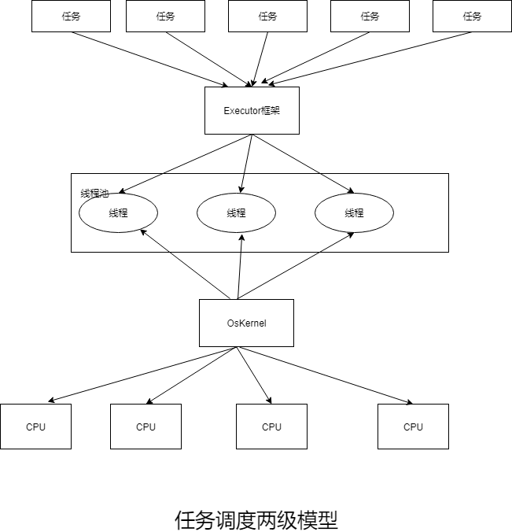
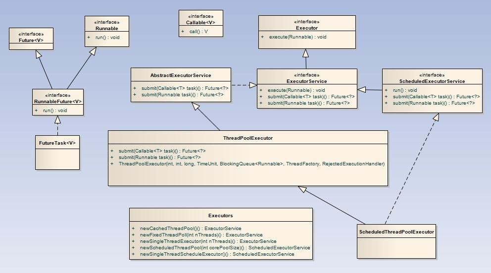
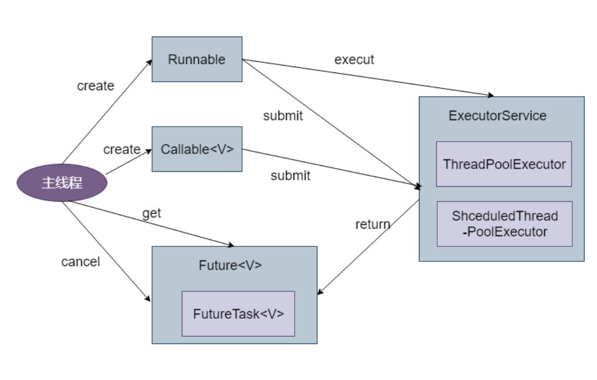
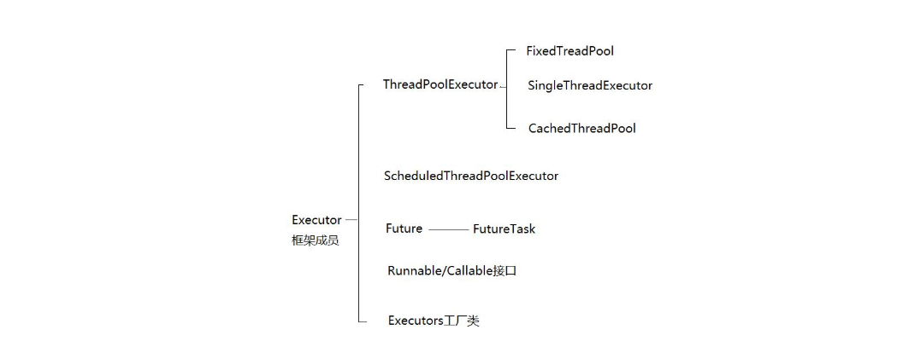

# Executor框架学习

## 1.Executor框架简介

### 1.1Executor框架的两级调度模型

在上层，Java多线程通常把应用划分为若干个任务，然后使用用户级的调度器将任务映射到固定数量的线程，在底层，操作系统内核将这些线程映射到硬件处理器上。这种调度模型的示意图如下：



从图中可以看出，应用程序通过Executor框架控制上层的调度，而下层的调度则有操作系统调度，下层的调度不受应用程序的控制。

### 1.2Executor框架的结构

- 任务：包括被执行任务需要实现的接口：Runnable接口和Callable接口。
- 任务的执行：包括任务执行机制的核心接口Executor,以及继承自Executor的ExecutorService接口。
- 异步计算的结果：包括接口Future和实现Future接口的FutureTask类。



下面是这些类和接口的简介：

- Executor是一个接口，它是Executor框架的基础，它将任务的提交与任务的执行分离开来。

- ThreadPoolExecutor 是线程池的核心实现类，用来执行被提交的任务。

- ScheduledThreadPoolExecutor 是一个实现类，可以在给定的延迟后运行命令，或者定期执行命令。ScheduledThreadPoolExecutor比Timer更灵活，功能更强大。

- Future接口和实现Future接口的FutureTask类，代表异步计算的结果。

- Runnable接口和Callable接口的实现类，都可以被ThreadPoolExecutor 或ScheduledThreadPoolExecutor执行。

Executor框架的使用示意图如下：



1. 创建Runnable并重写run（）方法或者Callable对象并重写call（）方法：

```java
class callableTest implements Callable<String >{
               @Override
               public String call() {
                   try{
                       String a = "return String";
                       return a;
                   }
                   catch(Exception e){
                       e.printStackTrace();
                       return "exception";
                   }
               }
           }
```

2. 创建Executor接口的实现类ThreadPoolExecutor类或者ScheduledThreadPoolExecutor类的对象，然后调用其execute（）方法或者submit（）方法把工作任务添加到线程中，如果有返回值则返回Future对象。其中Callable对象有返回值，因此使用submit（）方法；而Runnable可以使用execute（）方法，此外还可以使用submit（）方法，只要使用callable（Runnable task）或者callable(Runnable task,  Object result)方法把Runnable对象包装起来就可以，使用callable（Runnable task）方法返回的null，使用callable(Runnable task,  Object result)方法返回result。

   ```java
   ThreadPoolExecutor tpe = new ThreadPoolExecutor(5, 10,
                   100, MILLISECONDS, new ArrayBlockingQueue<Runnable>(5));
   Future<String> future = tpe.submit(new callableTest());
   ```

3. 调用Future对象的get（）方法后的返回值，或者调用Future对象的cancel（）方法取消当前线程的执行。最后关闭线程池

   ```java
   
   try{
               System.out.println(future.get());
           }
           catch(Exception e){
               e.printStackTrace();
           }
           finally{
               tpe.shutdown();
           }
   ```


### 1.3Executor框架成员

ThreadPoolExecutor实现类、ScheduledThreadPoolExecutor实现类、Future接口、Runnable和Callable接口、Executors工厂类



## 2.小结

本文介绍了`Executor`框架的整体结构和成员组件。
希望读者阅读本章之后，能够对`Executor`框架有一个比较深入的理解，同时也希望本章内容有助于读者更熟练地使用`Executor`框架。

