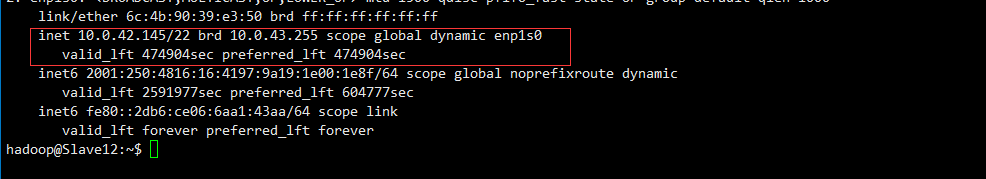
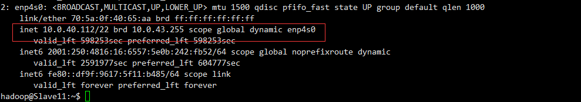

# keepalived安装与配置

## 1.keepalived简介：

keepalived是集群管理中保证集群高可用的一个服务软件，用来防止单点故障。

## 2.Keepalived工作原理

keepalived是以VRRP协议为实现基础的，VRRP全称Virtual Router Redundancy Protocol，即[虚拟路由冗余协议](http://en.wikipedia.org/wiki/VRRP)。

虚拟路由冗余协议，可以认为是实现路由器高可用的协议，即将N台提供相同功能的路由器组成一个路由器组，这个组里面有一个master和多个backup，master上面有一个对外提供服务的vip（该路由器所在局域网内其他机器的默认路由为该vip），master会发组播，当backup收不到vrrp包时就认为master宕掉了，这时就需要根据[VRRP的优先级](http://tools.ietf.org/html/rfc5798#section-5.1)来[选举一个backup当master](http://en.wikipedia.org/wiki/Virtual_Router_Redundancy_Protocol#Elections_of_master_routers)。这样的话就可以保证路由器的高可用了。

keepalived主要有三个模块，分别是core、check和vrrp。core模块为keepalived的核心，负责主进程的启动、维护以及全局配置文件的加载和解析。check负责健康检查，包括常见的各种检查方式。vrrp模块是来实现VRRP协议的。

## 3.安装keepalived

- 主机和备用机安装keepalived之前请先安装几个程序，命令：

  ```shell
  sudo apt-get install libssl-dev 
  sudo apt-get install openssl 
  sudo apt-get install libpopt-dev 
  ```

- 在主机和备用机安装keepalived

  ```shell
  apt-cache search keepalived
  
  sudo apt-get install keepalived
  ```

## 4.配置语法

配置虚拟路由器：实现IP流动的部分:

```shell
vrrp_instance <STRING> {
....
}
专用参数：
state MASTER|BACKUP：当前节点在此虚拟路由器上的初始状态；只能有一个是MASTER，余下的都应该为BACKUP；
interface IFACE_NAME：绑定为当前虚拟路由器使用的物理接口；
virtual_router_id VRID：当前虚拟路由器的惟一标识，范围是0-255；
priority 100：当前主机在此虚拟路径器中的优先级；范围1-254；
advert_int 1：vrrp通告的时间间隔；
authentication {
auth_type AH|PASS
auth_pass <PASSWORD>
}
virtual_ipaddress {
<IPADDR>/<MASK> brd <IPADDR> dev <STRING> scope <SCOPE> label <LABEL>
192.168.200.17/24 dev eth1
192.168.200.18/24 dev eth2 label eth2:1
}
track_interface {
eth0
eth1
...
}
配置要监控的网络接口，一旦接口出现故障，则转为FAULT状态；
nopreempt：定义工作模式为非抢占模式；
preempt_delay 300：抢占式模式下，节点上线后触发新选举操作的延迟时长；
定义通知脚本：
notify_master <STRING>|<QUOTED-STRING>：当前节点成为主节点时触发的脚本；
notify_backup <STRING>|<QUOTED-STRING>：当前节点转为备节点时触发的脚本；
notify_fault <STRING>|<QUOTED-STRING>：当前节点转为“失败”状态时触发的脚本；
notify <STRING>|<QUOTED-STRING>：通用格式的通知触发机制，一个脚本可完成以上三种状态的转换时的通知；
```

## 5.Keepalived 双主虚拟路由配置实例

演示说明：

 2台ubuntu 主机：node-01，node-02

node-01 ip: 10.0.42.145

node-02 ip: 10.0.40.112

>  node-01的配置如下:

```xshell
global_defs {
   notification_email {
    root@localhost
   }
   notification_email_from keepalived@localhost           #定义来信人
   smtp_server 127.0.0.1
   smtp_connect_timeout 30
   router_id node-00
   vrrp_mcast_group4 224.0.38.12
}

vrrp_instance VI_1 {
    state MASTER
    interface enp1s0
    virtual_router_id 38
    priority 100
    advert_int 1
    authentication {
        auth_type PASS
        auth_pass x1er44q
    }
    virtual_ipaddress {
        10.0.42.145/16 dev enp1s0
    }

    smtp_alert            #状态切换，使用邮件通知
}
vrrp_instance VI_2 {
    state BACKUP
    interface enp1s0
    virtual_router_id 39
    priority 97
    advert_int 1
    authentication {
        auth_type PASS
        auth_pass x1er44q
    }   
    virtual_ipaddress {
       10.0.40.112/16  dev enp1s0
    }  
   
```

> node-02的配置如下:

```shell
global_defs {
   notification_email {
    root@localhost
   }
   notification_email_from keepalived@localhost           #定义来信人
   smtp_server 127.0.0.1
   smtp_connect_timeout 30
   router_id node-00
   vrrp_mcast_group4 224.0.38.12
}

vrrp_instance VI_1 {
    state BACKUP
    interface enp1s0
    virtual_router_id 38
    priority 100
    advert_int 1
    authentication {
        auth_type PASS
        auth_pass x1er44q
    }
    virtual_ipaddress {
        10.0.42.145/16 dev enp1s0
    }

    smtp_alert            #状态切换，使用邮件通知
}
vrrp_instance VI_2 {
    state MASTER
    interface enp1s0
    virtual_router_id 39
    priority 97
    advert_int 1
    authentication {
        auth_type PASS
        auth_pass x1er44q
    }   
    virtual_ipaddress {
       10.0.40.112/16  dev enp1s0
    }  
```

配置完成后，启动服务:

```shell
sudo service keepalived start
```

查看进程是否存在：

```shell
ps -ef|grep keep
```


使用ip 命令查看ip情况：

```shell
ip address show
```

> node01



> node02

