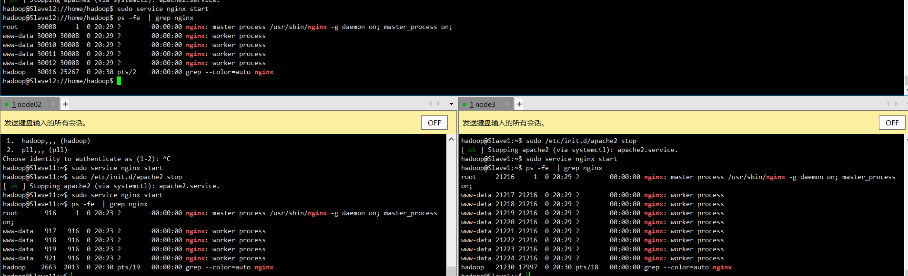
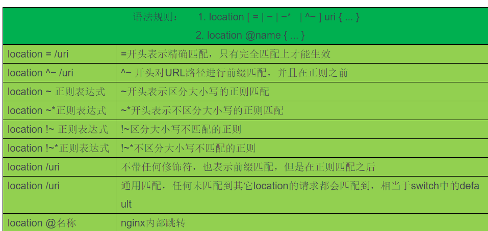

Nginx的安装与配置

## 1. ubuntu nginx 安装

安装

```shell

sudo apt install nginx 
```

启动与停止

```
sudo service nginx start //启动

sudo service nginx restart//重启

sudo service nginx stop//停止

```

查看nginx进程

```she
ps -fe  | grep nginx
```



## 2.nginx events配置解析

```

events {
    accept_mutex on; #设置网路连接序列化，防止惊群现象发生，默认为on
    multi_accept on; #设置一个进程是否同时接受多个网络连接，默认为off
    #use epoll; #事件驱动模型，select|poll|kqueue|epoll|resig|/dev/poll|eventport
    worker_connections 1024; # 最大连接数
    client_header_buffer_size 4k;
    open_file_cache max=2000 inactive=60s;
    open_file_cache_valid 60s;
    open_file_cache_min_uses 1
}
```

-  worker_connections 的值，根据worker_processes进程数目和系统可以打开的最大文件总数进行适当的设置。
  - 使并发总数小于操作系统可以打开的最大文件数目
  - 本质是根据主机的物理CPU和内存进行配置
  - 理论的并发数和实际有偏差，主机有其他进程需要消耗

```
ulimit -a//查看系统约束
ulimit -SHn 65535//改变系统约束
```


- accept_mutex on

惊群现象：一个网路连接到来，多个睡眠的进程被同时叫醒，但只有一个进程能获得链接，这样会影响系统性能。设置网路连接序列化，防止惊群现象发生，默认为on。

- multi_accept on

设置是否允许同时接受多个网络连接：

　　只能在events模块设置，Nginx服务器的每个工作进程可以同时接受多个新的网络连接，但是需要在配置文件中配置，此指令默认为关闭，即默认为一个工作进程只能一次接受一个新的网络连接，打开后几个同时接受多个。

- use epoll

  使用epoll的I/O 模型（值得注意的是如果你不知道Nginx该使用哪种轮询方法的话，它会选择一个最适合你操作系统的）

  ）标准事件模型

  Select、poll属于标准事件模型，如果当前系统不存在更有效的方法，nginx会选择select或poll

  B）高效事件模型

  Kqueue：使用于FreeBSD 4.1+, OpenBSD 2.9+, NetBSD 2.0 和 MacOS X.使用双处理器的MacOS X系统使用kqueue可能会造成内核崩溃。

   Epoll：使用于Linux内核2.6版本及以后的系统

- keepalive_timeout 60

keepalive超时时间。 这里指的是http层面的keep-alive 并非tcp的keepalive 。

- client_header_buffer_size 4k

客户端请求头部的缓冲区大小，这个可以根据你的系统分页大小来设置，一般一个请求头的大小不会超过1k，不过由于一般系统分页都要大于1k，所以这里设置为系统分页大小。查看系统分页可以使用 getconf PAGESIZE命令：

- open_file_cache max=2000 inactive=60s

  为打开文件指定缓存，默认是没有启用的，max指定缓存最大数量，建议和打开文件数一致，inactive是指经过多长时间文件没被请求后删除缓存 打开文件最大数量为我们再main配置的worker_rlimit_nofile参数。

- open_file_cache_valid 60s

  这个是指多长时间检查一次缓存的有效信息。如果有一个文件在inactive时间内一次没被使用，它将被移除

- open_file_cache_min_uses 1

  open_file_cache指令中的inactive参数时间内文件的最少使用次数，如果超过这个数字，文件描述符一直是在缓存中打开的，如果有一个文件在inactive时间内一次没被使用，它将被移除

## 3.location配置

- location语法

　> location [=|~|~*|^~] patt { }  //中括号中为修饰符，可以不写任何参数,此时称为一般匹配，也可以写参数

```shell
　location = patt {} [精准匹配]

　location patt{}     [普通匹配]

　location ~ patt{}  [正则匹配]
```

- location匹配过程：

  - 先进性精准匹配,如果命中立即返回结果并结束解析的过程。
  - 精准匹配未命中判断普通匹配,如果命中多个会记录下"最长的"命中结果,但不会结束解析;
  - 继续判断正则匹配,按照正则匹配设置的规则正则表达式进行匹配,如果有多个正则匹配由上到下进行匹配,一旦匹配成功一个会立即返回结果并结束解析.

  ```shell
  server {
  
          listen 80; 
  
          server_name localhost; 
  
          location =/text.html { #精准匹配,浏览器输入IP地址/text.html,定位到服务器/var/www/html/text.html文件
  
              root /var/www/html;   
  
              index text.html;
  
          }
  
          location / { #普通匹配,浏览器输入IP地址,定位到服务器/usr/local/nginx/html/default.html文件
  
              root html;   
  
              index default.html;
  
          }
  
  
  　　　　location ~ image { #正则匹配,浏览器输入IP/image..地址会被命中,定位到/var/www/image/index.html
  　　　　　　root /var/www/image;
  　　　　　　index index.html;
  　　　　}
      }
  ```

  