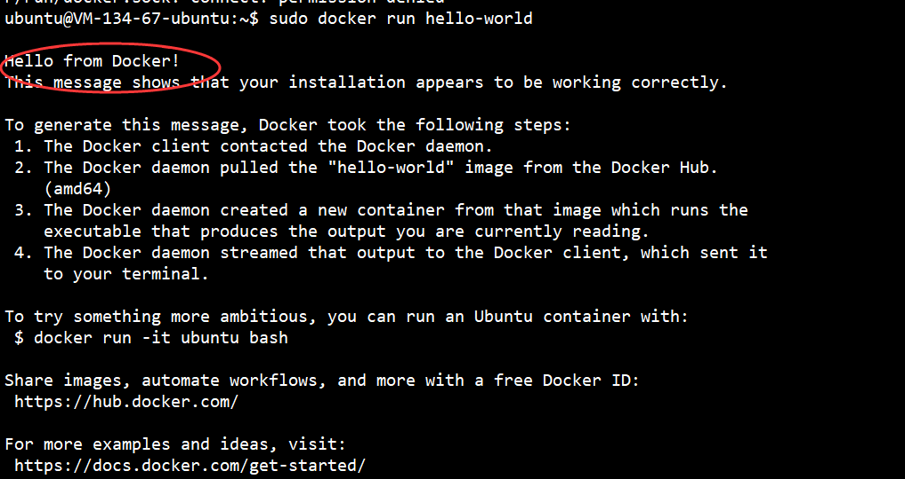
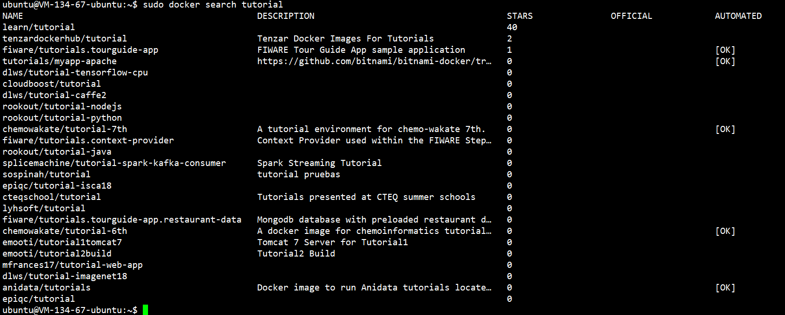
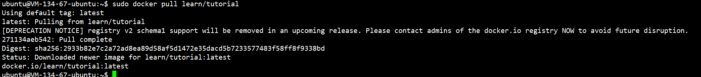
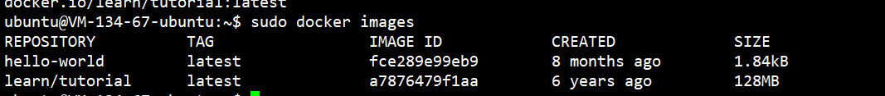
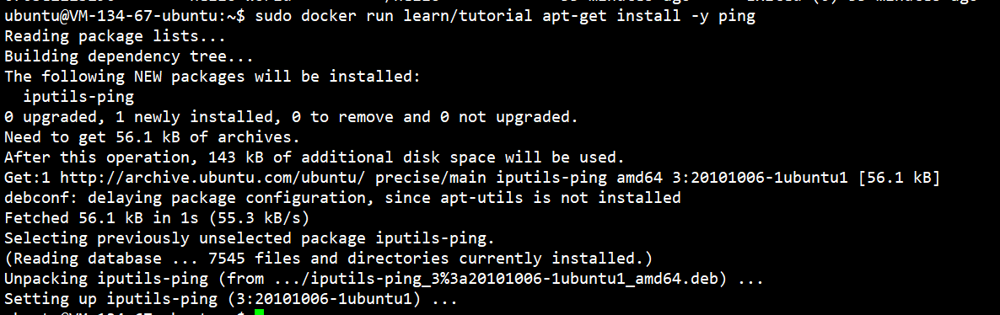
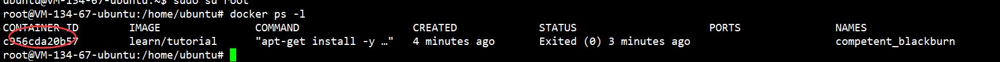
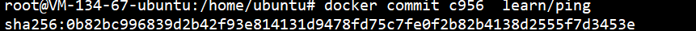
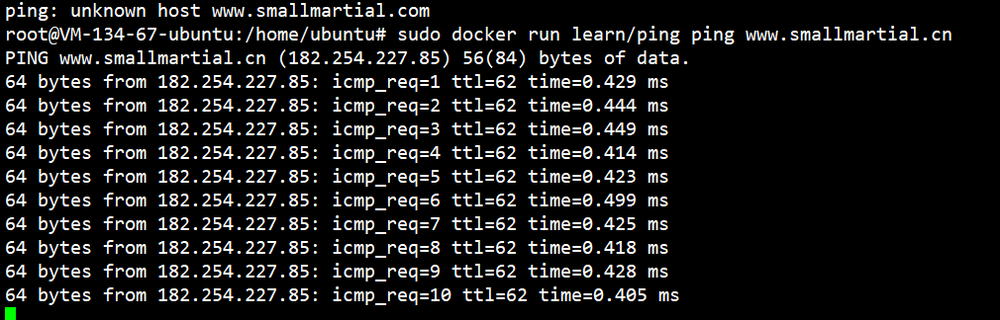
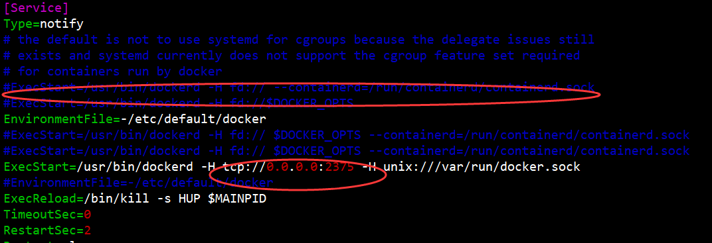
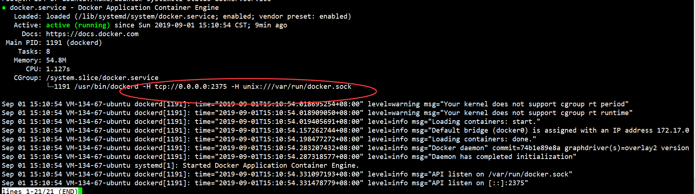

# 在Ubuntu操作系统里安装Docker

Docker 是一个开源的应用容器引擎，让开发者可以打包他们的应用以及依赖包到一个可移植的容器中，然后发布到任何流行的 Linux 机器上，也可以实现虚拟化。容器是完全使用沙箱机制，相互之间不会有任何接口。

1. 由于Ubuntu里apt官方库里的docker版本可能比较低，因此先用下面的命令行卸载旧版本（如果有的话）

   ```shell
   sudo apt-get remove docker docker-engine docker-ce docker.io
   ```

## 1.安装docker CE时

```shell
sudo apt-get install -y apt-transport-https ca-certificates curl software-properties-common
```

## 2添加Docker官方GPG key, 需要切换到root账号

```shell
sudo su root
sudo curl -fsSL https://mirrors.aliyun.com/docker-ce/linux/ubuntu/gpg | apt-key add -
```

## 3.添加最新或测试repository

```
add-apt-repository "deb [arch=amd64] https://mirrors.aliyun.com/docker-ce/linux/ubuntu $(lsb_release -cs) stable"
```

## 4.更新apt包索引

```
apt-get update
```

## 5.安装最新版本的Docker CE

```
apt-get install -y docker-ce
```

## 6.查看docker版本

```shell
docker version
```


## 7.使用命令sudo docker run hello-world，能观察到从远程下载这个测试用的容器：Pulling from library/hello-world:然后看到打印消息：Hello from Docker! 说明Docker安装成功。



## 8.搜索可用的docker镜像

```shell
sudo docker search tutorial
```



## 9.下载容器镜像

学会使用docker命令来下载镜像
下载镜像的命令非常简单，使用docker pull命令即可。(译者按：docker命令和git有一些类似的地方）。在docker的镜像索引网站上面，镜像都是按照 用户名/镜像名 的方式来存储的。有一组比较特殊的镜像，比如ubuntu这类基础镜像，经过官方的验证，值得信任，可以直接用 镜像名来检索到。

目标：通过docker命令下载tutorial镜像。

```shell
sudo docker pull learn/tutorial
```



## 10.查看镜像

```shell
sudo docker images 
```



## 11.Docker 删除镜像

```html
1. 查询镜像：docker images
    可以看到所有已经存在的镜像的 ID (IMAGE ID)
2. 查询容器：docker ps -a
    可以看到所有容器的 ID (CONTAINER ID)
3. 先删除容器：docker rm 容器ID
4. 再删除镜像：docker rmi 镜像ID
```

## 12.在容器中安装新的程序

下一步我们要做的事情是在容器里面安装一个简单的程序(ping)。我们之前下载的tutorial镜像是基于ubuntu的，所以你可以使用ubuntu的apt-get命令来安装ping程序： apt-get install -y ping

```shell
sudo docker run learn/tutorial apt-get install -y ping
```



## 13.保存对容器的修改

简介：通过docker commit命令保存对容器的修改,保存对容器的修改,当你对某一个容器做了修改之后（通过在容器中运行某一个命令），可以把对容器的修改保存下来，这样下次可以从保存后的最新状态运行该容器。docker中保存状态的过程称之为committing，它保存的新旧状态之间的区别，从而产生一个新的版本。

1. 首先使用 **docker ps -l** 命令获得安装完ping命令之后容器的id

   ```ht
   提示：
       1. 运行docker commit，可以查看该命令的参数列表。
       2. 你需要指定要提交保存容器的ID。(译者按：通过docker ps -l 命令获得)
       3. 无需拷贝完整的id，通常来讲最开始的三至四个字母即可区分。（译者按：非常类似git里面的版本号)
   ```

   

2. 提交

   ```shell
   docker commit c956  learn/ping
   ```

   

## 14.运行新的镜像

```shell
docker run learn/ping ping www.smallmartial.cn
```



15.Ubuntu 18 下修改docker 配置文件不生效问题解决:

```shell
vim /lib/systemd/system/docker.service
#修改之后 执行以下代码
sudo systemctl daemon-reload
sudo service docker restart
#查看状态
systemctl status docker.service
```




```shell
源地址 
ExecStart=/usr/bin/dockerd -H fd:// --containerd=/run/containerd/containerd.sock
修改为
ExecStart=/usr/bin/dockerd -H tcp://0.0.0.0:2375 -H unix:///var/run/docker.sock
```

``tcp://0.0.0.0:2375``对外访问端口
