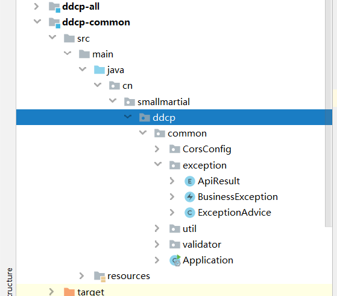
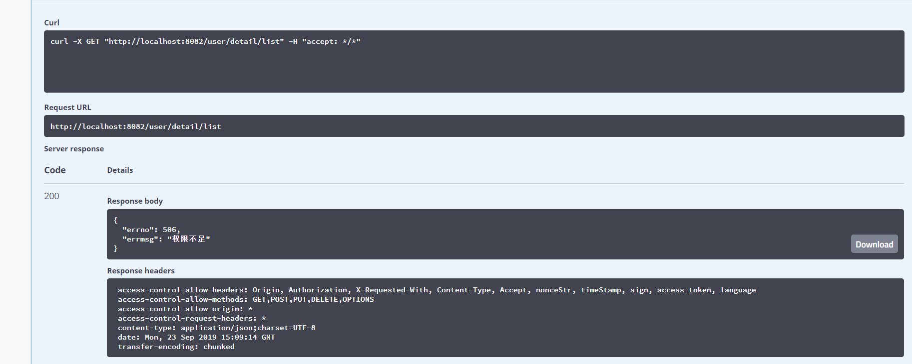

## Spring boot异常统一处理

## 1.首先创建异常处理包和类



## 2.使用@ControllerAdvice注解

全局捕获异常类，只要作用在@RequestMapping上，所有的异常都会被捕获。

```java
@ControllerAdvice
@ResponseBody
@Slf4j
public class ExceptionAdvice {

    /**
     * 400 - Bad Request
     */
    @ResponseStatus(HttpStatus.BAD_REQUEST)
    @ExceptionHandler(HttpMessageNotReadableException.class)
    public Object handleHttpMessageNotReadableException(HttpMessageNotReadableException e) {
        log.error("参数解析失败", e);
        return ResponseUtil.badArgument();
    }

    /**
     * 405 - Method Not Allowed
     */
    @ResponseStatus(HttpStatus.METHOD_NOT_ALLOWED)
    @ExceptionHandler(HttpRequestMethodNotSupportedException.class)
    public Object handleHttpRequestMethodNotSupportedException(HttpRequestMethodNotSupportedException e, HttpServletRequest request) {
        log.error("不支持当前请求方法", e);
        return ResponseUtil.unsupport();
    }

    /**
     * 415 - Unsupported Media Type
     */
    @ResponseStatus(HttpStatus.UNSUPPORTED_MEDIA_TYPE)
    @ExceptionHandler(HttpMediaTypeNotSupportedException.class)
    public Object handleHttpMediaTypeNotSupportedException(Exception e, HttpServletRequest request) {
        log.error("不支持当前请求方法", e);
        return ResponseUtil.unsupport();
    }

    /**
     * 500 - Internal Server Error
     * 系统异常以506返回
     */
    @ResponseStatus(HttpStatus.OK)
    @ExceptionHandler(Exception.class)
    public Object handleException(Exception e, HttpServletRequest request, HttpServletResponse response) {
        log.error(e.getMessage(), e);
        if (e instanceof ExpiredJwtException) {
            Map<String, Object> obj = new HashMap<String, Object>();
            obj.put("errno", 506);
            obj.put("errmsg", "系统异常");
            log.error("权限不足", e);
            return obj;
        }
        log.error("系统异常", e);
        return ResponseUtil.serious();
    }

    /**
     * 业务异常
     */
    @ResponseStatus(HttpStatus.OK)
    @ExceptionHandler(BusinessException.class)
    public Object handleException(BusinessException e) {
        log.error(e.getMessage(), e);
        ApiResult apiResult = e.getApiResult();
        Map<String, Object> obj = new HashMap<String, Object>();
        obj.put("errno", apiResult.getErrno());
        obj.put("errmsg", apiResult.getErrmsg());
        return obj;
    }
}
```

## 3.自定义异常

### 3.1首先创建自定义异常枚举类型：

```java
public enum ApiResult {
    /**
     * 自定义异常
     */
    UNAUTHZ(506,"权限不足"),
    BADARGUMENT(401,"参数不对")
    ;


    private Integer errno;

    private String errmsg;

    ApiResult(Integer errno, String errmsg) {
        this.errno = errno;
        this.errmsg = errmsg;
    }

    public Integer getErrno() {
        return errno;
    }

    public void setErrno(Integer errno) {
        this.errno = errno;
    }

    public String getErrmsg() {
        return errmsg;
    }

    public void setErrmsg(String errmsg) {
        this.errmsg = errmsg;
    }
}

```

### 3.2定义异常类继承extends RuntimeException

```java
public class BusinessException extends RuntimeException {

    private static final long serialVersionUID = -9138712164205129842L;

    private ApiResult apiResult;

    public BusinessException(ApiResult apiResult) {
        this.apiResult = apiResult;
    }

    public BusinessException(String message, ApiResult apiResult) {
        super(message);
        this.apiResult = apiResult;
    }

    public BusinessException(String message, Throwable cause, ApiResult apiResult) {
        super(message, cause);
        this.apiResult = apiResult;
    }

    public BusinessException(Throwable cause, ApiResult apiResult) {
        super(cause);
        this.apiResult = apiResult;
    }

    public BusinessException(String message, Throwable cause, boolean enableSuppression, boolean writableStackTrace, ApiResult apiResult) {
        super(message, cause, enableSuppression, writableStackTrace);
        this.apiResult = apiResult;
    }

    public ApiResult getApiResult() {
        return apiResult;
    }

    public void setApiResult(ApiResult apiResult) {
        this.apiResult = apiResult;
    }

    public Map<String, Object> getResultMap() {
        Map<String, Object> result = new HashMap<>(2);
        result.put("errno", apiResult.getErrno());
        result.put("errmsg", apiResult.getErrmsg());
        return result;
    }

    @Override
    public String toString() {
        return "BusinessException{" +
                "apiResult=" + apiResult.toString() +
                '}';
    }
}
```

4.异常测试：

```java
/**
 * @Author smallmartial
 * @Date 2019/9/22
 * @Email smallmarital@qq.com
 */
@RestController
@RequestMapping("/user/detail")
@Api(tags = {"用户详情接口"})
public class TbUserDetailController extends BaseController{

    @Autowired
    private TbUserDetailService tbUserDetailService;

    @GetMapping("/list")
    public Object list(){
        AuthInfo userAuthInfo = getUSERAuthInfo();
        //未授权抛出异常
        checkCommonParam(userAuthInfo);
        TbUserDetail tbUserDetail = tbUserDetailService.findById(1L);
        return ResponseUtil.ok(tbUserDetail);
    }
}

```



## 4.总结

为什么需要自定义异常呢？自定义异常可以捕获系统的内部错误，让用户可以看到自己定义的错误，而不是出现一段异常代码。使用@ControllerAdvice可以简化try.catch去捕获，代码还是根据业务需求去补充完善。好的代码结构永远值得我们去学习和借鉴。