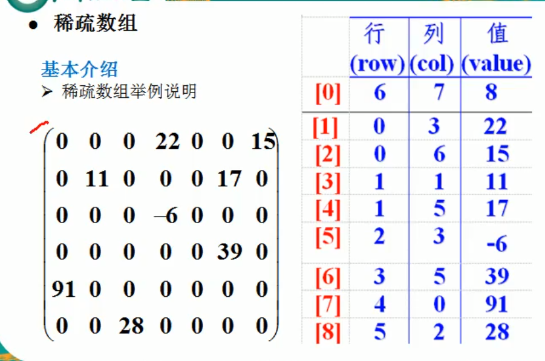
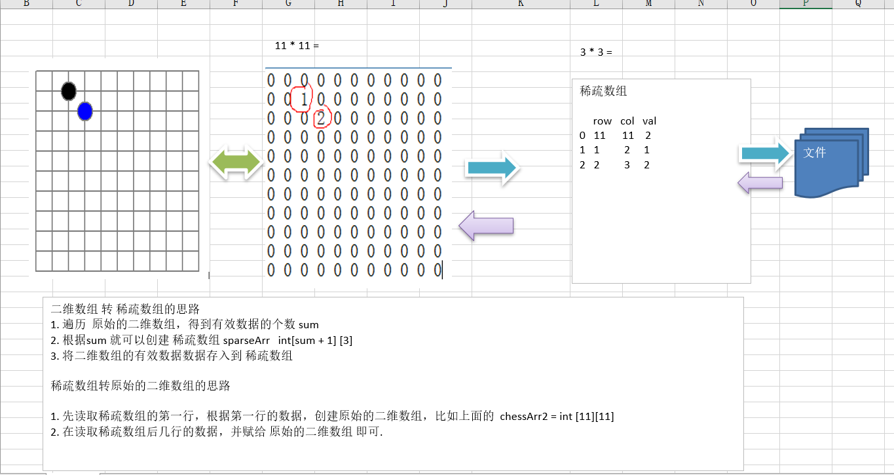
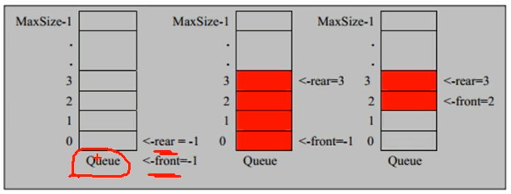

## 1.数据结构包括：线性结构和非线性结构

### 1.1线性结构

- 线性结构为最常用的数据结构，其特点是**数据元素之间存在一对一**的线性关系
- 线性结构有两种不同的存储结构，即顺序存储结构和链式存储结构。顺序存储的线性表称为顺序表，顺序表中的存续元素是连续的
- 链式存储的线性表称为链表，链表中的存储元素不一定连续，元素节点中存放数据元素以及相邻元素的地址信息
- 线性结构常见有：数组，队列，链表和栈

### 1.2非线性结构

非线性结构包括：二维组，多维数组，广义表，树结构，图结构

## 2.稀疏数组

### 2.1基本介绍：

当一个数组中大部分元素为0，或者为同一个值的数组时，可以用稀疏数组保存。

### 2.2稀疏数组处理方法：

- 纪录数据一共有几行几列，有多少个不同的值

- 把具有不同值的元素行列及值纪录在一个小规模的数组中，从而缩小程序的规模

  

### 2.3稀疏数组实现思路



### 2.4代码实现

```java
package cn.smallmartial.demo;

/**
 * @Author smallmartial
 * @Date 2019/6/1
 * @Email smallmarital@qq.com
 */
public class SparseArray {

    public static void main(String[] args){
        //创建一个二维数组
        //0 表示没有棋子，1表示黑子，2表示白子
        int chessArr1[][] = new int[11][11];
        chessArr1[1][2] = 1;
        chessArr1[2][3] = 2;
        System.out.println("原始数组");
        for (int[] row : chessArr1) {
            for (int data : row) {
                System.out.print("\t"+data);
            }
            System.out.println();
        }
        //将二维数据转换为稀疏数组
        //1.先遍历二维数组，得到非0个数据
        int sum = 0;
        for (int i = 0; i < 11; i++) {
            for (int j = 0; j < 11; j++) {
                if (chessArr1[i][j] !=0){
                    sum ++;
                }
            }
        }
        //2.创建对应的稀疏数组
        int sparseArr[][] = new int[sum+1][3];
        //给稀疏数组赋值
        sparseArr[0][0] = 11;
        sparseArr[0][1] = 11;
        sparseArr[0][2] = sum;
        //遍历二维数组，将非0的值存放在sparseArr中
        int count = 0;
        for (int i = 0; i < 11; i++) {
            for (int j = 0; j < 11; j++) {

                if (chessArr1[i][j] !=0){
                    count++;
                    sparseArr[count][0] = i;
                    sparseArr[count][1] = j;
                    sparseArr[count][2] = chessArr1[i][j];
                }
            }
        }

        //输出稀疏数组
        System.out.println();
        System.out.println("得到的稀疏数组-----");
        for (int i = 0; i < sparseArr.length; i++) {
            System.out.print("\t"+sparseArr[i][0]+"\t"+sparseArr[i][1]+"\t"+sparseArr[i][2]+"\n");
        }
        System.out.println();

        //稀疏数组转为二维数组
        int chessArr2 [][] = new  int[sparseArr[0][0]][sparseArr[0][1]];
        for (int i = 1; i < sparseArr.length; i++) {
            chessArr2[sparseArr[i][0]][sparseArr[i][1]] = sparseArr[i][2];
        }
        System.out.println("恢复后的二维数组");
        for (int[] row : chessArr2) {
            for (int data : row) {
                System.out.print("\t"+data);
            }
            System.out.println();
        }
    }
}

```

## 3.队列

### 3.1队列介绍

- 对列是一个有序的列表，可以用数组或者链表表示

- 遵循先入先出的原则

- 示意图：

  

### 3.2数组模拟队列思路分析

- 将尾指针后移；rear + 1,当 front == rear【空】
- 若尾指针rear小于队列最大下标maxSize-1， 则将数据从存入rear所指的数组。

### 3.3代码实现

```java
package cn.smallmartial.demo;

import java.util.Scanner;

/**
 * @Author smallmartial
 * @Date 2019/6/1
 * @Email smallmarital@qq.com
 */
public class ArrayQueueDemo {
    public static void main(String[] args) {
        //创建一个队列
        ArrayQueue arrayQueue = new ArrayQueue(3);
        char key = ' ';
        Scanner scanner = new Scanner(System.in);
        boolean loop = true;
        while (loop){
            System.out.println("s（show）:显示队列");
            System.out.println("e（exit）:退出队列");
            System.out.println("a(add)：添加队列");
            System.out.println("g(get):从队列取出数据");
            System.out.println("h(head):查看队列的头信息");
            key = scanner.next().charAt(0);//接受一个字符
            switch (key){
                case 's':
                    arrayQueue.showQueue();
                    break;
                case 'a':
                    System.out.println("输入一个字符");
                    int value = scanner.nextInt();
                    arrayQueue.addQueue(value);
                    break;
                case 'g'://取出数据
                    try {
                        int res = arrayQueue.getQueue();
                        System.out.print(res+"\n");
                    } catch (Exception e) {
                        System.out.println(e.getMessage());
                        //e.printStackTrace();
                    }
                    break;
                case 'h':
                    try {
                        int res  = arrayQueue.headQueue();
                        System.out.println("队列头的数据是："+res);
                    } catch (Exception e) {
                        System.out.println(e.getMessage());
                    }
                    break;
                case 'e':
                    scanner.close();
                    loop =false;
                    break;
                 default:
                     break;
            }
        }
        System.out.println("程序退出");
    }
}

//使用数组模拟队列，编写ArrayQueue
class ArrayQueue{
    private int maxSize;//表示数组最大容量
    private int front;//队列头
    private int rear;//队列尾
    private int[] arr;//数组，模拟队列

    //创建队列构造器
    public ArrayQueue(int arrMaxSize){
        maxSize = arrMaxSize;
        arr = new int[maxSize];
        front = -1;//指向队列头部，是front指向队列头的前一个位置
        rear = -1;//指向队列尾部。指向队列尾部的最后一个数组
    }

    //判断队列是否满；
    public boolean isFull(){
        return rear == maxSize -1;
    }
    //判断队列是否为空；
    public boolean isEmpty(){
        return rear == front;
    }
    //添加数据到队列
    public void addQueue(int n){
        if (isFull()){
            System.out.println("队列满，不能添加数据-----");
            return;
        }
        rear++;//让rear后移
        arr[rear] = n;
    }
    //获取队列的数据，出队列
    public int getQueue(){
        //判断是否为空
        if (isEmpty()){
            throw new RuntimeException("队列为空，不能取数据");
        }
        front++;//front后移
        return arr[front];
    }
    //显示队列的所有数据
    public void showQueue(){
        if (isEmpty()){
            System.out.println("队列为空，没有数据");
            return;
        }
        for (int i = 0; i < arr.length; i++) {
            System.out.print("arr["+i+"]"+"="+"\t"+arr[i]+"\n");
        }
    }

    //显示队列的头数据
    public int headQueue(){
        if (isEmpty()){
            throw new RuntimeException("队列为空，不能取数据");
        }
        return arr[front+1];
    }
}
```

> 存在问题：数组没有达到复用效果

### 3.4环形数据队列思路分析：

-  front 变量的含义做一个调整： front 就指向队列的第一个元素, 也就是说 arr[front] 就是队列的第一个元素 front 的初始值 = 0
- rear 变量的含义做一个调整：rear 指向队列的最后一个元素的后一个位置. 因为希望空出一个空间做为约定.rear 的初始值 = 0

- 当队列满时，条件是  (rear  + 1) % maxSize == front 【满】

- 对队列为空的条件， rear == front 空

-  当我们这样分析， 队列中有效的数据的个数   (rear + maxSize - front) % maxSize   // rear = 1 front = 0 

-  我们就可以在原来的队列上修改得到，一个环形队列

### 3.5环形数组队列代码实现

```java
package cn.smallmartial.demo;

import java.util.Scanner;

/**
 * @Author smallmartial
 * @Date 2019/6/1
 * @Email smallmarital@qq.com
 */
public class CircleArrayQueueDemo {
    public static void main(String[] args) {
        //创建一个队列
        CircleArray arrayQueue = new CircleArray(4);
        char key = ' ';
        Scanner scanner = new Scanner(System.in);
        boolean loop = true;
        while (loop){
            System.out.println("s（show）:显示队列");
            System.out.println("e（exit）:退出队列");
            System.out.println("a(add)：添加队列");
            System.out.println("g(get):从队列取出数据");
            System.out.println("h(head):查看队列的头信息");
            key = scanner.next().charAt(0);//接受一个字符
            switch (key){
                case 's':
                    arrayQueue.showQueue();
                    break;
                case 'a':
                    System.out.println("输入一个字符");
                    int value = scanner.nextInt();
                    arrayQueue.addQueue(value);
                    break;
                case 'g'://取出数据
                    try {
                        int res = arrayQueue.getQueue();
                        System.out.print(res+"\n");
                    } catch (Exception e) {
                        System.out.println(e.getMessage());
                        //e.printStackTrace();
                    }
                    break;
                case 'h':
                    try {
                        int res  = arrayQueue.headQueue();
                        System.out.println("队列头的数据是："+res);
                    } catch (Exception e) {
                        System.out.println(e.getMessage());
                    }
                    break;
                case 'e':
                    scanner.close();
                    loop =false;
                    break;
                default:
                    break;
            }
        }
        System.out.println("程序退出");
    }
}

class  CircleArray{
    private int maxSize;//表示数组最大容量
    //front 变量的含义做一个调整： front 就指向队列的第一个元素, 也就是说 arr[front] 就是队列的第一个元素 front 的初始值 = 0
    private int front;//队列头
    //rear 变量的含义做一个调整：rear 指向队列的最后一个元素的后一个位置. 因为希望空出一个空间做为约定.
    private int rear;//队列尾
    private int[] arr;//数组，模拟队列

    public CircleArray(int arrMaxSize) {
        maxSize = arrMaxSize;
        arr = new int[maxSize];
        front = 0;
        rear = 0;
    }
    //判断队列是否满；
    public boolean isFull(){
        return  (rear+1)%maxSize == front;
    }

    //判断队列是否为空；
    public boolean isEmpty(){
        return rear == front;
    }

    //添加数据到队列
    public void addQueue(int n){
        if (isFull()){
            System.out.println("队列满，不能添加数据-----");
            return;
        }
        //直接将数据加入
        arr[rear] = n;
        //将rear后移，取模
        rear = (rear+1)%maxSize;
    }

    //获取队列的数据，出队列
    public int getQueue(){
        //判断是否为空
        if (isEmpty()){
            throw new RuntimeException("队列为空，不能取数据");
        }
        //1.先把front对应的值保留到一个临时变量
        //2.将front后移
        //3.将临时变量返回
        int value = arr[front];
        front = (front+1) % maxSize;
        return value;
    }

    //显示队列的所有数据
    public void showQueue(){
        if (isEmpty()){
            System.out.println("队列为空，没有数据");
            return;
        }
        for (int i = front; i < front+size(); i++) {
            System.out.print("arr["+i%maxSize+"]"+"="+"\t"+arr[i%maxSize]+"\n");
        }
    }
    //求出当前队列的有效值
    public int size(){
        return (rear + maxSize -front) % maxSize;
    }

    //显示队列的头数据
    public int headQueue(){
        if (isEmpty()){
            throw new RuntimeException("队列为空，不能取数据");
        }
        return arr[front];
    }
}
```

