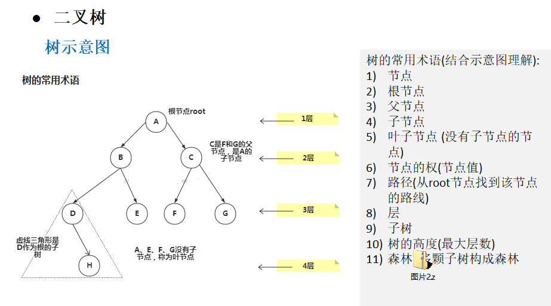
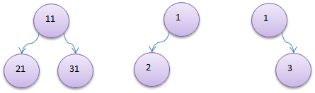
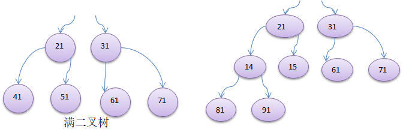
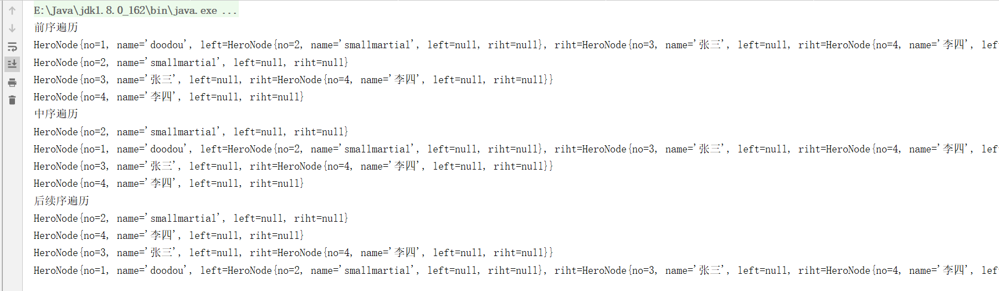
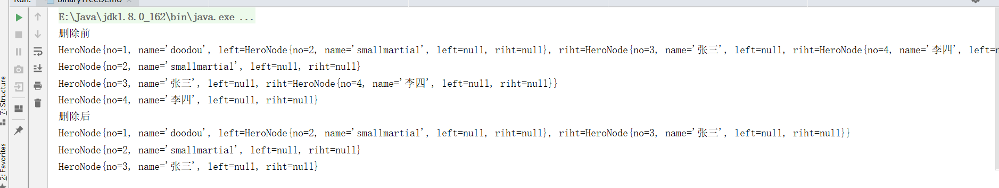

# 二叉树

## 1.为什么需要树这种数据结构

- 数组存储方式的分析优点：通过下标方式访问元素，速度快。对于有序数组，还可使用二分查找提高检索速度。缺点：如果要检索具体某个值，或者插入值(按一定顺序)会整体移动，效率较低 
- 链式存储方式的分析优点：在一定程度上对数组存储方式有优化(比如：插入一个数值节点，只需要将插入节点，链接到链表中即可， 删除效率也很好)。缺点：在进行检索时，效率仍然较低，比如(检索某个值，需要从头节点开始遍历
- 树存储方式的分析能提高数据存储，读取的效率,  比如利用 二叉排序树(Binary Sort Tree)，既可以保证数据的检索速度，同时也可以保证数据的插入，删除，修改的速度。

## 2.树示意图



## 3.二叉树的概念

- 树有很多种，每个节点最多只能有两个子节点的一种形式称为二叉树。
- 二叉树的子节点分为左节点和右节点。



- 如果该二叉树的所有叶子节点都在最后一层，并且结点总数= 2^n -1 , n 为层数，则我们称为满二叉树。
- 如果该二叉树的所有叶子节点都在最后一层或者倒数第二层，而且最后一层的叶子节点在左边连续，倒数第二层的叶子节点在右边连续，我们称为完全二叉树。



### 3.1二叉树遍历

- 前序遍历: **先输出父节点**，再遍历左子树和右子树
- 中序遍历: 先遍历左子树，**再输出父节点**，再遍历右子树
- 后序遍历: 先遍历左子树，再遍历右子树，**最后输出父节点**

- **小结**: 看输出父节点的顺序，就确定是前序，中序还是后序

### 3.2代码实现

```java
package cn.smallmartial.tree;

/**
 * @Author smallmartial
 * @Date 2019/6/15
 * @Email smallmarital@qq.com
 */
public class BinaryTreeDemo {
    public static void main(String[] args) {
        //创建一个二叉树
        BinaryTree binaryTree = new BinaryTree();
        HeroNode root = new HeroNode(1, "doodou");
        HeroNode heroNode2 = new HeroNode(2, "smallmartial");
        HeroNode heroNode3 = new HeroNode(3, "张三");
        HeroNode heroNode4 = new HeroNode(4, "李四");

        //先手动创建二叉树
        root.setLeft(heroNode2);
        root.setRiht(heroNode3);
        heroNode3.setRiht(heroNode4);
        binaryTree.setRoot(root);
        System.out.println("前序遍历");
        binaryTree.preOrder();

        System.out.println("中序遍历");
        binaryTree.infixOrder();
        System.out.println("后续序遍历");
        binaryTree.postOrder();
    }
}
//创建二叉树
class BinaryTree{

    private HeroNode root;

    public void setRoot(HeroNode root){
        this.root = root;
    }
    //前序遍历
    public void preOrder(){
        if (this.root != null){
            this.root.proOrder();
        }else {
            System.out.println("二叉树为空，无法遍历");
        }
    }

    //中序遍历
    public void infixOrder(){
        if (this.root != null){
            this.root.infixOrder();
        }else {
            System.out.println("二叉树为空，无法遍历");
        }
    }
    //后续遍历
    public void postOrder(){
        if (this.root != null){
            this.root.postOrder();
        }else {
            System.out.println("二叉树为空，无法遍历");
        }
    }
}

class HeroNode{
    private int no;
    private String name;
    private HeroNode left;
    private HeroNode right;

    public HeroNode(int no, String name) {
        this.no = no;
        this.name = name;
    }

    public int getNo() {
        return no;
    }

    public void setNo(int no) {
        this.no = no;
    }

    public String getName() {
        return name;
    }

    public void setName(String name) {
        this.name = name;
    }

    public HeroNode getLeft() {
        return left;
    }

    public void setLeft(HeroNode left) {
        this.left = left;
    }

    public HeroNode getRiht() {
        return right;
    }

    public void setRiht(HeroNode riht) {
        this.right = riht;
    }

    @Override
    public String toString() {
        return "HeroNode{" +
                "no=" + no +
                ", name='" + name + '\'' +
                ", left=" + left +
                ", riht=" + right +
                '}';
    }
    //前序遍历
    public void proOrder(){
        System.out.println(this);
        //递归向左子树前序遍历
        if (this.left != null){
            this.left.proOrder();
        }
        //递归向右子树前序遍历
        if (this.right != null){
            this.right.proOrder();
        }
        //中序遍历
    }

    //中序遍历
    public void infixOrder(){
        //递归向左子树中序遍历
        if (this.left != null){
            this.left.infixOrder();
        }
        //输出父节点
        System.out.println(this);
        //递归向右子树中序遍历
        if (this.right != null){
            this.right.infixOrder();
        }
    }

    //后序遍历
    public void  postOrder(){
        if (this.left != null){
            this.left.postOrder();
        }
        if (this.right != null){
            this.right.postOrder();
        }
        System.out.println(this);
    }

}

```

运行结果



### 3.3二叉树-查找指定节点

- 要求：
  请编写前序查找，中序查找和后序查找的方法。
  并分别使用三种查找方式，查找 heroNO = 5 的节点
  并分析各种查找方式，分别比较了多少次

- 代码

  ```java
  package cn.smallmartial.tree;
  
  /**
   * @Author smallmartial
   * @Date 2019/6/15
   * @Email smallmarital@qq.com
   */
  public class BinaryTreeDemo {
      public static void main(String[] args) {
          //创建一个二叉树
          BinaryTree binaryTree = new BinaryTree();
          HeroNode root = new HeroNode(1, "doodou");
          HeroNode heroNode2 = new HeroNode(2, "smallmartial");
          HeroNode heroNode3 = new HeroNode(3, "张三");
          HeroNode heroNode4 = new HeroNode(4, "李四");
  
          //先手动创建二叉树
          root.setLeft(heroNode2);
          root.setRiht(heroNode3);
          heroNode3.setRiht(heroNode4);
          binaryTree.setRoot(root);
  
  //
  //        System.out.println("前序遍历");
  //        binaryTree.preOrder();
  //
  //        System.out.println("中序遍历");
  //        binaryTree.infixOrder();
  //
  //        System.out.println("后续序遍历");
  //        binaryTree.postOrder();
  
          //前序遍历
          System.out.println("前序遍历方式");
          HeroNode resNode = binaryTree.preOrderSerch(4);
          if (resNode != null){
              System.out.println("找到了信息为no="+resNode.getNo()+"name="+resNode.getName());
          }else {
              System.out.println("没有找到 no ="+5);
          }
      }
  }
  //创建二叉树
  class BinaryTree{
  
      private HeroNode root;
  
      public void setRoot(HeroNode root){
          this.root = root;
      }
      //前序遍历
      public void preOrder(){
          if (this.root != null){
              this.root.proOrder();
          }else {
              System.out.println("二叉树为空，无法遍历");
          }
      }
  
      //中序遍历
      public void infixOrder(){
          if (this.root != null){
              this.root.infixOrder();
          }else {
              System.out.println("二叉树为空，无法遍历");
          }
      }
      //后续遍历
      public void postOrder(){
          if (this.root != null){
              this.root.postOrder();
          }else {
              System.out.println("二叉树为空，无法遍历");
          }
      }
      //前序遍历查找
      public HeroNode preOrderSerch(int no){
          if (root != null){
              return root.proOrderserch(no);
          }else {
              return null;
          }
      }
  
      //中序遍历
      public HeroNode infixOrderSearch(int no){
          if (root != null){
              return root.infixOrderSearch(no);
          }else {
              return null;
          }
      }
      //后续遍历
      public HeroNode postOrderSearch(int no ){
          if (root != null){
              return root.postOrderSerach(no);
          }else {
              return null;
          }
      }
  
  }
  
  class HeroNode{
      private int no;
      private String name;
      private HeroNode left;
      private HeroNode right;
  
      public HeroNode(int no, String name) {
          this.no = no;
          this.name = name;
      }
  
      public int getNo() {
          return no;
      }
  
      public void setNo(int no) {
          this.no = no;
      }
  
      public String getName() {
          return name;
      }
  
      public void setName(String name) {
          this.name = name;
      }
  
      public HeroNode getLeft() {
          return left;
      }
  
      public void setLeft(HeroNode left) {
          this.left = left;
      }
  
      public HeroNode getRiht() {
          return right;
      }
  
      public void setRiht(HeroNode riht) {
          this.right = riht;
      }
  
      @Override
      public String toString() {
          return "HeroNode{" +
                  "no=" + no +
                  ", name='" + name + '\'' +
                  ", left=" + left +
                  ", riht=" + right +
                  '}';
      }
      //前序遍历
      public void proOrder(){
          System.out.println(this);
          //递归向左子树前序遍历
          if (this.left != null){
              this.left.proOrder();
          }
          //递归向右子树前序遍历
          if (this.right != null){
              this.right.proOrder();
          }
          //中序遍历
      }
  
      //中序遍历
      public void infixOrder(){
          //递归向左子树中序遍历
          if (this.left != null){
              this.left.infixOrder();
          }
          //输出父节点
          System.out.println(this);
          //递归向右子树中序遍历
          if (this.right != null){
              this.right.infixOrder();
          }
      }
  
      //后序遍历
      public void  postOrder(){
          if (this.left != null){
              this.left.postOrder();
          }
          if (this.right != null){
              this.right.postOrder();
          }
          System.out.println(this);
      }
  
      //前序遍历查找
      public HeroNode proOrderserch(int no){
          if (this.no == no){
              return this;
          }
  
          HeroNode resNode = null;
          if (this.left != null){
              resNode = this.left.proOrderserch(no);
          }
  
          if (resNode != null){
              return resNode;
          }
  
          if (this.right != null){
              resNode = this.right.proOrderserch(no);
          }
          return resNode;
      }
  
      //中序遍历查找
      public  HeroNode infixOrderSearch(int no){
  
          HeroNode resNode = null;
          if (this.left != null){
              resNode = this.left.infixOrderSearch(no);
          }
  
          if (resNode != null){
              return resNode;
          }
  
          if (this.no == no){
              return this;
          }
  
          if (this.right != null){
              resNode = this.right.infixOrderSearch(no);
          }
          return resNode;
      }
  
      //后序遍历
      public HeroNode postOrderSerach(int no ){
          HeroNode resNode = null;
          if (this.left != null){
              resNode = this.left.infixOrderSearch(no);
          }
  
          if (resNode != null){
              return resNode;
          }
          if (this.right != null){
              resNode = this.right.infixOrderSearch(no);
          }
  
          if (this.no == no){
              return this;
          }
          return resNode;
  
      }
  
  }
  
  ```

### 3.4二叉树的删除

- 如果删除的节点是叶子节点，则删除该节点
  如果删除的节点是非叶子节点，则删除该子树.
  测试，删除掉 5号叶子节点 和 3号子树.

- 代码

  ```java
  package cn.smallmartial.tree;
  
  /**
   * @Author smallmartial
   * @Date 2019/6/15
   * @Email smallmarital@qq.com
   */
  public class BinaryTreeDemo {
      public static void main(String[] args) {
          //创建一个二叉树
          BinaryTree binaryTree = new BinaryTree();
          HeroNode root = new HeroNode(1, "doodou");
          HeroNode heroNode2 = new HeroNode(2, "smallmartial");
          HeroNode heroNode3 = new HeroNode(3, "张三");
          HeroNode heroNode4 = new HeroNode(4, "李四");
  
          //先手动创建二叉树
          root.setLeft(heroNode2);
          root.setRiht(heroNode3);
          heroNode3.setRiht(heroNode4);
          binaryTree.setRoot(root);
  
  //
  //        System.out.println("前序遍历");
  //        binaryTree.preOrder();
  //
  //        System.out.println("中序遍历");
  //        binaryTree.infixOrder();
  //
  //        System.out.println("后续序遍历");
  //        binaryTree.postOrder();
  
  //        //前序遍历
  //        System.out.println("前序遍历方式");
  //        HeroNode resNode = binaryTree.preOrderSerch(4);
  //        if (resNode != null){
  //            System.out.println("找到了信息为no="+resNode.getNo()+"name="+resNode.getName());
  //        }else {
  //            System.out.println("没有找到 no ="+5);
  //        }
  
          //测试删除
  
          System.out.println("删除前");
          binaryTree.preOrder();
          binaryTree.delNode(4);
          System.out.println("删除后");
          binaryTree.preOrder();
      }
  }
  //创建二叉树
  class BinaryTree{
  
      private HeroNode root;
  
      public void setRoot(HeroNode root){
          this.root = root;
      }
  
      public void delNode(int no){
          if (root != null){
              if (root.getNo() == no){
                  root = null;
              }else {
                  root.delNode(no);
              }
          }
      }
      //前序遍历
      public void preOrder(){
          if (this.root != null){
              this.root.proOrder();
          }else {
              System.out.println("二叉树为空，无法遍历");
          }
      }
  
      //中序遍历
      public void infixOrder(){
          if (this.root != null){
              this.root.infixOrder();
          }else {
              System.out.println("二叉树为空，无法遍历");
          }
      }
      //后续遍历
      public void postOrder(){
          if (this.root != null){
              this.root.postOrder();
          }else {
              System.out.println("二叉树为空，无法遍历");
          }
      }
      //前序遍历查找
      public HeroNode preOrderSerch(int no){
          if (root != null){
              return root.proOrderserch(no);
          }else {
              return null;
          }
      }
  
      //中序遍历
      public HeroNode infixOrderSearch(int no){
          if (root != null){
              return root.infixOrderSearch(no);
          }else {
              return null;
          }
      }
      //后续遍历
      public HeroNode postOrderSearch(int no ){
          if (root != null){
              return root.postOrderSerach(no);
          }else {
              return null;
          }
      }
  
  }
  
  class HeroNode{
      private int no;
      private String name;
      private HeroNode left;
      private HeroNode right;
  
      public HeroNode(int no, String name) {
          this.no = no;
          this.name = name;
      }
  
      public int getNo() {
          return no;
      }
  
      public void setNo(int no) {
          this.no = no;
      }
  
      public String getName() {
          return name;
      }
  
      public void setName(String name) {
          this.name = name;
      }
  
      public HeroNode getLeft() {
          return left;
      }
  
      public void setLeft(HeroNode left) {
          this.left = left;
      }
  
      public HeroNode getRiht() {
          return right;
      }
  
      public void setRiht(HeroNode riht) {
          this.right = riht;
      }
  
      @Override
      public String toString() {
          return "HeroNode{" +
                  "no=" + no +
                  ", name='" + name + '\'' +
                  ", left=" + left +
                  ", riht=" + right +
                  '}';
      }
  
      //递归删除节点
      public void delNode(int no){
  
          if (this.left != null &&this.left.no == no){
              this.left = null;
              return;
          }
  
          if (this.right != null && this.right.no == no){
              this.right = null;
              return;
          }
          //向左子树递归删除
          if (this.left != null){
              this.left.delNode(no);
          }
  
          //向右递归删除
          if (this.right != null){
              this.right.delNode(no);
          }
  
  
      }
      //前序遍历
      public void proOrder(){
          System.out.println(this);
          //递归向左子树前序遍历
          if (this.left != null){
              this.left.proOrder();
          }
          //递归向右子树前序遍历
          if (this.right != null){
              this.right.proOrder();
          }
          //中序遍历
      }
  
      //中序遍历
      public void infixOrder(){
          //递归向左子树中序遍历
          if (this.left != null){
              this.left.infixOrder();
          }
          //输出父节点
          System.out.println(this);
          //递归向右子树中序遍历
          if (this.right != null){
              this.right.infixOrder();
          }
      }
  
      //后序遍历
      public void  postOrder(){
          if (this.left != null){
              this.left.postOrder();
          }
          if (this.right != null){
              this.right.postOrder();
          }
          System.out.println(this);
      }
  
      //前序遍历查找
      public HeroNode proOrderserch(int no){
          if (this.no == no){
              return this;
          }
  
          HeroNode resNode = null;
          if (this.left != null){
              resNode = this.left.proOrderserch(no);
          }
  
          if (resNode != null){
              return resNode;
          }
  
          if (this.right != null){
              resNode = this.right.proOrderserch(no);
          }
          return resNode;
      }
  
      //中序遍历查找
      public  HeroNode infixOrderSearch(int no){
  
          HeroNode resNode = null;
          if (this.left != null){
              resNode = this.left.infixOrderSearch(no);
          }
  
          if (resNode != null){
              return resNode;
          }
  
          if (this.no == no){
              return this;
          }
  
          if (this.right != null){
              resNode = this.right.infixOrderSearch(no);
          }
          return resNode;
      }
  
      //后序遍历
      public HeroNode postOrderSerach(int no ){
          HeroNode resNode = null;
          if (this.left != null){
              resNode = this.left.infixOrderSearch(no);
          }
  
          if (resNode != null){
              return resNode;
          }
          if (this.right != null){
              resNode = this.right.infixOrderSearch(no);
          }
  
          if (this.no == no){
              return this;
          }
          return resNode;
  
      }
  
  }
  
  ```

- 运行结果

  

