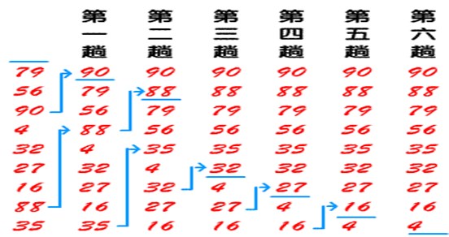
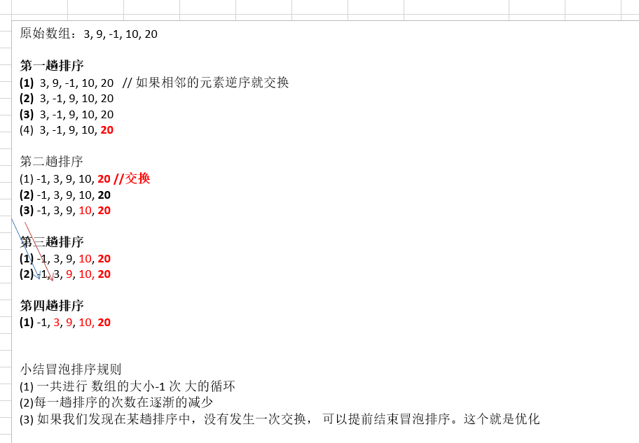
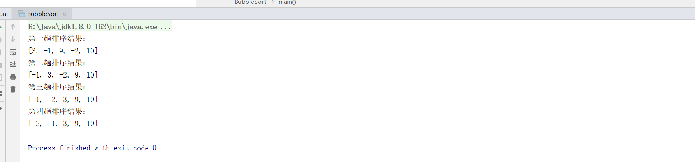

# 数据结构之冒泡排序

## 1.基本介绍

- 冒泡排序（Bubble Sorting）的基本思想是：通过对待排序序列从前向后（从下标较小的元素开始）,依次比较相邻元素的值，若发现逆序则交换，使值较大的元素逐渐从前移向后部，就象水底下的气泡一样逐渐向上冒。

- 因为排序的过程中，各元素不断接近自己的位置，如果一趟比较下来没有进行过交换，就说明序列有序，因此要在排序过程中设置一个标志flag判断元素是否进行过交换。从而减少不必要的比较。(这里说的优化，可以在冒泡排序写好后，在进行)



## 2.冒泡排序算法的过程



### 2.1Java代码实现

```java
package cn.smallmartial.sort;


import java.util.Arrays;

/**
 * @Author smallmartial
 * @Date 2019/6/6
 * @Email smallmarital@qq.com
 */

public class BubbleSort {
    public static void main(String[] args) {
        int arr[] = {3,9,-1,10,-2};

        int temp = 0;
        //第一次排序，将最大的值排到最后
        for (int i = 0; i < arr.length-1; i++) {
            if (arr[i] > arr[i+1]){
                temp = arr[i];
                arr[i] = arr[i+1];
                arr[i+1] = temp;
            }
        }
        System.out.println("第一趟排序结果：");
        System.out.println(Arrays.toString(arr));
        //第二趟排序
        for (int i = 0; i < arr.length - 2; i++) {
            if (arr[i] > arr[i+1]){
                temp = arr[i];
                arr[i] = arr[i+1];
                arr[i+1] = temp;
            }
        }
        System.out.println("第二趟排序结果：");
        System.out.println(Arrays.toString(arr));

        //第三趟排序
        for (int i = 0; i < arr.length - 3; i++) {
            if (arr[i] > arr[i+1]){
                temp = arr[i];
                arr[i] = arr[i+1];
                arr[i+1] = temp;
            }
        }
        System.out.println("第三趟排序结果：");
        System.out.println(Arrays.toString(arr));
        //第四躺排序
        for (int i = 0; i < arr.length - 4; i++) {
            if (arr[i] > arr[i+1]){
                temp = arr[i];
                arr[i] = arr[i+1];
                arr[i+1] = temp;
            }
        }
        System.out.println("第四趟排序结果：");
        System.out.println(Arrays.toString(arr));
    }


}

```

### 2.2运行结果



### 2.3简化过程

```java
        for (int i = 0; i < arr.length -1; i++) {
            for (int j = 0; j < arr.length - 1 - i; j++) {
                if (arr[j] > arr[j+1]){
                    temp = arr[j];
                    arr[j] = arr[j+1];
                    arr[j+1] = temp;
                }
            }
            System.out.println("第"+(i + 1)+"趟排序的数组");
            System.out.println(Arrays.toString(arr));
        }
```

### 2.4算法优化

```java
        boolean flag = false;//表示是否进行交换
        for (int i = 0; i < arr.length -1; i++) {
            for (int j = 0; j < arr.length - 1 - i; j++) {
                if (arr[j] > arr[j+1]){
                    flag = true;
                    temp = arr[j];
                    arr[j] = arr[j+1];
                    arr[j+1] = temp;
                }
            }
            if (!flag){//表示未发生交换
                break;
            }else {
                flag = false;//重置flag，进行下次交换
            }
            System.out.println("第"+(i + 1)+"趟排序的数组");
            System.out.println(Arrays.toString(arr));

        }
    }

```

