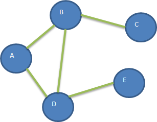
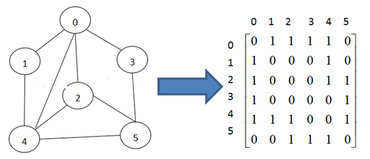
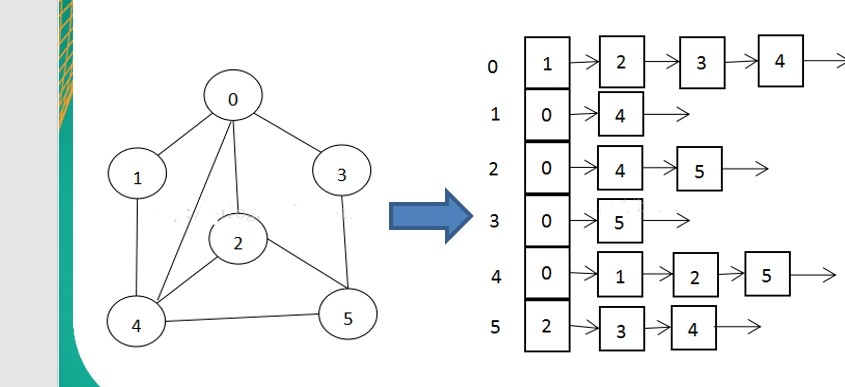
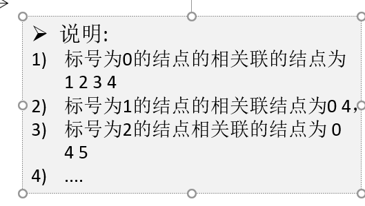
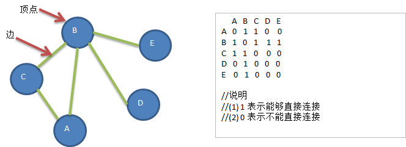
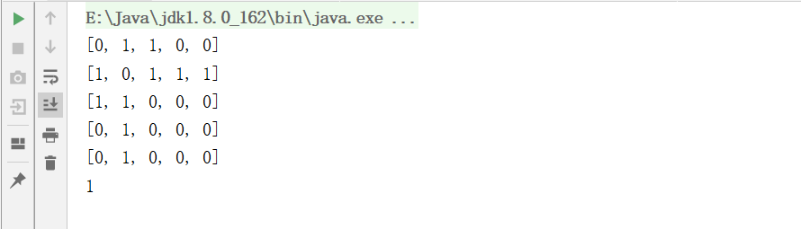
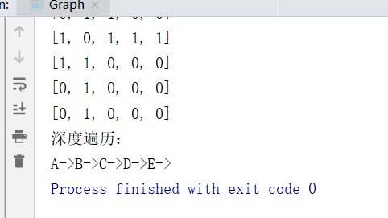

## 1.为什么要有图

1)前面我们学了线性表和树

2)线性表局限于一个直接前驱和一个直接后继的关系

3)树也只能有一个直接前驱也就是父节点

4)当我们需要表示多对多的关系时， 这里我们就用到了图

- 图是一种数据结构，其中结点可以具有零个或多个相邻元素。两个结点之间的连接称为边。结点也可以称为顶点。如图：

  

## 2.图的表示方式

图的表示方式有两种：二维数组表示（邻接矩阵）；链表表示（邻接表）。

###  2.1邻接矩阵

邻接矩阵是表示图形中顶点之间相邻关系的矩阵，对于n个顶点的图而言，矩阵是的row和col表示的是1....n个点。



### **2.2邻接表**

1)邻接矩阵需要为每个顶点都分配n个边的空间，其实有很多边都是不存在,会造成空间的一定损失.

2）邻接表的实现只关心存在的边，不关心不存在的边。因此没有空间浪费，邻接表由数组+链表组成





## 3.入门

1)要求: 代码实现如下图结构.



代码：

```java
package cn.smallmartial;

import java.util.ArrayList;
import java.util.Arrays;

/**
 * @Author smallmartial
 * @Date 2019/6/29
 * @Email smallmarital@qq.com
 */
public class Graph {

    private ArrayList<String> vertexList; //储存顶点集合

    private int[][] edges; //存储对应的邻接矩阵

    private int numOfEdges; //表示边的数目

    public static void main(String[] args) {
        int n = 5;
        String Vertexs[] = {"A","B","C","D","E"};
        //创建对象
        Graph graph = new Graph(n);
        for (String vertex : Vertexs) {
            graph.insertVertex(vertex);
        }
        //添加边
        //A-B A-C
        graph.insertEdge(0,1,1);
        graph.insertEdge(0,2,1);
        graph.insertEdge(1,2,1);
        graph.insertEdge(1,3,1);
        graph.insertEdge(1,4,1);

        //显示邻接矩阵
        graph.show();
//        int weight = graph.getWeight(0, 1);
//        System.out.println(weight);
    }
    //显示矩阵
    public void show(){
        for (int[] link : edges) {
            System.out.println(Arrays.toString(link));
        }
    }

    //得到边的数目
    public int getNumOfEdges(){
        return numOfEdges;
    }
    //返回节点对应的数据 0 ->"A" 1->"B" 2->"C"
    public String getValueByIndex(int i){
        return vertexList.get(i);
    }

    //返回v1和v2的权值
    public int getWeight(int v1, int v2){
        return edges[v1][v2];
    }


    public Graph(int n) {
        //初始化节点
        edges = new int[n][n];
        vertexList = new ArrayList<String>(n);
        numOfEdges = 0;
    }

    //插入节点
    public void insertVertex(String vertex){
        vertexList.add(vertex);
    }

    //添加边
    public void insertEdge(int v1, int v2,  int weight){
        edges[v1][v2] = weight;
        edges[v2][v1] = weight;
        numOfEdges++;
    }

}

```

运行结果：



## 4.图的遍历介绍

所谓图的遍历，即是对结点的访问。一个图有那么多个结点，如何遍历这些结点，需要特定策略，一般有两种访问策略: (1)深度优先遍历 (2)广度优先遍历

### 4.1深度优先遍历基本思想

图的深度优先搜索(Depth First Search) 。

1)深度优先遍历，从初始访问结点出发，初始访问结点可能有多个邻接结点，深度优先遍历的策略就是首先访问第一个邻接结点，然后再以这个被访问的邻接结点作为初始结点，访问它的第一个邻接结点， 可以这样理解：每次都在访问完**当前结点**后首先访问**当前结点的第一个邻接结点**。

2)我们可以看到，这样的访问策略是优先往纵向挖掘深入，而不是对一个结点的所有邻接结点进行横向访问。

3)显然，深度优先搜索是一个递归的过程

### **4.2深度优先遍历算法步骤**

1)访问初始结点v，并标记结点v为已访问。

2)查找结点v的第一个邻接结点w。

3)若w存在，则继续执行4，如果w不存在，则回到第1步，将从v的下一个结点继续。

4)若w未被访问，对w进行深度优先遍历递归（即把w当做另一个v，然后进行步骤123）。

5)查找结点v的w邻接结点的下一个邻接结点，转到步骤3。

 代码：

```java
package cn.smallmartial;

import java.util.ArrayList;
import java.util.Arrays;

/**
 * @Author smallmartial
 * @Date 2019/6/29
 * @Email smallmarital@qq.com
 */
public class Graph {

    private ArrayList<String> vertexList; //储存顶点集合

    private int[][] edges; //存储对应的邻接矩阵

    private int numOfEdges; //表示边的数目

    private boolean[] isVisited ;

    public static void main(String[] args) {
        int n = 5;
        String Vertexs[] = {"A","B","C","D","E"};
        //创建对象
        Graph graph = new Graph(n);
        for (String vertex : Vertexs) {
            graph.insertVertex(vertex);
        }
        //添加边
        //A-B A-C
        graph.insertEdge(0,1,1);
        graph.insertEdge(0,2,1);
        graph.insertEdge(1,2,1);
        graph.insertEdge(1,3,1);
        graph.insertEdge(1,4,1);

        //显示邻接矩阵
        graph.show();
//        int weight = graph.getWeight(0, 1);
//        System.out.println(weight);
        System.out.println("深度遍历：");
        graph.dfs();
    }
    //显示矩阵
    public void show(){
        for (int[] link : edges) {
            System.out.println(Arrays.toString(link));
        }
    }

    //得到边的数目
    public int getNumOfEdges(){
        return numOfEdges;
    }
    //返回节点对应的数据 0 ->"A" 1->"B" 2->"C"
    public String getValueByIndex(int i){
        return vertexList.get(i);
    }

    //返回v1和v2的权值
    public int getWeight(int v1, int v2){
        return edges[v1][v2];
    }


    public Graph(int n) {
        //初始化节点
        edges = new int[n][n];
        vertexList = new ArrayList<String>(n);
        numOfEdges = 0;
        isVisited = new boolean[5];
    }
    //得到第一个邻接节点的下标w
    public int getFirstNeighbor(int index){
        for (int j = 0; j < vertexList.size(); j++) {
            if (edges[index][j]>0){
                return j;
            }
        }
        return -1;
    }
    //根据前一个邻接节点的下标获取下一个节点的邻接节点
    public int getNextNeighbor(int v1, int v2){
        for (int j = v2+1; j < vertexList.size(); j++) {
            if (edges[v1][j]>0){
                return j;
            }
        }
        return -1;
    }

    //深度优先遍历
    public void dfs(boolean[] isVisited, int i){
        //首先访问该节点，输出
        System.out.print(getValueByIndex(i)+"->");
        //将节点设置为已经访问
        isVisited[i] = true;
        //查找结点i的第一个邻接结点w
        int w = getFirstNeighbor(i);
        while (w != -1){
            if (!isVisited[w]){
                dfs(isVisited,w);
            }
            //如果w已经被访问
            w = getNextNeighbor(i,w);
        }
    }

    //对dfs进行重载 遍历所有节点
    public void dfs(){
        //遍历所有的节点
        for (int i = 0; i < getNumOfEdges(); i++) {
            if(!isVisited[i]){
                dfs(isVisited,i);
            }
        }
    }
    //插入节点
    public void insertVertex(String vertex){
        vertexList.add(vertex);
    }

    //添加边
    public void insertEdge(int v1, int v2,  int weight){
        edges[v1][v2] = weight;
        edges[v2][v1] = weight;
        numOfEdges++;
    }

}

```

运行结果：



### **4.3广度优先遍历基本思想**


图的广度优先搜索(Broad First Search) 。

类似于一个分层搜索的过程，广度优先遍历需要使用一个队列以保持访问过的结点的顺序，以便按这个顺序来访问这些结点的邻接结点


### **4.4广度优先遍历算法步骤**

1)访问初始结点v并标记结点v为已访问。

2)结点v入队列

3)当队列非空时，继续执行，否则算法结束。

4)出队列，取得队头结点u。

5)查找结点u的第一个邻接结点w。

6)若结点u的邻接结点w不存在，则转到步骤3；否则循环执行以下三个步骤：

6.1 若结点w尚未被访问，则访问结点w并标记为已访问。 

6.2 结点w入队列 

6.3 查找结点u的继w邻接结点后的下一个邻接结点w，转到步骤6。

代码：

```java
package cn.smallmartial;

import java.util.ArrayList;
import java.util.Arrays;
import java.util.LinkedList;

/**
 * @Author smallmartial
 * @Date 2019/6/29
 * @Email smallmarital@qq.com
 */
public class Graph {

    private ArrayList<String> vertexList; //储存顶点集合

    private int[][] edges; //存储对应的邻接矩阵

    private int numOfEdges; //表示边的数目

    private boolean[] isVisited ;

    public static void main(String[] args) {
        int n = 5;
        String Vertexs[] = {"A","B","C","D","E"};
        //创建对象
        Graph graph = new Graph(n);
        for (String vertex : Vertexs) {
            graph.insertVertex(vertex);
        }
        //添加边
        //A-B A-C
        graph.insertEdge(0,1,1);
        graph.insertEdge(0,2,1);
        graph.insertEdge(1,2,1);
        graph.insertEdge(1,3,1);
        graph.insertEdge(1,4,1);

        //显示邻接矩阵
        graph.show();
//        int weight = graph.getWeight(0, 1);
//        System.out.println(weight);
        System.out.println("深度遍历：");
        //graph.dfs();
        System.out.println("广度优先");
        graph.bfs();
    }

    //遍历所有的节点都进行广度优先遍历
    public void bfs(){
        for (int i = 0; i < getNumOfVertex(); i++) {
            if (!isVisited[i]){
                bfs(isVisited,i);
            }
        }
    }
    //返回节点的个数
    public int getNumOfVertex(){
        return vertexList.size();
    }
    //显示矩阵
    public void show(){
        for (int[] link : edges) {
            System.out.println(Arrays.toString(link));
        }
    }

    //得到边的数目
    public int getNumOfEdges(){
        return numOfEdges;
    }
    //返回节点对应的数据 0 ->"A" 1->"B" 2->"C"
    public String getValueByIndex(int i){
        return vertexList.get(i);
    }

    //返回v1和v2的权值
    public int getWeight(int v1, int v2){
        return edges[v1][v2];
    }


    public Graph(int n) {
        //初始化节点
        edges = new int[n][n];
        vertexList = new ArrayList<String>(n);
        numOfEdges = 0;
        isVisited = new boolean[5];
    }
    //得到第一个邻接节点的下标w
    public int getFirstNeighbor(int index){
        for (int j = 0; j < vertexList.size(); j++) {
            if (edges[index][j]>0){
                return j;
            }
        }
        return -1;
    }
    //根据前一个邻接节点的下标获取下一个节点的邻接节点
    public int getNextNeighbor(int v1, int v2){
        for (int j = v2+1; j < vertexList.size(); j++) {
            if (edges[v1][j]>0){
                return j;
            }
        }
        return -1;
    }

    //深度优先遍历
    public void dfs(boolean[] isVisited, int i){
        //首先访问该节点，输出
        System.out.print(getValueByIndex(i)+"->");
        //将节点设置为已经访问
        isVisited[i] = true;
        //查找结点i的第一个邻接结点w
        int w = getFirstNeighbor(i);
        while (w != -1){
            if (!isVisited[w]){
                dfs(isVisited,w);
            }
            //如果w已经被访问
            w = getNextNeighbor(i,w);
        }
    }

    //对dfs进行重载 遍历所有节点
    public void dfs(){
        //遍历所有的节点
        for (int i = 0; i < getNumOfEdges(); i++) {
            if(!isVisited[i]){
                dfs(isVisited,i);
            }
        }
    }

    //对一个节点进行广度优先遍历的算法
    public void bfs(boolean[] isVisited, int i){
        int u;
        int w;
        LinkedList queue = new LinkedList();
        System.out.print(getValueByIndex(i)+"->");
        isVisited[i] = true;
        queue.addLast(i);
        while (!queue.isEmpty()){
            //取出队列的头节点
            u = (Integer) queue.removeFirst();
            w = getFirstNeighbor(u);
            while (w != -1){
                if (!isVisited[w]){
                    System.out.print(getValueByIndex(w)+"->");
                    isVisited[w] = true;
                    queue.addLast(w);
                }
                w = getNextNeighbor(u,w);//广度优先

            }
        }

    }
    //插入节点
    public void insertVertex(String vertex){
        vertexList.add(vertex);
    }

    //添加边
    public void insertEdge(int v1, int v2,  int weight){
        edges[v1][v2] = weight;
        edges[v2][v1] = weight;
        numOfEdges++;
    }

}

```

