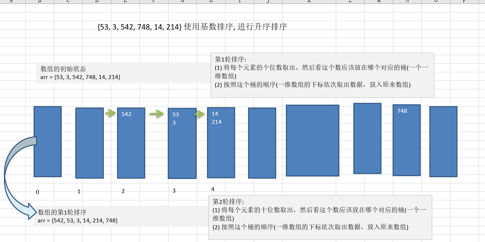
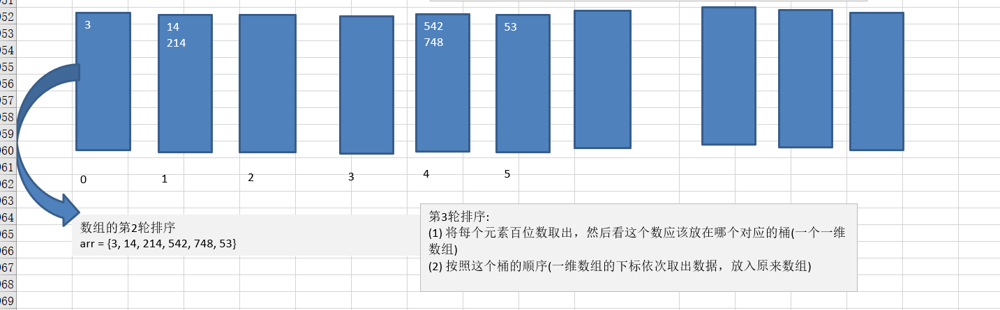
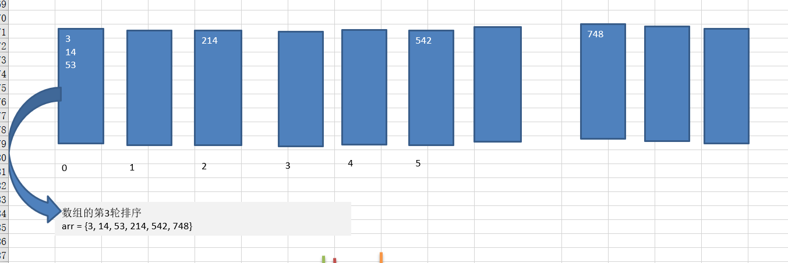
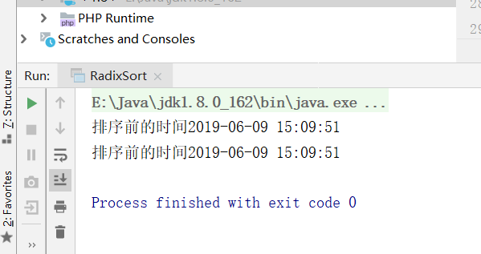

# 1.基数排序(桶排序)介绍

- 基数排序（radix sort）属于“分配式排序”（distribution sort），又称“桶子法”（bucket sort）-或bin sort，顾名思义，它是通过键值的各个位的值，将要排序的元素分配至某些“桶”中，达到排序的作用

- 基数排序法是属于稳定性的排序，基数排序法的是效率高的稳定性排序法

- 基数排序(Radix Sort)是桶排序的扩展

- 基数排序是1887年赫尔曼·何乐礼发明的。它是这样实现的：将整数按位数切割成不同的数字，然后按每个位数分别比较。

# 2.基数排序基本思想

- 将所有待比较数值统一为同样的数位长度，数位较短的数前面补零。然后，从最低位开始，依次进行一次排序。这样从最低位排序一直到最高位排序完成以后, 数列就变成一个有序序列。







# 3.java代码推导过程

```java
package cn.smallmartial.sort;

import java.util.Arrays;

/**
 * @Author smallmartial
 * @Date 2019/6/9
 * @Email smallmarital@qq.com
 */
public class RadixSort {
    public static void main(String[] args) {
        int arr[] = {53, 3, 542, 748, 14, 214};
        radixSort(arr);
    }
    public static void radixSort(int[] arr){
        //定一个二维数组，表示10个桶
        int[][] bucket = new int[10][arr.length];

        //为了记录每个桶中存放的数据，定义一个一维数组记录各个桶中的数据
        int[] bucketElementCounts = new int[10];
        //第一轮 对各位进行处理
        for (int j = 0; j < arr.length; j++) {
            int digitOfElement = arr[j]%10;
            //放入对应的桶中
            bucket[digitOfElement][bucketElementCounts[digitOfElement]] = arr[j];
            bucketElementCounts[digitOfElement]++;
        }
        //按照桶的顺序，依次取出下标
        int index = 0;
        for (int k = 0; k < bucketElementCounts.length; k++) {
            //如果桶中有数据 放入一维数组
            if (bucketElementCounts[k] != 0){
                for (int l = 0; l < bucketElementCounts[k]; l++) {
                    //取出元素放入arr
                    arr[index++] = bucket[k][l];
                }
            }
            //第一轮处理后 bucketElementCounts[k] = 0
            bucketElementCounts[k] = 0;
        }
        System.out.println(Arrays.toString(arr));

        //第一轮 对各位进行处理
        for (int j = 0; j < arr.length; j++) {
            int digitOfElement = arr[j]/10%10;
            //放入对应的桶中
            bucket[digitOfElement][bucketElementCounts[digitOfElement]] = arr[j];
            bucketElementCounts[digitOfElement]++;
        }
        //按照桶的顺序，依次取出下标
        index = 0;
        for (int k = 0; k < bucketElementCounts.length; k++) {
            //如果桶中有数据 放入一维数组
            if (bucketElementCounts[k] != 0){
                for (int l = 0; l < bucketElementCounts[k]; l++) {
                    //取出元素放入arr
                    arr[index++] = bucket[k][l];
                }
            }
            bucketElementCounts[k] = 0;
        }
        System.out.println(Arrays.toString(arr));

        //第三轮 对各位进行处理
        for (int j = 0; j < arr.length; j++) {
            int digitOfElement = arr[j]/100%10;
            //放入对应的桶中
            bucket[digitOfElement][bucketElementCounts[digitOfElement]] = arr[j];
            bucketElementCounts[digitOfElement]++;
        }
        //按照桶的顺序，依次取出下标
        index = 0;
        for (int k = 0; k < bucketElementCounts.length; k++) {
            //如果桶中有数据 放入一维数组
            if (bucketElementCounts[k] != 0){
                for (int l = 0; l < bucketElementCounts[k]; l++) {
                    //取出元素放入arr
                    arr[index++] = bucket[k][l];
                }
            }
            //bucketElementCounts[k] = 0;
        }
        System.out.println(Arrays.toString(arr));
}


}

```

# 4.java代码

```java
package cn.smallmartial.sort;

import java.text.SimpleDateFormat;
import java.util.Arrays;
import java.util.Date;

/**
 * @Author smallmartial
 * @Date 2019/6/9
 * @Email smallmarital@qq.com
 */
public class RadixSort {
    public static void main(String[] args) {
       // int arr[] = {53, 3, 542, 748, 14, 214};
        int[] arr = new int[80000];
        for (int i = 0; i < arr.length -1 ; i++) {
            arr[i] = (int)(Math.random()*80000);
        }
        Date data = new Date();
        SimpleDateFormat simpleDateFormat = new SimpleDateFormat("yyyy-MM-dd HH:mm:ss");
        String dataStr = simpleDateFormat.format(data);
        System.out.println("排序前的时间"+dataStr);
        radixSort(arr);

        Date data2 = new Date();
        // SimpleDateFormat simpleDateFormat = new SimpleDateFormat("yyyy-MM-dd HH:mm:ss");
        String data2Str = simpleDateFormat.format(data2);
        System.out.println("排序前的时间"+data2Str);
    }
    public static void radixSort(int[] arr){

        //最终版
        int max = arr[0];
        for (int i = 1; i < arr.length ;i++) {
            if (arr[i] >max){
                max = arr[i];
            }
        }
        //得到最大的几位数
        int maxLength = (max +"").length();

        //定一个二维数组，表示10个桶
        int[][] bucket = new int[10][arr.length];

        //为了记录每个桶中存放的数据，定义一个一维数组记录各个桶中的数据
        int[] bucketElementCounts = new int[10];

        for (int i = 0 ,n = 1; i < maxLength; i++, n*=10) {

            for (int j = 0; j < arr.length; j++) {
                int digitOfElement = arr[j]/n%10;
                //放入对应的桶中
                bucket[digitOfElement][bucketElementCounts[digitOfElement]] = arr[j];
                bucketElementCounts[digitOfElement]++;
            }
            //按照桶的顺序，依次取出下标
            int index = 0;
            for (int k = 0; k < bucketElementCounts.length; k++) {
                //如果桶中有数据 放入一维数组
                if (bucketElementCounts[k] != 0){
                    for (int l = 0; l < bucketElementCounts[k]; l++) {
                        //取出元素放入arr
                        arr[index++] = bucket[k][l];
                    }
                }
                //第一轮处理后 bucketElementCounts[k] = 0
                bucketElementCounts[k] = 0;
            }
           // System.out.println("第"+(i+1)+"轮"+Arrays.toString(arr));
        }

}


}

```

运行结果：



# 5.常用排序算法对比


- 稳定：如果a原本在b前面，而a=b，排序之后a仍然在b的前面；
- 不稳定：如果a原本在b的前面，而a=b，排序之后a可能会出现在b的后面；
- 内排序：所有排序操作都在内存中完成；
- 外排序：由于数据太大，因此把数据放在磁盘中，而排序通过磁盘和内存的数据传输才能进行；

- 时间复杂度： 一个算法执行所耗费的时间。
- 空间复杂度：运行完一个程序所需内存的大小。
- n: 数据规模
- k: “桶”的个数
- In-place:    不占用额外内存
- Out-place: 占用额外内存