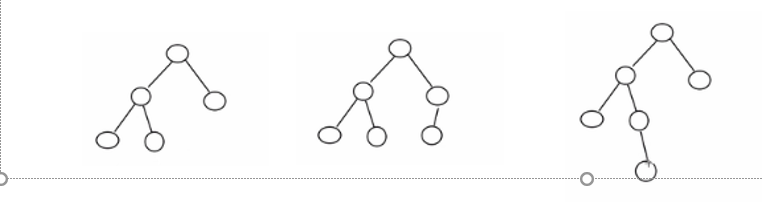

## **1.基本介绍**


1)平衡二叉树也叫平衡二叉搜索树（Self-balancing binary search tree）又被称为AVL树， 可以**保证查询效率较高**。

2)具有以下**特点**：它是一 棵空树或它的左右两个子树的高度差的绝对值不超过1，并且左右两个子树都是一棵平衡二叉树。平衡二叉树的常用实现方法有[红黑树](https://baike.baidu.com/item/红黑树/2413209)、[AVL](https://baike.baidu.com/item/AVL/7543015)、[替罪羊树](https://baike.baidu.com/item/替罪羊树/13859070)、[Treap](https://baike.baidu.com/item/Treap)、[伸展树](https://baike.baidu.com/item/伸展树/7003945)等。

3)举例说明, 看看下面哪些AVL树, 为什么?



## 2.代码实现

```java
package cn.smallmartial.avl;

/**
 * @Author smallmartial
 * @Date 2019/6/22
 * @Email smallmarital@qq.com
 */
public class AVLTreeDemo {
    public static void main(String[] args) {
     //   int[] arr = {4,3,6,5,7,8};
        int[] arr = {10,12,8,9,7,6};
        AVLTree avlTree = new AVLTree();
        for (int i = 0; i < arr.length; i++) {
            avlTree.add(new Node(arr[i]));
        }
        //遍历
        System.out.println("中序遍历");
        avlTree.infixOrder();

        System.out.println("在未做平衡之前");
        System.out.println("树的高度 = "+avlTree.getRoot().height());
        System.out.println("树的左子树高度 = "+avlTree.getRoot().leftHeight());
        System.out.println("树的有子树高度 = "+avlTree.getRoot().rightHeight());
        System.out.println("根节点的左子节点"+avlTree.getRoot().left);
        System.out.println("根节点"+avlTree.getRoot());
        System.out.println("根节点的右子节点"+avlTree.getRoot().right);
    }
}

class AVLTree{
    private Node root;

    public Node getRoot(){
        return root;
    }
    //查找要删除的节点
    public Node search(int value){
        if (root == null){
            return null;
        }else {
            return root.search(value);
        }
    }

    //查找父节点
    public Node searchParent(int value){
        if (root == null){
            return null;
        }else {
            return root.searchParent(value);
        }
    }

    /**
     *
     * @param node 传入节点 作为二叉排序树的根节点
     * @return
     */
    public int delRightTreeMin(Node node){
        Node target = node;
        while (target.left != null){
            target = target.left;
        }
        //删除最小节点
        delNode(target.value);
        return target.value;
    }

    //删除节点
    public void delNode(int value){
        if (root == null){
            return;
        }else {
            Node targetNode = search(value);
            if (targetNode == null){
                return;
            }

            if (root.left == null && root.right == null){
                root = null;
                return;
            }

            //去找到targetNode的父节点
            Node parent = searchParent(value);

            if (targetNode.left == null && targetNode.right == null){
                //判断targetNode是父节点的左子节点还是右子节点
                if (parent.left != null && parent.left.value == value){
                    parent.left  = null;
                }else if (parent.right != null && parent.right.value == value){
                    parent.right = null;
                }
            }else if (targetNode.left!= null && targetNode.right !=null){//删除有2颗子树的节点
                int minVal = delRightTreeMin(targetNode.right);
                targetNode.value = minVal;
            }else {//删除只有一颗子树的节点
                if (targetNode.left !=null){
                    if (parent.left.value == value){
                        parent.left = targetNode.left;
                    }else {
                        parent.right = targetNode.left;
                    }
                }else {
                    if (parent.left.value == value){
                        parent.left = targetNode.right;
                    }else {
                        parent.right = targetNode.right;
                    }
                }

            }
        }


    }

    //添加节点的方法
    public void add(Node node){
        if (root == null){
            root = node;
        }else {
            root.add(node);
        }
    }
    //中序遍历
    public void infixOrder(){
        if (root != null){
            root.infixOrder();
        }else {
            System.out.println("二叉树为空，不能遍历");
        }
    }
}


//创建Node结点
class Node{

    int value;
    Node left;
    Node right;

    public Node(int value) {
        this.value = value;
    }

    //返回左子树的高度
    public int leftHeight(){
        if (left == null){
            return 0;
        }
        return left.height();
    }

    //返回右子树的高度
    public int rightHeight(){
        if (right == null){
            return 0;
        }
        return right.height();
    }
    //返回当前结点的高度
    public int height(){
        return Math.max(left == null ? 0 : left.height(),right == null ? 0 :  right.height())+1;
    }

    //左旋转
    private void leftRotate(){
        //创建新的结点
        Node newNode = new Node(value);
        //把新的结点左子树设置为当前结点的左子树
        newNode.left = left;
        //把新结点的右子树设置成为过去结点的右子树的左子树
        newNode.right = right.left;
        //把当前结点的值替换成右子节点的值
        value = right.value;
        //把当前节点的右子树设置成为右子树的右子树
        right = right.right;
        //把当前节点的左子树设置成新的节点
        left = newNode;

    }

    //右旋转
    private void rightRotate(){
        Node newNode = new Node(value);
        newNode.right = right;
        newNode.left = left.right;
        value = left.value;
        left = left.left;
        right = newNode;

    }

    /**
     *查找删除的节点
     * @param value
     * @return
     */
    //查找删除节点
    public Node search(int value){
        if (value == this.value){
            return this;
        }else  if(value <this.value){//如果查找当前的值小于当前节点，向左递归查找
            //如果左子节点为空
            if (this.left == null){
                return null;
            }
            return this.left.search(value);
        }else {//如果查找当前的值不小于当前节点，向小递归查找
            if (this.right == null){
                return null;
            }
            return this.right.search(value);

        }
    }
    //查找要删除节点的父节点
    public Node searchParent(int value){
        if (this.left != null && this.left.value == value ||(this.right != null && this.right.value == value)){
            return this;
        }else {
            //如果查找的值小于当前结点的值，并且当前节点的左子节点不为空
            if (value < this.value && this.left != null){
                return this.left.searchParent(value);
            }else if (value >= this.value && this.right != null){
                return this.right.searchParent(value);
            }else {
                return null;
            }
        }
    }

    @Override
    public String toString() {
        return "Node{" +
                "value=" + value +
                '}';
    }

    //添加节点方法
    public void add(Node node){
        if (node == null){
            return;
        }

        //判断传入结点的值，和当前子树的根节点的关系
        if (node.value < this.value){
            //如果当前左子节点为null
            if (this.left == null){
                this.left = node;
            }else {
                this.left.add(node);
            }
        }else {
            if (this.right == null){
                this.right = node;
            }else {
                this.right.add(node);
            }
        }

        if (rightHeight() -leftHeight() >1){
            //如果它的右子树的左子树高度大于它的右子树的右子树高度
            if (right !=null && right.rightHeight() <right.leftHeight()){
                //先进右旋转
                right.rightRotate();
                //然后对当前节点进行左旋转
                leftRotate();
            }else {
                //直接进行左旋转
                leftRotate();
            }

        }

        if (leftHeight() - rightHeight() >1){
            //如果它的左子树高度大于它的右子树高度
            if (left !=null && left.rightHeight() > left.leftHeight()){
                //先对当前节点的左节点-》左旋转
                left.leftRotate();
                //在对当前节点右旋转
                rightRotate();
            }else {
                //直接右旋转
                rightRotate();
            }
        }
    }

    //中序遍历
    public void infixOrder(){
        if (this.left != null){
            this.left.infixOrder();
        }

        System.out.println(this);

        if (this.right !=null){
            this.right.infixOrder();
        }

    }

}
```

