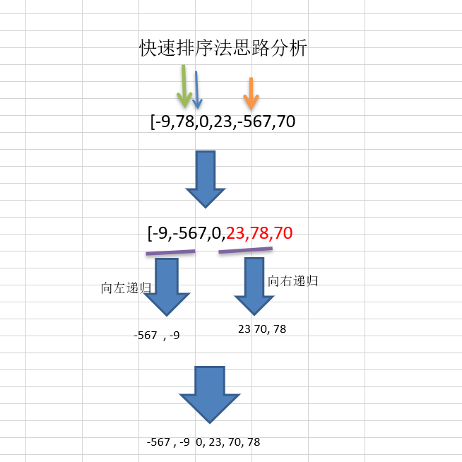
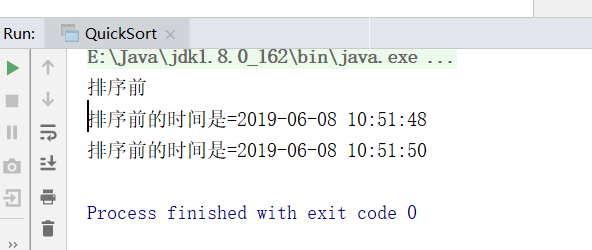
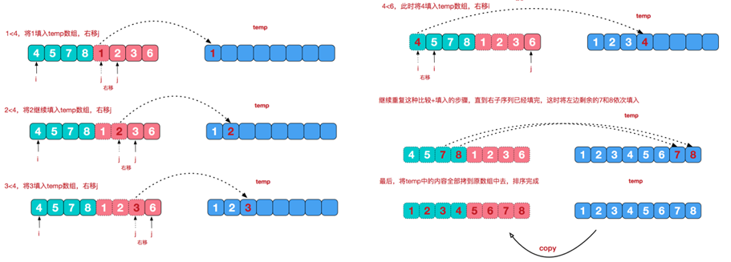
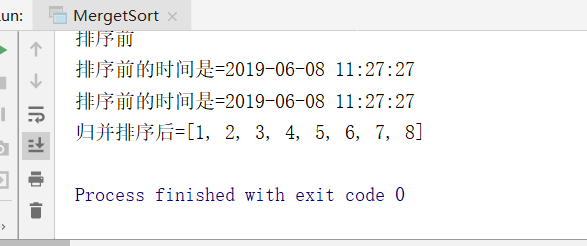

# 1.快速排序

## 1.1快速排序法介绍

快速排序（Quicksort）是对冒泡排序的一种改进。基本思想是：通过一趟排序将要排序的数据分割成独立的两部分，其中一部分的所有数据都比另外一部分的所有数据都要小，然后再按此方法对这两部分数据分别进行快速排序，整个排序过程可以递归进行，以此达到整个数据变成有序序列

## 1.2快速排序法示意图


## 1.3快速排序思路分析

要求: 对 [-9,78,0,23,-567,70] 进行从小到大的排序，要求使用快速排序法。【测试8w和800w】 



## 1.4代码实现

```java
package cn.smallmartial.sort;

import java.util.Arrays;

/**
 * @Author smallmartial
 * @Date 2019/6/8
 * @Email smallmarital@qq.com
 */

import java.text.SimpleDateFormat;
import java.util.Arrays;
import java.util.Date;

public class QuickSort {

    public static void main(String[] args) {
      //  int[] arr = {-9,78,0,23,-567,70, -1,900, 4561};

        //测试快排的执行速度
        // 创建要给80000个的随机的数组
        int[] arr = new int[8000000];
        for (int i = 0; i < 8000000; i++) {
            arr[i] = (int) (Math.random() * 8000000); // 生成一个[0, 8000000) 数
        }

        System.out.println("排序前");
        Date data1 = new Date();
        SimpleDateFormat simpleDateFormat = new SimpleDateFormat("yyyy-MM-dd HH:mm:ss");
        String date1Str = simpleDateFormat.format(data1);
        System.out.println("排序前的时间是=" + date1Str);

        quickSort(arr, 0, arr.length-1);
       // System.out.println(Arrays.toString(arr));

        Date data2 = new Date();
        String date2Str = simpleDateFormat.format(data2);
        System.out.println("排序前的时间是=" + date2Str);
        //System.out.println("arr=" + Arrays.toString(arr));
    }

    public static void quickSort(int[] arr,int left, int right) {
        int l = left; //左下标
        int r = right; //右下标
        //pivot 中轴值
        int pivot = arr[(left + right) / 2];
        int temp = 0; //临时变量，作为交换时使用
        //while循环的目的是让比pivot 值小放到左边
        //比pivot 值大放到右边
        while( l < r) {
            //在pivot的左边一直找,找到大于等于pivot值,才退出
            while( arr[l] < pivot) {
                l += 1;
            }
            //在pivot的右边一直找,找到小于等于pivot值,才退出
            while(arr[r] > pivot) {
                r -= 1;
            }
            //如果l >= r说明pivot 的左右两的值，已经按照左边全部是
            //小于等于pivot值，右边全部是大于等于pivot值
            if( l >= r) {
                break;
            }

            //交换
            temp = arr[l];
            arr[l] = arr[r];
            arr[r] = temp;

            //如果交换完后，发现这个arr[l] == pivot值 相等 r--， 前移
            if(arr[l] == pivot) {
                r -= 1;
            }
            //如果交换完后，发现这个arr[r] == pivot值 相等 l++， 后移
            if(arr[r] == pivot) {
                l += 1;
            }
        }

        // 如果 l == r, 必须l++, r--, 否则为出现栈溢出
        if (l == r) {
            l += 1;
            r -= 1;
        }
        //向左递归
        if(left < r) {
            quickSort(arr, left, r);
        }
        //向右递归
        if(right > l) {
            quickSort(arr, l, right);
        }


    }
}

```

1.5运行结果：



# 2.归并排序

## 2.1归并排序介绍:

归并排序（MERGE-SORT）是利用归并的思想实现的排序方法，该算法采用经典的分治（divide-and-conquer）策略（分治法将问题分(divide)成一些小的问题然后递归求解，而治(conquer)的阶段则将分的阶段得到的各答案"修补"在一起，即分而治之)。

## 2.2归并排序思想示意图1-基本思想


说明:
可以看到这种结构很像一棵完全二叉树，本文的归并排序我们采用递归去实现（也可采用迭代的方式去实现）。分阶段可以理解为就是递归拆分子序列的过程。

## 2.3归并排序思想示意图2-合并相邻有序子序列:

再来看看治阶段，我们需要将两个已经有序的子序列合并成一个有序序列，比如上图中的最后一次合并，要将[4,5,7,8]和[1,2,3,6]两个已经有序的子序列，合并为最终序列[1,2,3,4,5,6,7,8]，来看下实现步骤



## 2.4代码实现：

```java
package cn.smallmartial.sort;


import java.text.SimpleDateFormat;
import java.util.Arrays;
import java.util.Date;

public class MergetSort {

    public static void main(String[] args) {
        int arr[] = { 8, 4, 5, 7, 1, 3, 6, 2 }; //

        //测试快排的执行速度
        // 创建要给80000个的随机的数组
        //int[] arr = new int[8000000];
//        for (int i = 0; i < 8000000; i++) {
//            arr[i] = (int) (Math.random() * 8000000); // 生成一个[0, 8000000) 数
//        }
        System.out.println("排序前");
        Date data1 = new Date();
        SimpleDateFormat simpleDateFormat = new SimpleDateFormat("yyyy-MM-dd HH:mm:ss");
        String date1Str = simpleDateFormat.format(data1);
        System.out.println("排序前的时间是=" + date1Str);

        int temp[] = new int[arr.length]; //归并排序需要一个额外空间
        mergeSort(arr, 0, arr.length - 1, temp);

        Date data2 = new Date();
        String date2Str = simpleDateFormat.format(data2);
        System.out.println("排序前的时间是=" + date2Str);

        System.out.println("归并排序后=" + Arrays.toString(arr));
    }


    //分+合方法
    public static void mergeSort(int[] arr, int left, int right, int[] temp) {
        if(left < right) {
            int mid = (left + right) / 2; //中间索引
            //向左递归进行分解
            mergeSort(arr, left, mid, temp);
            //向右递归进行分解
            mergeSort(arr, mid + 1, right, temp);
            //合并
            merge(arr, left, mid, right, temp);

        }
    }

    //合并的方法
    /**
     *
     * @param arr 排序的原始数组
     * @param left 左边有序序列的初始索引
     * @param mid 中间索引
     * @param right 右边索引
     * @param temp 做中转的数组
     */
    public static void merge(int[] arr, int left, int mid, int right, int[] temp) {

        int i = left; // 初始化i, 左边有序序列的初始索引
        int j = mid + 1; //初始化j, 右边有序序列的初始索引
        int t = 0; // 指向temp数组的当前索引

        //(一)
        //先把左右两边(有序)的数据按照规则填充到temp数组
        //直到左右两边的有序序列，有一边处理完毕为止
        while (i <= mid && j <= right) {//继续
            //如果左边的有序序列的当前元素，小于等于右边有序序列的当前元素
            //即将左边的当前元素，填充到 temp数组
            //然后 t++, i++
            if(arr[i] <= arr[j]) {
                temp[t] = arr[i];
                t += 1;
                i += 1;
            } else { //反之,将右边有序序列的当前元素，填充到temp数组
                temp[t] = arr[j];
                t += 1;
                j += 1;
            }
        }

        //(二)
        //把有剩余数据的一边的数据依次全部填充到temp
        while( i <= mid) { //左边的有序序列还有剩余的元素，就全部填充到temp
            temp[t] = arr[i];
            t += 1;
            i += 1;
        }

        while( j <= right) { //右边的有序序列还有剩余的元素，就全部填充到temp
            temp[t] = arr[j];
            t += 1;
            j += 1;
        }


        //(三)
        //将temp数组的元素拷贝到arr
        //注意，并不是每次都拷贝所有
        t = 0;
        int tempLeft = left; //
        //第一次合并 tempLeft = 0 , right = 1 //  tempLeft = 2  right = 3 // tL=0 ri=3
        //最后一次 tempLeft = 0  right = 7
        while(tempLeft <= right) {
            arr[tempLeft] = temp[t];
            t += 1;
            tempLeft += 1;
        }

    }

}

```

## 2.5运行结果

