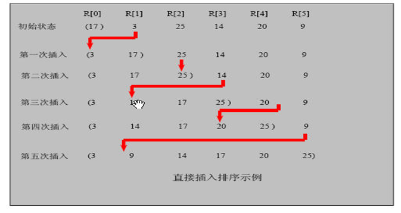
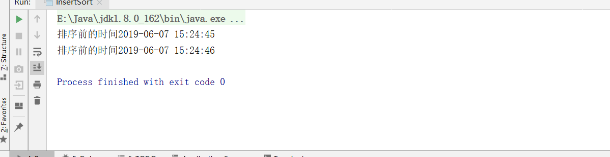
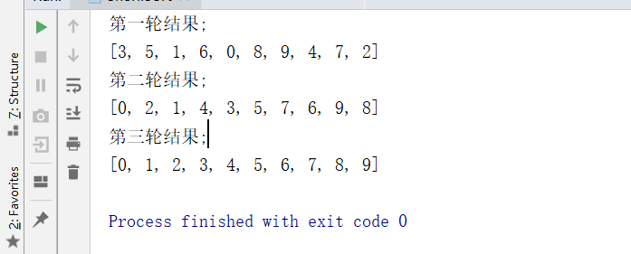
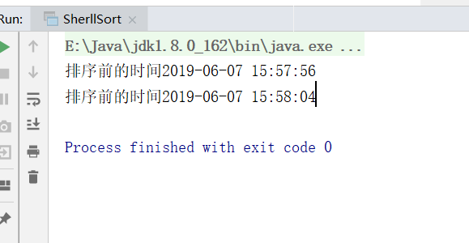
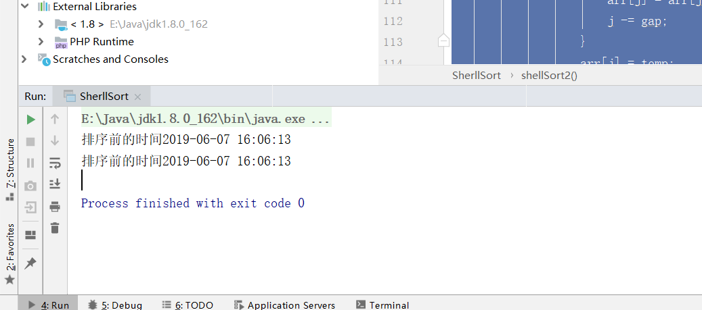

## 1.插入排序

插入式排序属于内部排序法，是对于欲排序的元素以插入的方式找寻该元素的适当位置，以达到排序的目的。

### 1.2.插入排序法思想

插入排序（Insertion Sorting）的基本思想是：把n个待排序的元素看成为一个有序表和一个无序表，开始时有序表中只包含一个元素，无序表中包含有n-1个元素，排序过程中每次从无序表中取出第一个元素，把它的排序码依次与有序表元素的排序码进行比较，将它插入到有序表中的适当位置，使之成为新的有序表。

### 1.3.插入排序思路图



### 1.4.代码实现

```java
package cn.smallmartial.sort;

import java.text.SimpleDateFormat;
import java.util.Arrays;
import java.util.Date;

/**
 * @Author smallmartial
 * @Date 2019/6/7
 * @Email smallmarital@qq.com
 */
public class InsertSort {
    public static void main(String[] args) {
       // int[] arr = {101,34,119,1};
        int[] arr = new int[80000];
        for (int i = 0; i < arr.length -1 ; i++) {
            arr[i] = (int)(Math.random()*80000);
        }
        Date data = new Date();
        SimpleDateFormat simpleDateFormat = new SimpleDateFormat("yyyy-MM-dd HH:mm:ss");
        String dataStr = simpleDateFormat.format(data);
        System.out.println("排序前的时间"+dataStr);
        insertSort(arr);
        Date data2 = new Date();
        // SimpleDateFormat simpleDateFormat = new SimpleDateFormat("yyyy-MM-dd HH:mm:ss");
        String data2Str = simpleDateFormat.format(data2);
        System.out.println("排序前的时间"+data2Str);
    }
    public static void insertSort(int[] arr){
        for (int i = 1; i < arr.length; i++) {
            int insertVal = arr[i];
            int insertIndex = i - 1;

            while (insertIndex >= 0 && insertVal <arr[insertIndex]){
                arr[insertIndex +1] = arr[insertIndex];
                insertIndex--;
            }
            arr[insertIndex + 1] = insertVal;
//            System.out.println("第一轮插入：");
//            System.out.println(Arrays.toString(arr));
        }


//        int insertVal = arr[1];
//        int insertIndex = 1 - 1;
//
//        while (insertIndex >= 0 && insertVal <arr[insertIndex]){
//            arr[insertIndex +1] = arr[insertIndex];
//            insertIndex--;
//        }
//        arr[insertIndex + 1] = insertVal;
//        System.out.println("第一轮插入：");
//        System.out.println(Arrays.toString(arr));

//        //第二轮
//         insertVal = arr[2];
//         insertIndex = 2 - 1;
//
//        while (insertIndex >= 0 && insertVal <arr[insertIndex]){
//            arr[insertIndex +1] = arr[insertIndex];
//            insertIndex--;
//        }
//        arr[insertIndex + 1] = insertVal;
//        System.out.println("第二轮插入：");
//        System.out.println(Arrays.toString(arr));
//
//        //第3轮
//        insertVal = arr[3];
//        insertIndex = 3 - 1;
//
//        while (insertIndex >= 0 && insertVal <arr[insertIndex]){
//            arr[insertIndex +1] = arr[insertIndex];
//            insertIndex--;
//        }
//        arr[insertIndex + 1] = insertVal;
//        System.out.println("第三轮插入：");
//        System.out.println(Arrays.toString(arr));
    }
}

```

### 1.5运行结果




### 1.6简单插入排序存在的问题

我们看简单的插入排序可能存在的问题. 
数组 arr = {2,3,4,5,6,1} 这时需要插入的数 1(最小), 这样的过程是：
{2,3,4,5,6,6}
{2,3,4,5,5,6}
{2,3,4,4,5,6}
{2,3,3,4,5,6}
{2,2,3,4,5,6}
{1,2,3,4,5,6}
结论: 当需要插入的数是较小的数时，后移的次数明显增多，对效率有影响.

## 2.希尔排序

### 2.1希尔排序法介绍

希尔排序是希尔（Donald Shell）于1959年提出的一种排序算法。希尔排序也是一种插入排序，它是简单插入排序经过改进之后的一个更高效的版本，也称为缩小增量排序。

### 2.2希尔排序法基本思想

希尔排序是把记录按下标的一定增量分组，对每组使用直接插入排序算法排序；随着增量逐渐减少，每组包含的关键词越来越多，当增量减至1时，整个文件恰被分成一组，算法便终止

### 2.3希尔排序示意图


### 2.4代码分析

```java
package cn.smallmartial.sort;

import java.util.Arrays;

/**
 * @Author smallmartial
 * @Date 2019/6/7
 * @Email smallmarital@qq.com
 */
public class SherllSort {
    public static void main(String[] args) {
        int[] arr ={8,9,1,7,2,3,5,4,6,0};
        shellSort(arr);
     }
     
     //逐步分析，交换法
    public static void shellSort(int[] arr){
        //
        
        int temp = 0;
        //第一轮排序
        //将10个数据分成5组
        for (int i = 5; i < arr.length; i++) {
            //共5组 ，2个元素
            for (int j = i - 5; j >= 0 ; j -= 5) {
                if(arr[j]>arr[j+5]){
                    temp = arr[j];
                    arr[j] = arr[j+5];
                    arr[j+5] = temp;
                }
            }
        }
        System.out.println("第一轮结果;");
        System.out.println(Arrays.toString(arr));


        //第二轮，将5组分成 2组
        for (int i = 2; i < arr.length; i++) {
            //共5组 ，2个元素
            for (int j = i - 2; j >= 0 ; j -= 2) {
                if(arr[j]>arr[j+2]){
                    temp = arr[j];
                    arr[j] = arr[j+2];
                    arr[j+2] = temp;
                }
            }
        }
        System.out.println("第二轮结果;");
        System.out.println(Arrays.toString(arr));

        //第三轮，将2组分成 1组
        for (int i = 1; i < arr.length; i++) {
            //共5组 ，2个元素
            for (int j = i - 1; j >= 0 ; j -= 1) {
                if(arr[j]>arr[j+1]){
                    temp = arr[j];
                    arr[j] = arr[j+1];
                    arr[j+1] = temp;
                }
            }
        }
        System.out.println("第三轮结果;");
        System.out.println(Arrays.toString(arr));
    }
}

```

运行结果：




### 2.5代码优化

```java
        int temp = 0;
        int count = 0;
        for (int gap = arr.length / 2; gap > 0; gap /= 2) {
            for (int i = gap; i < arr.length; i++) {

                for (int j = i - gap; j >= 0; j -= gap) {
                    if (arr[j] > arr[j + gap]) {
                        temp = arr[j];
                        arr[j] = arr[j + gap];
                        arr[j + gap] = temp;
                    }
                }
            }
            System.out.println("第"+(++count)+"轮结果;");
            System.out.println(Arrays.toString(arr));
        }
```

### 2.6 测试8万数据

```java
package cn.smallmartial.sort;

import java.text.SimpleDateFormat;
import java.util.Arrays;
import java.util.Date;

/**
 * @Author smallmartial
 * @Date 2019/6/7
 * @Email smallmarital@qq.com
 */
public class SherllSort {
    public static void main(String[] args) {
       // int[] arr ={8,9,1,7,2,3,5,4,6,0};
        int[] arr = new int[80000];
        for (int i = 0; i < arr.length -1 ; i++) {
            arr[i] = (int)(Math.random()*80000);
        }
        Date data = new Date();
        SimpleDateFormat simpleDateFormat = new SimpleDateFormat("yyyy-MM-dd HH:mm:ss");
        String dataStr = simpleDateFormat.format(data);
        System.out.println("排序前的时间"+dataStr);
        shellSort(arr);
        Date data2 = new Date();
        // SimpleDateFormat simpleDateFormat = new SimpleDateFormat("yyyy-MM-dd HH:mm:ss");
        String data2Str = simpleDateFormat.format(data2);
        System.out.println("排序前的时间"+data2Str);
     }
     
     //逐步分析，交换法
    public static void shellSort(int[] arr) {
        //交换法
        int temp = 0;
        int count = 0;
        for (int gap = arr.length / 2; gap > 0; gap /= 2) {
            for (int i = gap; i < arr.length; i++) {

                for (int j = i - gap; j >= 0; j -= gap) {
                    if (arr[j] > arr[j + gap]) {
                        temp = arr[j];
                        arr[j] = arr[j + gap];
                        arr[j + gap] = temp;
                    }
                }
            }
          //  System.out.println("第"+(++count)+"轮结果;");
            //System.out.println(Arrays.toString(arr));
        }

   }
}

```

运行结果




### 2.7移位法

```java
   public static void shellSort2(int[] arr){

       //int temp = 0;
       int count = 0;
       for (int gap = arr.length / 2; gap > 0; gap /= 2) {
            //从第gap个元素，逐个对其所在组直接进行插入
           for (int i = gap; i < arr.length; i++) {
               int j = i;
               int temp = arr[j];
               if (arr[j] <arr[j -gap]){
                   while (j - gap >= 0 && temp <arr[j -gap]){
                       //移动
                       arr[j] = arr[j -gap];
                       j -= gap;
                   }
                   arr[j] = temp;
               }
           }

       }

       }
```

运行时间

