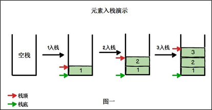
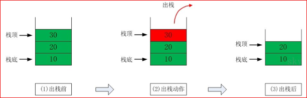
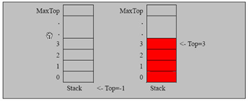
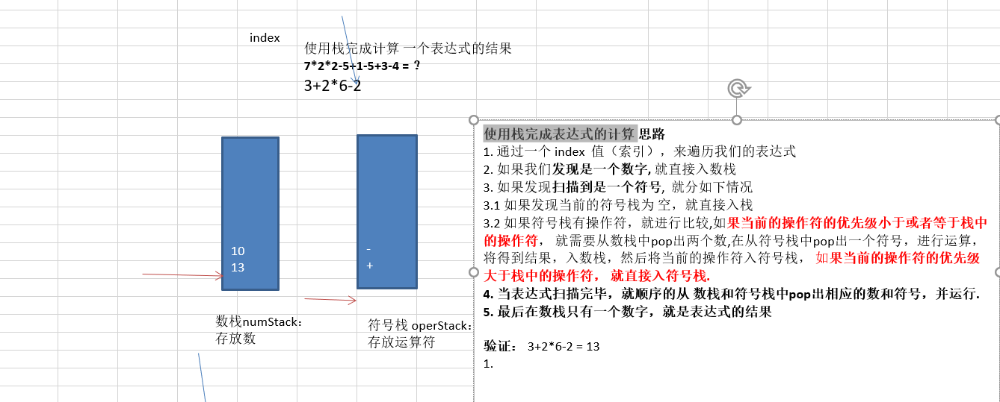
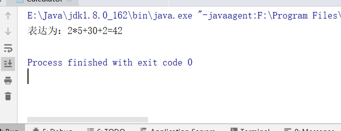
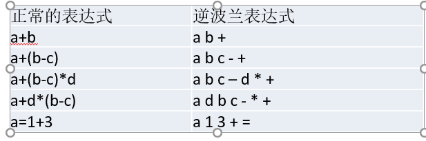

## 1.栈的介绍

- 栈的英文为(stack)

- 栈是一个先入后出(FILO-First In Last Out)的有序列表。

- 栈(stack)是限制线性表中元素的插入和删除只能在线性表的同一端进行的一种特殊线性表。允许插入和删除的一端，为变化的一端，称为栈顶(Top)，另一端为固定的一端，称为栈底(Bottom)。

- 根据栈的定义可知，最先放入栈中元素在栈底，最后放入的元素在栈顶，而删除元素刚好相反，最后放入的元素最先删除，最先放入的元素最后删除

- 出栈(pop)和入栈(push)的概念(如图所示)

  



## 2.栈的应用场景

- 子程序的调用：在跳往子程序前，会先将下个指令的地址存到堆栈中，直到子程序执行完后再将地址取出，以回到原来的程序中。
-  处理递归调用：和子程序的调用类似，只是除了储存下一个指令的地址外，也将参数、区域变量等数据存入堆栈中。
- 表达式的转换[中缀表达式转后缀表达式]与求值(实际解决)。
- 二叉树的遍历。
- 图形的深度优先(depth一first)搜索法。

## 3.数组模拟栈分析



1. 使用数组来模拟栈
2. 定义一个 top  来表示栈顶，初始化 为  -1
3. 入栈的操作，当有数据加入到栈时， top++;  stack[top] = data;
4. 出栈的操作， int value = stack[top]; top--, return value

### 3.1代码实现

```java
package cn.smallmartial.stack;

import java.util.Scanner;

/**
 * @Author smallmartial
 * @Date 2019/6/4
 * @Email smallmarital@qq.com
 */
public class ArrayStackDemo {
    public static void main(String[] args) {
        //Test
        ArrayStack arrayStack = new ArrayStack(4);
        String key = "";
        boolean loop = true;
        Scanner scanner = new Scanner(System.in);
        while (loop){
            System.out.println("show:表示显示栈");
            System.out.println("exit:表示退出");
            System.out.println("push:表示入栈");
            System.out.println("pop:表示出栈");
            System.out.println("请输入的选择");
            key = scanner.next();
            switch (key){
                case "show":
                    arrayStack.list();
                    break;
                case "push":
                    System.out.println("请输入一个数字：");
                    int value = scanner.nextInt();
                    arrayStack.push(value);
                    break;
                case "pop":
                    int res = 0;
                    try {
                        res = arrayStack.pop();
                        System.out.println("出栈的数据："+res);
                    } catch (Exception e) {
                        System.out.println(e.getMessage());
                    }
                    break;
                case "exit":
                    scanner.close();
                    loop = false;
                    break;
                 default:
                     break;
            }
            System.out.println("程序退出");
        }
    }
}

class ArrayStack{
    private int maxSize; //栈的大小
    private int[] stack; //数组 模拟栈
    private int top = -1; //top 表示栈顶

    public ArrayStack(int maxSize) {
        this.maxSize = maxSize;
        stack = new int[this.maxSize];
    }
    //栈满
    public boolean isFull(){
        return top == maxSize - 1;

    }

    //栈空
    public boolean isEmpty(){
        return top == -1;
    }

    //入栈
    public void push(int value){
        if (isFull()){
            System.out.println("栈满");
            return;
        }

        top++;
        stack[top] = value;
    }

    //出栈
    public int pop(){
        if (isEmpty()){
           throw new RuntimeException("栈空");
        }
        
        int value = stack[top];
        top--;
        return value;
    }
    
    //显示栈
    public void list(){
        if (isEmpty()){
            System.out.println("没有数据");
            return;
        }
        for (int i = top; i >=0 ; i--) {
            System.out.println("stack"+i+"="+stack[i]);
        }
    }
}

```

## 4.**使用栈完成表达式的计算** 

### 4.1思路



### 4.2代码实现

```java
package cn.smallmartial.stack;

/**
 * @Author smallmartial
 * @Date 2019/6/4
 * @Email smallmarital@qq.com
 */
public class Calculator {

    public static void main(String[] args) {
        String expression = "2*5+30+2";
        //创建2个栈 一个数字栈 一个符号栈
        ArrayStack2 numStack = new ArrayStack2(10);
        ArrayStack2 operStack = new ArrayStack2(10);
        int index = 0;//用于扫描
        int num1 = 0;
        int num2 = 0;
        int oper = 0;
        int res = 0;
        char ch = ' ';//将每次扫描的char保存到ch
        String keepNum = "";
        while (true){
            ch = expression.substring(index,index+1).charAt(0);//得到一个字符
            //判断ch类型
            if (operStack.isoper(ch)){ //如果是运算符
                //判断当前的符号是否为空
                if (!operStack.isEmpty()){
                    /**
                     * 如果符号栈有操作符，就进行比较,如果当前的操作符的优先级小于或者等于栈中的操作符，
                     * 就需要从数栈中pop出两个数,在从符号栈中pop出一个符号，进行运算，将得到结果，入数栈，
                     * 然后将当前的操作符入符号栈， 如果当前的操作符的优先级大于栈中的操作符， 就直接入符号栈.
                     */
                    if (operStack.priority(ch)<=operStack.priority(operStack.peek())){
                        num1 = numStack.pop();
                        num2 = numStack.pop();
                        oper = operStack.pop();
                        res = numStack.cal(num1,num2,oper);
                        //把运输结果加入数栈
                        numStack.push(res);
                        //然后将当前操作的入符号栈
                        operStack.push(ch);
                    }else {
                        operStack.pop();
                    }
                }else {
                    //如果为空，直接入栈
                    operStack.push(ch);
                }

            }else {//如果数则数字
                //numStack.push(ch - 48);
                //处理多位数
                keepNum+=ch;
                //判断下个字符是不是数字，如果是数字则继续扫描，否则入栈
                //
                if(index == expression.length() -1 ){
                    numStack.push(Integer.parseInt(keepNum));
                }else {
                if(operStack.isoper(expression.substring(index+1,index+2).charAt(0))){
                    //如果后一位是运算符，则入栈
                    numStack.push(Integer.parseInt(keepNum));
                    //清空
                    keepNum="";
                }
                }
            }
            index++;
            if (index >= expression.length()){
                break;
            }
        }

        while (true){
            //如果符合栈，为空则计算最后结果
            if (operStack.isEmpty()){
                break;
            }else {
                num1 = numStack.pop();
                num2 = numStack.pop();
                oper = operStack.pop();
                res = numStack.cal(num1,num2,oper);
                numStack.push(res);//入栈
            }
        }
        System.out.println("表达为："+expression+"="+numStack.pop());
    }
}

//创建一个栈
class ArrayStack2{
    private int maxSize; //栈的大小
    private int[] stack; //数组 模拟栈
    private int top = -1; //top 表示栈顶

    public ArrayStack2(int maxSize) {
        this.maxSize = maxSize;
        stack = new int[this.maxSize];
    }
    //返回当前栈顶的值
    public int peek(){
        return stack[top];
    }
    //栈满
    public boolean isFull(){
        return top == maxSize - 1;

    }

    //栈空
    public boolean isEmpty(){
        return top == -1;
    }

    //入栈
    public void push(int value){
        if (isFull()){
            System.out.println("栈满");
            return;
        }

        top++;
        stack[top] = value;
    }

    //出栈
    public int pop(){
        if (isEmpty()){
            throw new RuntimeException("栈空");
        }

        int value = stack[top];
        top--;
        return value;
    }

    //显示栈
    public void list(){
        if (isEmpty()){
            System.out.println("没有数据");
            return;
        }
        for (int i = top; i >=0 ; i--) {
            System.out.println("stack"+i+"="+stack[i]);
        }
    }

    //返回运算符优先级，优先级用数字表示 ，数字越大优先级越高
    public int priority(int oper){
        if (oper == '*' || oper == '/'){
            return 1;
        }else if(oper == '+'|| oper == '-'){
            return 0;
        }else {
            return -1;//
        }
    }

    //判断是否为运算符
    public boolean isoper(char val){
        return val == '+'||val =='-'||val =='*'||val =='/';
    }
    //计算
    public int cal(int num1, int num2, int oper){
        int res = 0;//存放运算结果
        switch (oper){
            case '+':
                res = num1 + num2;
                break;
            case '-':
                res = num1 - num2;
                break;
            case '*':
                res = num1 * num2;
                break;
            case '/':
                res = num1 / num2;
                break;
            default:
                break;

        }
        return res;
    }
}

```

### 4.3运行结果



## 5.前缀、中缀、后缀表达式

### 5.1前缀表达式

- 前缀表达式又称波兰式，前缀表达式的运算符位于操作数之前

- 举例说明： (3+4)×5-6 对应的前缀表达式就是 - × + 3 4 5 6

  从右至左扫描表达式，遇到数字时，将数字压入堆栈，遇到运算符时，弹出栈顶的两个数，用运算符对它们做相应的计算（栈顶元素 和 次顶元素），并将结果入栈；重复上述过程直到表达式最左端，最后运算得出的值即为表达式的结果

  例如: (3+4)×5-6 对应的前缀表达式就是 - × + 3 4 5 6 , 针对前缀表达式求值步骤如下:

  从右至左扫描，将6、5、4、3压入堆栈
  遇到+运算符，因此弹出3和4（3为栈顶元素，4为次顶元素），计算出3+4的值，得7，再将7入栈
  接下来是×运算符，因此弹出7和5，计算出7×5=35，将35入栈
  最后是-运算符，计算出35-6的值，即29，由此得出最终结果。

### 5.2中缀表达式

- 中缀表达式就是常见的运算表达式，如(3+4)×5-6
- 中缀表达式的求值是我们人最熟悉的，但是对计算机来说却不好操作(前面我们讲的案例就能看的这个问题)，因此，在计算结果时，往往会将中缀表达式转成其它表达式来操作(一般转成后缀表达式.)

### 5.3后缀表达式

- 后缀表达式又称逆波兰表达式,与前缀表达式相似，只是运算符位于操作数之后

- 中举例说明： (3+4)×5-6 对应的后缀表达式就是 3 4 + 5 × 6 –

- 再比如:

  

- 将中缀表达式“1+((2+3)×4)-5”转换为后缀表达式的过程如下

  | 扫描到的元素 | s2(栈底->栈顶)          | s1 (栈底->栈顶) | 说明                               |
  | ------------ | ----------------------- | --------------- | ---------------------------------- |
  | 1            | 1                       | 空              | 数字，直接入栈                     |
  | +            | 1                       | +               | s1为空，运算符直接入栈             |
  | (            | 1                       | + (             | 左括号，直接入栈                   |
  | (            | 1                       | + ( (           | 同上                               |
  | 2            | 1 2                     | + ( (           | 数字                               |
  | +            | 1 2                     | + ( ( +         | s1栈顶为左括号，运算符直接入栈     |
  | 3            | 1 2 3                   | + ( ( +         | 数字                               |
  | )            | 1 2 3 +                 | + (             | 右括号，弹出运算符直至遇到左括号   |
  | ×            | 1 2 3 +                 | + ( ×           | s1栈顶为左括号，运算符直接入栈     |
  | 4            | 1 2 3 + 4               | + ( ×           | 数字                               |
  | )            | 1 2 3 + 4 ×             | +               | 右括号，弹出运算符直至遇到左括号   |
  | -            | 1 2 3 + 4 × +           | -               | -与+优先级相同，因此弹出+，再压入- |
  | 5            | 1 2 3 + 4 × + 5         | -               | 数字                               |
  | 到达最右端   | **1   2 3 + 4 × + 5 -** | 空              | s1中剩余的运算符                   |