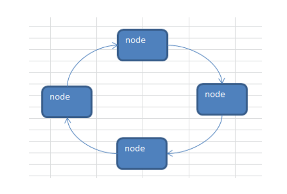
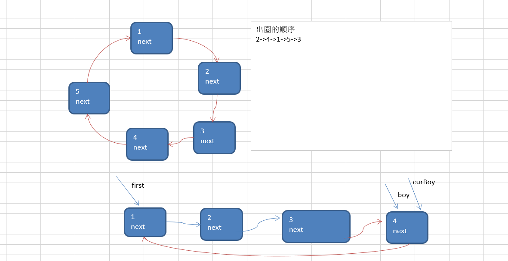
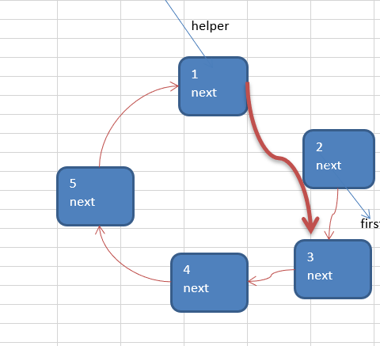
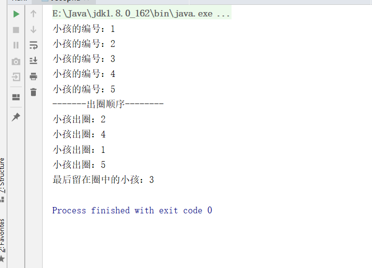

# 单项环形链表介绍和约瑟夫问题

## 1.单项环形链表图解



## 2.Josephu（约瑟夫）问题

Josephu  问题为：设编号为1，2，… n的n个人围坐一圈，约定编号为k（1<=k<=n）的人从1开始报数，数到m 的那个人出列，它的下一位又从1开始报数，数到m的那个人又出列，依次类推，直到所有人出列为止，由此产生一个出队编号的序列。

- n = 5 , 即有5个人 

- k = 1, 从第一个人开始报数

- m = 2, 数2下

### 2.1Josephu（约瑟夫）问题示意图（单项环形链表完成）



- 构建一个单向的环形链表思路：

1. 先创建第一个节点, 让 first 指向该节点，并形成环形
2. 后面当我们每创建一个新的节点，就把该节点，加入到已有的环形链表中即可.

遍历环形链表
1. 先让一个辅助指针(变量) curBoy，指向first节点
2. 然后通过一个while循环遍历 该环形链表即可 curBoy.next  == first 结束

- 根据用户的输入，生成一个小孩出圈的顺序

  

  n = 5 , 即有5个人 
  k = 1, 从第一个人开始报数
  m = 2, 数2下


  1.  需求创建一个辅助指针(变量) helper , 事先应该指向环形链表的最后这个节点.
  补充： 小孩报数前，先让 first 和  helper 移动 k - 1次
  2.  当小孩报数时，让first 和 helper 指针同时 的移动  m  - 1 次
  3.  这时就可以将first 指向的小孩节点 出圈
  first = first .next 
  helper.next = first  
  原来first 指向的节点就没有任何引用，就会被回收

  出圈的顺序
  2->4->1->5->3

### 2.2代码实现

```java
package cn.smallmartial.linkedlist;

/**
 * @Author smallmartial
 * @Date 2019/6/4
 * @Email smallmarital@qq.com
 */
public class Josephu {
    public static void main(String[] args) {
        //测试
        CircleSingleLinkedList circleSingleLinkedList = new CircleSingleLinkedList();
        circleSingleLinkedList.addBoy(5);
        circleSingleLinkedList.showBoy();
        //测试小孩出圈
        System.out.println("-------出圈顺序--------");
        circleSingleLinkedList.countBoy(1,2,5);
    }
}

//创建一个环形单链表
class CircleSingleLinkedList{
    //创建一个first节点，当前没有编号
    private Boy first = null;
    //添加一个小孩形成一个环形链表
    public void addBoy(int nums){
        if (nums < 1){
            System.out.println("nums的值不正确");
        }
        Boy curBoy = null;//辅助指针，帮助构建环形链表
        for (int i = 1; i <= nums; i++) {
            //根据编号，创建小孩节点
            Boy boy = new Boy(i);
            if (i == 1){
                first = boy;
                first.setNext(first);
                curBoy = first;
            }else {
                curBoy.setNext(boy);
                boy.setNext(first);
                curBoy = boy;
            }
        }
    }

    //遍历当前链表
    public void showBoy(){
        if(first == null){
            System.out.println("没有该节点");
            return;
        }

        Boy curBoy = first;
        while (true){
            System.out.println("小孩的编号："+curBoy.getNo());
            if (curBoy.getNext() == first){
                break;
            }

            curBoy = curBoy.getNext();//后移
        }

    }
    //根据用户的输入，计算小孩出圈的顺序

    /**
     *
     * @param startNo //表示从第几个小孩开始数数
     * @param countNum //表示数几下
     * @param nums //表示最初有多少小孩在圈中
     */
    public void countBoy(int startNo, int countNum,int nums){
        //先对数据进行校验
        if (first == null || startNo <1  || startNo >nums){
            System.out.println("参数输入有误，请重新输入");
            return;
        }
        //创建辅助指针
        Boy helper = first;
        while (true){
            if (helper.getNext() == first){
                break;
            }
            helper = helper.getNext();
        }
        //小孩报数之前，先让firsr和helper 移动 k-1次
        for (int j = 0; j < startNo  - 1; j++) {
            first = first.getNext();
            helper = helper.getNext();
        }

        while (true){
            if(helper == first){
                break;
            }

            for (int i = 0; i < countNum - 1; i++) {
                first = first.getNext();
                helper = helper.getNext();
            }
            System.out.println("小孩出圈："+first.getNo());
            first = first.getNext();
            helper.setNext(first);
        }
        System.out.println("最后留在圈中的小孩："+first.getNo());
    }
}

//创建一个boy类
class Boy{
    private int no;
    private Boy next;

    public Boy(int no) {
        this.no = no;
    }

    public int getNo() {
        return no;
    }

    public void setNo(int no) {
        this.no = no;
    }

    public Boy getNext() {
        return next;
    }

    public void setNext(Boy next) {
        this.next = next;
    }
}

```

### 2.4运行结果

