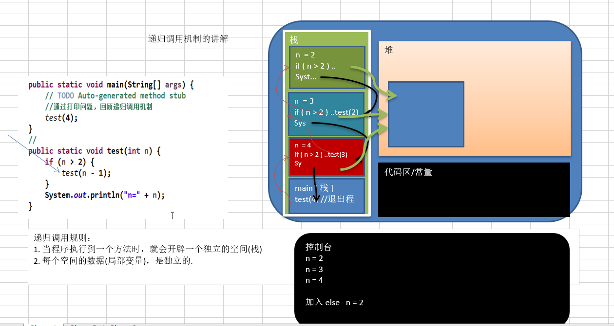
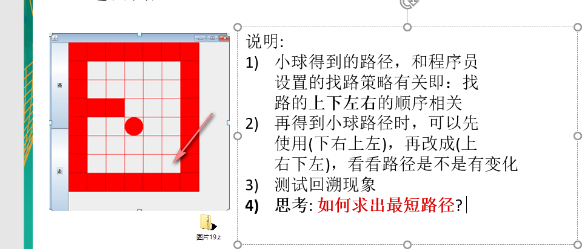
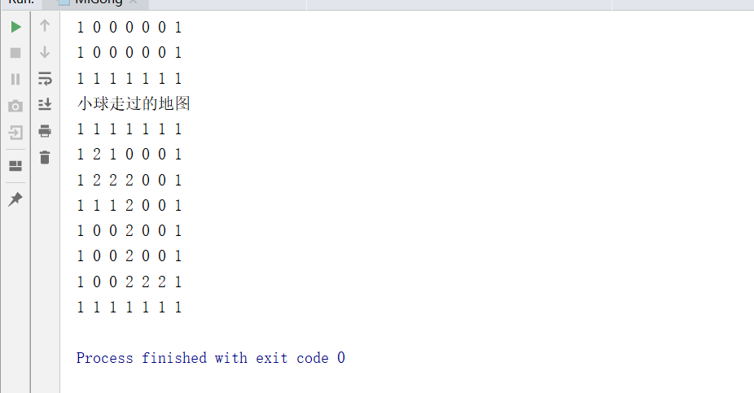
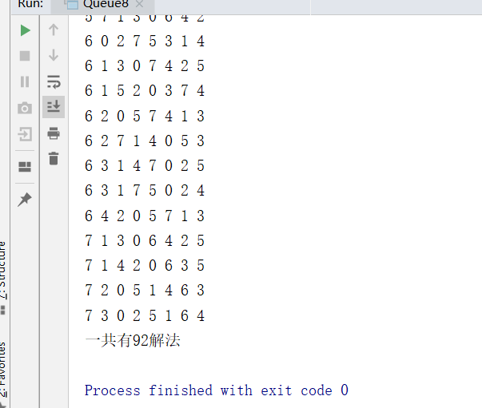

# 数据结构之递归

## 1.递归的概念

简单的说: 递归就是方法自己调用自己,每次调用时传入不同的变量.递归有助于编程者解决复杂的问题,同时可以让代码变得简洁。

## 2.递归调用机制



### 2.1测试代码

```java
package cn.smallmartial.recursion;

/**
 * @Author smallmartial
 * @Date 2019/6/5
 * @Email smallmarital@qq.com
 */
public class RecursionTest {
    public static void main(String[] args) {
        test(4);
    }

    public static void test(int n){
        if (n >2){
            test(n -1);
        }
        System.out.println("n = "+n);
    }
}

```

## 3.递归解决的问题

- 各种数学问题如: 8皇后问题 , 汉诺塔, 阶乘问题, 迷宫问题, 球和篮子的问题(google编程大赛)
- 各种算法中也会使用到递归，比如快排，归并排序，二分查找，分治算法等.
- 将用栈解决的问题-->第归代码比较简洁

## 4.递归需要遵守的重要规则

- 执行一个方法时，就创建一个新的受保护的独立空间(栈空间)
- 方法的局部变量是独立的，不会相互影响, 比如n变量
- 如果方法中使用的是引用类型变量(比如数组)，就会共享该引用类型的数据.
- 递归必须向退出递归的条件逼近，否则就是无限递归,出现StackOverflowError，死龟了:)
- 当一个方法执行完毕，或者遇到return，就会返回，遵守谁调用，就将结果返回给谁，同时当方法执行完毕或者返回时，该方法也就执行完毕。

## 5.递归-迷宫问题



### 5.1代码实现

```java
package cn.smallmartial.recursion;

/**
 * @Author smallmartial
 * @Date 2019/6/5
 * @Email smallmarital@qq.com
 */
public class MiGong {
    public static void main(String[] args) {
        //创建二维数组模拟迷宫
        int[][] map = new int[8][7];
        //使用1 表示迷宫的墙
        //上下置为1
        for (int i = 0; i < 7; i++) {
            map[0][i] = 1;
            map[7][i] = 1;

        }
        //左右置为1
        for (int i = 0; i < 8; i++) {
            map[i][0] = 1;
            map[i][6] = 1;
        }
        //设置障碍
        map[3][1] = 1;
        map[3][2] = 1;

        for (int i = 0; i < 8; i++) {
            for (int j = 0; j < 7; j++) {
                System.out.print(map[i][j] + " ");
            }
            System.out.println();
        }

        //递归找路
        setWay(map,1,1);
        //输出新的地图
        System.out.println("小球走过的地图");
        for (int i = 0; i < 8; i++) {
            for (int j = 0; j < 7; j++) {
                System.out.print(map[i][j] + " ");
            }
            System.out.println();
        }
    }
    //使用递归寻路

    /**
     * 1.map 表示地图
     * 2.i,j 表示出发位置（1，1）
     * 3.如果可以到达map[6][5],则说明通路
     * 4.0表示没有走过的点 1表示墙 2 表示通路 3表示已走过的点,但是走不通
     * 5.走路顺序为 下-右-上-左，如果该点不同，则回溯
     *
     * @param map 表示地图
     * @param i 起始点
     * @param j
     * @return  //如果找到 则返回true
     */
    public  static boolean setWay(int[][] map, int i, int j){
        if (map[6][5] == 2){
            return true;
        }else {
            if (map[i][j] == 0){
                //按照顺序为 下-右-上-左
                map[i][j] = 2;
                if (setWay(map,i+1,j)){//向下走
                    return true;
                }else if (setWay(map,i,j+1)){//向右走
                    return true;
                }else if (setWay(map,i-1,j)){//向上走
                    return true;
                }else if (setWay(map,i,j-1)){//向左走
                    return true;
                }else {
                    //该点走不通
                    map[i][j] = 3;
                    return false;
                }
            }else {//map[i][j] !=0, 可能是1，2，3
                return false;

            }
        }
    }
}


```

### 5.2运行结果



## 6.递归-八皇后问题

### 6.1八皇后问题算法思路分析

- 第一个皇后先放第一行第一列
- 第二个皇后放在第二行第一列、然后判断是否OK， 如果不OK，继续放在第二列、第三列、依次把所有列都放完，找到一个合适
- 继续第三个皇后，还是第一列、第二列……直到第8个皇后也能放在一个不冲突的位置，算是找到了一个正确解
- 当得到一个正确解时，在栈回退到上一个栈时，就会开始回溯，即将第一个皇后，放到第一列的所有正确解，全部得到.
- 然后回头继续第一个皇后放第二列，后面继续循环执行 1,2,3,4的步骤 

> **说明**：理论上应该创建一个二维数组来表示棋盘，但是实际上可以通过算法，用一个一维数组即可解决问题. arr[8] ={0 , 4, 7, 5, 2, 6, 1, 3} //对应arr 下标表示第几行，即第几个皇后，arr[i] = val , val 表示第i+1个皇后，放在第i+1行的第val+1列

### 6.2代码实现

```java
package cn.smallmartial.recursion;

/**
 * @Author smallmartial
 * @Date 2019/6/5
 * @Email smallmarital@qq.com
 */
public class Queue8 {
    //定一个max 表示共有多少皇后
    int max = 8;
    //保存皇后放置的结果
    int[] array = new int[max];

    static int count = 0;
    public static void main(String[] args) {
        //测试
        Queue8 queue8 = new Queue8();
        queue8.check(0);

        System.out.println("一共有"+count+"解法");

    }

    //放置第n个皇后
    //每个check都有  for (int i = 0; i < max; i++)
    private void check(int n){
        if (n == max){ //表示以放置好
            print();
            return;
        }
        //依次放入，判断是否冲突
        for (int i = 0; i < max; i++) {
            array[n] = i;
            if (judge(n)){
                check(n+1);
            }

        }
    }
    //查看我们放在的皇后，是否和前面的皇后冲突

    /**
     *
     * @param n 表示第n个皇后
     * @return
     */
    public boolean judge(int n){
        for (int i = 0; i < n; i++) {
            /**
             *1.array[i] == array[n] 表示是否在同一行
             * 2.Math.abs(n-i) == Math.abs(array[n] -array[i] 表示是否在同一斜线
             */
            if (array[i] == array[n] || Math.abs(n-i) == Math.abs(array[n] -array[i])){
                return false;
            }
        }
        return true;
    }

    //输出皇后的位置
    public void print(){
        count ++;
        for (int i = 0; i < array.length; i++) {
            System.out.print(array[i]+" ");
        }
        System.out.println();
    }

}

```

### 6.3运行结果

