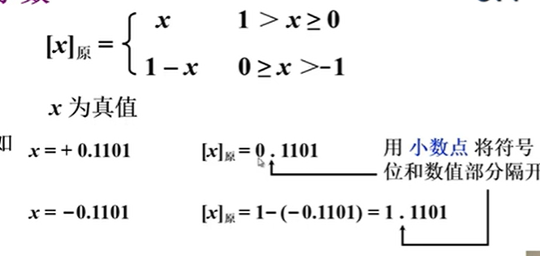

## 1.无符号和有符号

### 1.1无符号

- 寄存器的位数

- 反应无符号数表示范围

  

### 1.2有符号

- 机器数与真值

  

## 2.原码表示法

- 定义

  

  - 小数

    
    
  - 特点（简单、直观）

## 3.补码表示

- 概念

  

​    

- 计数器（模16）（**取反+1**）

  

- 正数的补数即为其本身

  

- 定义（负数求补：除符号位外每位取反，末位加一）

  - 整数

    

  - 小数

    

- 补码快捷方式

  （负数求补：除符号位外每位取反，末位加一）

  

## 4.反码

- 定义

  - 整数

    

  - 小数

    

## 5.移码

- 补码表示很难直接判断其真值大小

  

- 定义

  

